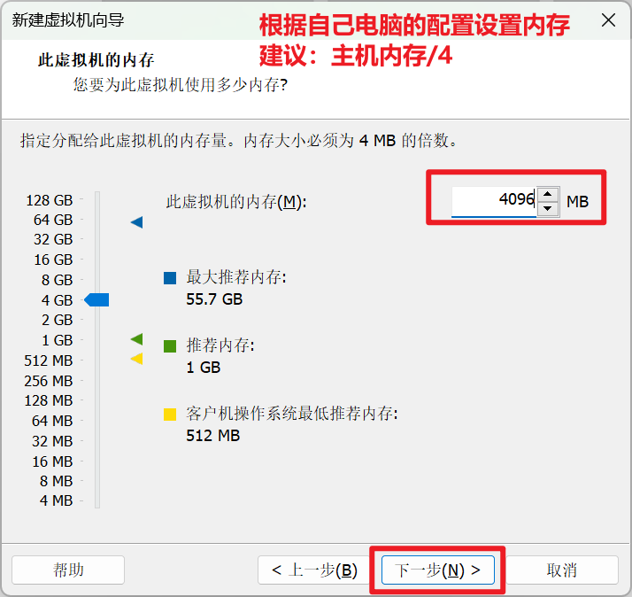
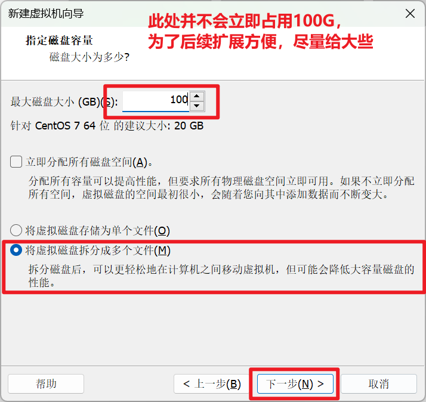
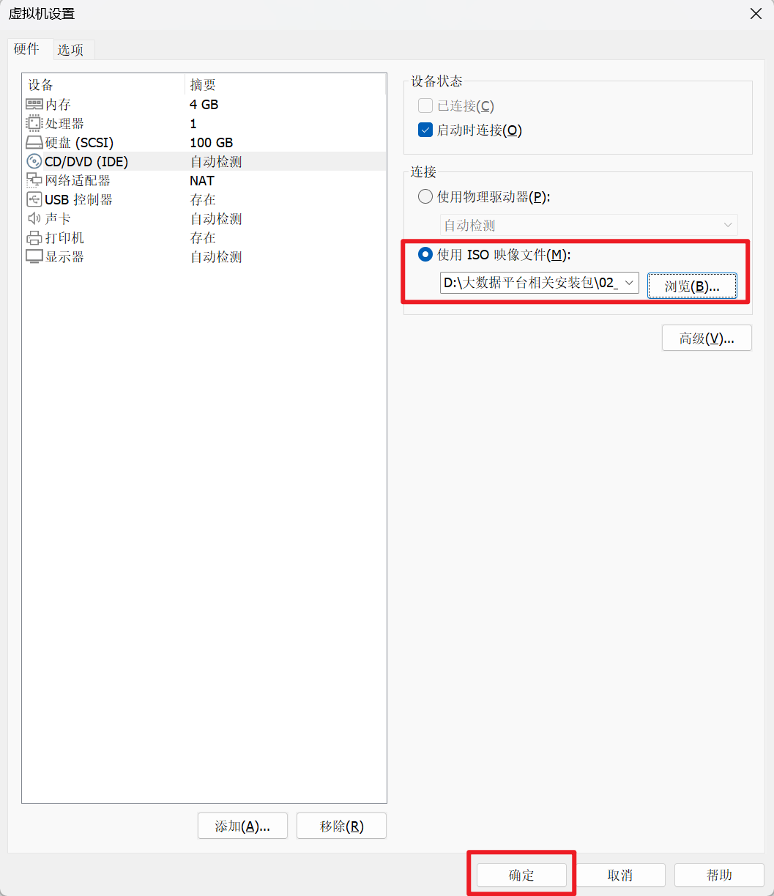
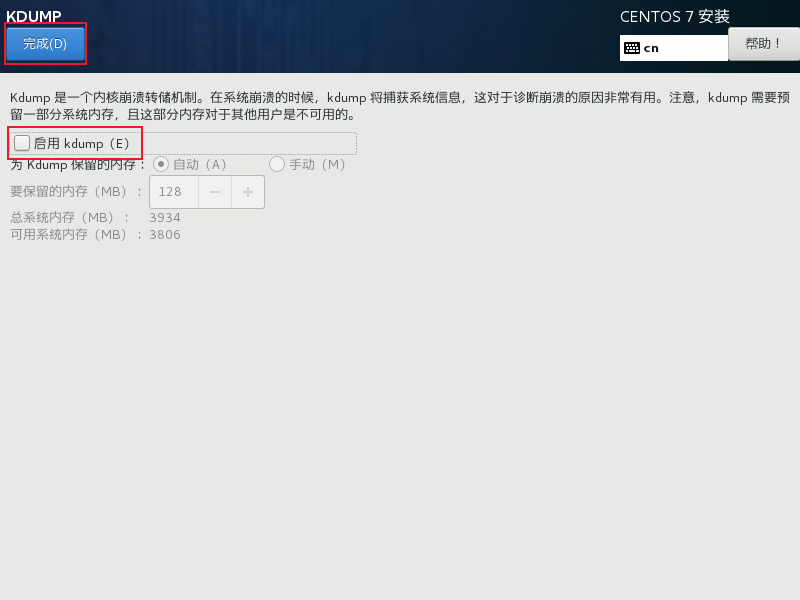
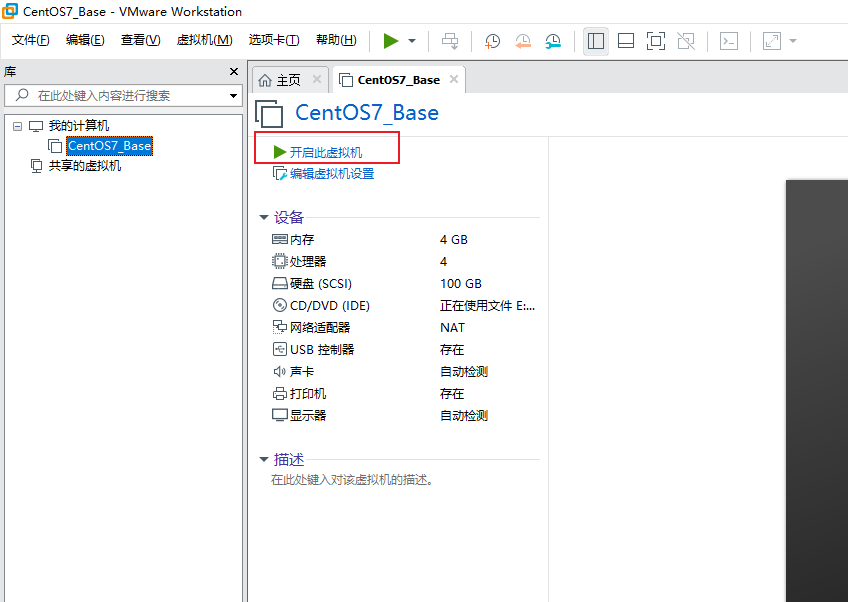
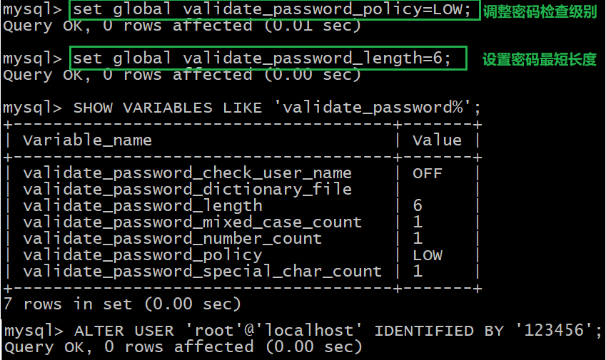
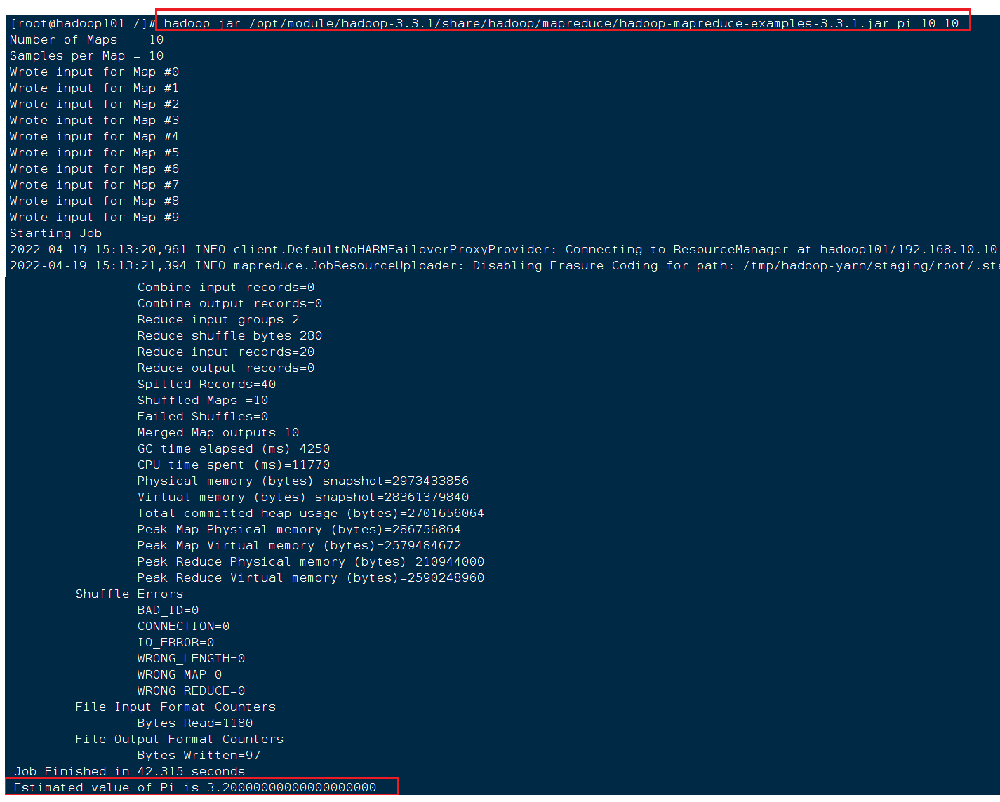
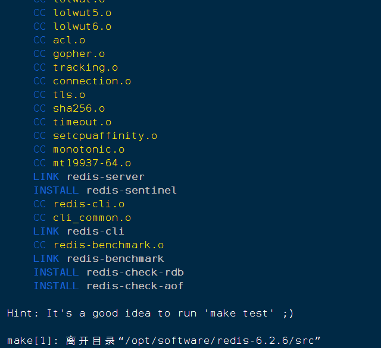
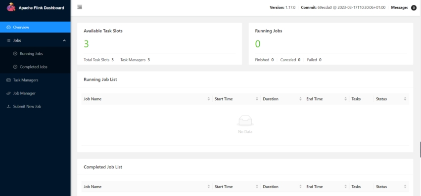
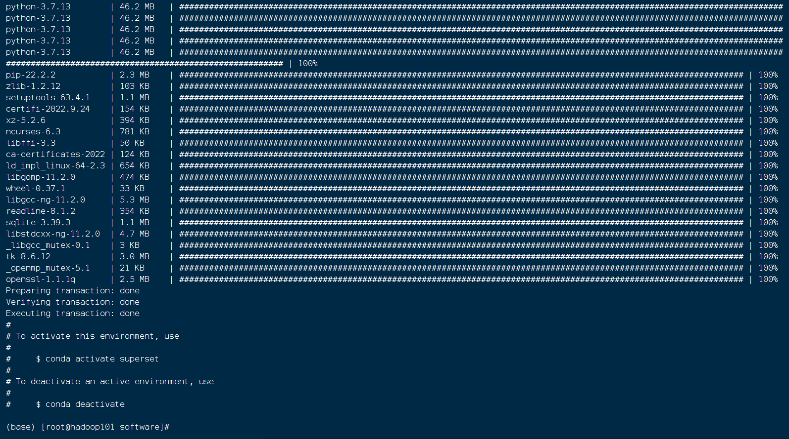

# 资源路径

资源存放在【百度网盘】

```
https://pan.baidu.com/s/1zlHNA1yi891crecbA3cCIw?pwd=sias 
```


# 软件版本


| 序号 | 名称       | 版本      | 软件包                                      | 备注                              |
| ---- | ---------- | --------- | ------------------------------------------- | --------------------------------- |
| 01   | VMware     | 17        | VMware-workstation-full-17.0.0-20800274.exe |                                   |
| 02   | CentOS     | 7.5       | CentOS-7.5-x86_64-DVD-1804.iso              | 建议密码: 12345678                |
| 03   | JDK        | 1.8.0_311 | jdk-8u311-linux-x64.tar.gz                  |                                   |
| 04   | MySql      | 8.0.16    | mysql-8.0.16-2.el7.x86_64.rpm-bundle.tar    | 建议密码: 12345678（开机自启）    |
| 05   | FinalShell | 4.2.4     | finalshell_4.2.4.exe                        | http://www.hostbuf.com/t/988.html |
| 06   | Hadoop     | 3.3.1     | hadoop-3.3.1.tar.gz                         | https://hadoop.apache.org/        |
| 07   | Zookeeper  | 3.8.0     | apache-zookeeper-3.8.0-bin.tar.gz           | https://zookeeper.apache.org/     |
| 08   | Hive       | 3.1.3     | apache-hive-3.1.3-bin.tar.gz                | https://hive.apache.org/          |
| 09   | Flume      | 1.10.1    | apache-flume-1.10.1-bin.tar.gz              | https://flume.apache.org/         |
| 10   | DataX      | 3.0       | datax.tar.gz                                | https://github.com/alibaba/DataX  |
| 11   | Spark      | 3.0.0     | spark-3.0.0-bin-hadoop3.2.tgz               | https://spark.apache.org/         |
| 12   | Redis      | 6.2.6     | redis-6.2.6.tar.gz                          | 建议密码: 12345678（开机自启）    |
| 13   | Kafka      | 3.6.1     | kafka_2.12-3.6.1                            |                                   |


# VMware安装


## 安装步骤

按照下列图示顺序安装即可


## 虚拟网卡

安装完毕之后，Windows的控制面板中会出现两块虚拟出来的网卡


# CentOS安装

## 创建虚拟机











## 开启虚拟机


### 选择系统


### 设置语言


### 设置时区


### 选择桌面安装


### 指定安装位置


### 关闭KDUMP





### 配置网络


### 配置安全项


### 设置密码


### 进入系统


## 开始使用


### 配置网卡信息


### 开机




为了方便学习使用，大家都采用root账户进入系统，root用户是超级管理员。


### 修改分辨率【可选】

为方便大家使用CentOS的桌面，可以调整一下分辨率。


### 配置IP

进入终端


执行以下命令：

```shell
vim  /etc/sysconfig/network-scripts/ifcfg-ens33 
```


完整内容如下【完全覆盖掉之前的内容】：

```properties
TYPE="Ethernet"    #网络类型（通常是Ethemet）
PROXY_METHOD="none"
BROWSER_ONLY="no"
BOOTPROTO="static"   #IP的配置方法[none|static|bootp|dhcp]（引导时不使用协议|静态分配IP|BOOTP协议|DHCP协议）
DEFROUTE="yes"
IPV4_FAILURE_FATAL="no"
IPV6INIT="yes"
IPV6_AUTOCONF="yes"
IPV6_DEFROUTE="yes"
IPV6_FAILURE_FATAL="no"
IPV6_ADDR_GEN_MODE="stable-privacy"
NAME="ens33"   
DEVICE="ens33"   #接口名（设备,网卡）
ONBOOT="yes"   #系统启动的时候网络接口是否有效（yes/no）
#IP地址
IPADDR=192.168.10.100  
#网关  
GATEWAY=192.168.10.2      
#域名解析器
DNS1=192.168.10.2
```


输入以下指令，重启network 服务：

```shell
systemctl restart network
```


> **Vim工具使用示例：**
>
> 1、在命令行界面输入：vim 文件名
>
> 2、输入 i 进入编辑模式
>
> 3、修改完毕，点击esc键，回到命令模式
>
> 4、输入 :wq 即可保存退出
>
> 更多操作，参考视频：https://www.bilibili.com/video/BV13t4y1t7Wg
>
> 
>
> 


### 修改主机名

进入终端，输入以下指令

```
vim /etc/hostname
```

内容如下：

```
hadoop100
```


### 修改hosts文件

```
vim /etc/hosts
```

内容如下：

```properties
192.168.10.100 hadoop100
192.168.10.101 hadoop101
192.168.10.102 hadoop102
192.168.10.103 hadoop103
192.168.10.104 hadoop104
192.168.10.105 hadoop105
192.168.10.106 hadoop106
192.168.10.107 hadoop107
192.168.10.108 hadoop108
```


### 重启系统

在终端输入以下指令：

```
# 重启系统
reboot
```


### 编辑Windows下的hosts文件

Win7可以直接修改，如果操作系统是Win10或者Win11，则先拷贝出来，修改保存以后，再覆盖即可。

（a）进入C:\Windows\System32\drivers\etc路径

（b）拷贝hosts文件到桌面

（c）打开桌面hosts文件并添加如下内容

```properties
192.168.10.100 hadoop100
192.168.10.101 hadoop101
192.168.10.102 hadoop102
192.168.10.103 hadoop103
192.168.10.104 hadoop104
192.168.10.105 hadoop105
192.168.10.106 hadoop106
192.168.10.107 hadoop107
192.168.10.108 hadoop108
```

（d）将桌面hosts文件覆盖C:\Windows\System32\drivers\etc路径hosts文件


# 远程终端工具安装

## FinalShell


# 基本环境准备


## 测试网络是否通畅

```
ping www.baidu.com
```


## 安装epel-release

EPEL (Extra Packages for Enterprise Linux)是基于Fedora的一个项目，为“红帽系”的操作系统提供额外的软件包，适用于RHEL、CentOS和Scientific Linux。（相当于是一个软件仓库，大多数rpm包在官方 repository 中是找不到的）

执行以下命令：

```shell
yum install -y epel-release
```


## 关闭防火墙


```shell
systemctl stop firewalld
systemctl disable firewalld.service
```


### 关闭selinux

```shell
vi /etc/selinux/config
```

修改内容如下：

```
SELINUX=disabled
```


## 时钟同步


```shell
## 安装
yum install -y ntp

## 启动定时任务
crontab -e

## 随后在输入界面键入，编写方式类似Vim
*/1 * * * * /usr/sbin/ntpdate ntp4.aliyun.com;
```


## lrzsz安装

rz，sz是Linux/Unix同Windows进行ZModem文件传输的命令行工具。

rz 可以很方便的从客户端传文件到服务器，sz也可以很方便的从服务器传文件到客户端，就算中间隔着跳板机也不影响。

```shell
yum -y install lrzsz
```

## netcat安装

Netcat 是一种跨网络连接读写数据的工具，使用 TCP 或 UDP 协议。Netcat 被称为 TCP/IP/网络瑞士军刀。

```shell
yum install -y nc
```

- 测试nc，监听9999端口的消息

```
nc -lk 9999
```

- 停止监听

```
ctrl + z
```


## centos7开机不进入图形界面

为了节省内存资源，我们可以不使用图形界面，在终端输入以下命令即可：

```
systemctl set-default multi-user.target
```


设置当前的target，可选值有`graphical.target`，multi-user.target，multi_user.target就是开机不进入图形界面的多用户模式。重启系统即直接进入命令行模式。

> **获取当前的默认target：**
>
> ```shell
> systemctl get-default 
> ```
>
> 


## 文件夹规划

为统一放置相关软件，提前创建好以下目录。

执行以下命令：

```shell
mkdir -p /opt/module    # 安装目录
mkdir -p /opt/software  # 软件包存放目录
mkdir -p /opt/scripts    # 启动脚本目录 
```


## 安装JDK

### 1. 查看自带的openjdk

```
rpm -qa | grep java
```


### 2. 卸载


```
rpm -e --nodeps tzdata-java-2018c-1.el7.noarch  
rpm -e --nodeps java-1.7.0-openjdk-1.7.0.171-2.6.13.2.el7.x86_64 
rpm -e --nodeps java-1.7.0-openjdk-headless-1.7.0.171-2.6.13.2.el7.x86_64 
rpm -e --nodeps java-1.8.0-openjdk-1.8.0.161-2.b14.el7.x86_64 
rpm -e --nodeps java-1.8.0-openjdk-headless-1.8.0.161-2.b14.el7.x86_64 
```


### 3. 下载JDK


> 更多JDK下载 - 编程宝库：http://www.codebaoku.com/jdk/jdk-index.html

### 4. 上传到software目录


### 5. 解压到module目录

```shell
tar -zxvf /opt/software/jdk-8u311-linux-x64.tar.gz -C /opt/module/
```


###  6. 配置环境变量

执行以下命令：

```shell
vim /etc/profile.d/my_env.sh
```


内容如下：

```shell
#JAVA_HOME
export JAVA_HOME=/opt/module/jdk1.8.0_311
export PATH=$PATH:$JAVA_HOME/bin
```


### 7. 重新加载环境变量

执行以下命令：

```
source /etc/profile
```


此时, `java`和`javac`命令都可以使用了


## 安装MySql8


### 卸载自带的mariadb

```shell
rpm -qa | grep -i mariadb
```


### 卸载

```shell
rpm -ev  --nodeps mariadb-libs-5.5.56-2.el7.x86_64
```

- `mariadb-libs-5.5.56-2.el7.x86_64`：这个文件名是根据第一个步骤查询出来的，不同的Linux系统是不一样的。

### 上传压缩包

```shell
# 上传压缩包到/opt/software目录
cd /opt/software
```


### 解压文件

```shell
# 创建mysql8目录
mkdir /opt/software/mysql8
# 解压缩
tar -xvf /opt/software/mysql-8.0.16-2.el7.x86_64.rpm-bundle.tar -C /opt/software/mysql8
```


### 顺序安装

应当按照common–>libs–>client–>server的顺序安装，否则安装过程会提醒依赖顺序，其他的为非必须安装包。

1. 进入mysql的安装包目录

```shell
cd /opt/software/mysql8
```

2. 依次安装下列依赖

```shell
rpm -ih mysql-community-common-8.0.16-2.el7.x86_64.rpm
rpm -ih mysql-community-libs-8.0.16-2.el7.x86_64.rpm 
rpm -ih mysql-community-client-8.0.16-2.el7.x86_64.rpm
rpm -ih mysql-community-server-8.0.16-2.el7.x86_64.rpm
rpm -ih mysql-community-devel-8.0.16-2.el7.x86_64.rpm --force --nodeps   # 供后续superset使用
rpm -ih mysql-community-libs-compat-8.0.16-2.el7.x86_64.rpm
rpm -ih mysql-community-embedded-compat-8.0.16-2.el7.x86_64.rpm
```


### 启动Mysql服务

```shell
systemctl start mysqld
```


### 查询初始密码

   ```shell
grep 'temporary password' /var/log/mysqld.log
   ```


### 登录MySql系统

```shell
# 登录系统
mysql -uroot -p
# 输入初始密码，见上图
例如我的临时密码是：#!pa!WZo-3Ez
```

 

## 修改密码

```
# 修改密码,密码默认是8位,并且包含大小写字母+特殊字符+数字
ALTER USER 'root'@'localhost' IDENTIFIED BY 'MySql5.8';
```


   

### 修改为简单密码

> 为方便教学和学习，我们统一修改mysql密码为12345678。由于MySql的限制，我们需要先修改密码规则。


执行以下命令即可：

```
set global validate_password.policy=LOW;
set global validate_password.length=6; 

ALTER USER 'root'@'localhost' IDENTIFIED WITH mysql_native_password BY '12345678';
```

   

   

 

   

> **查看密码规则:**
>
> ```
> SHOW VARIABLES LIKE 'validate_password%'; 
> ```
>
> 
>
> **关于 mysql 密码策略相关参数:** 
>
> 1. validate_password_length  固定密码的总长度；
> 2. validate_password_dictionary_file 指定密码验证的文件路径；
> 3. validate_password_mixed_case_count  整个密码中至少要包含大/小写字母的总个数
> 4. validate_password_number_count  整个密码中至少要包含阿拉伯数字的个数；
> 5. validate_password_policy 指定密码的强度验证等级，默认为 MEDIUM；
>
>    关于 validate_password_policy 的取值： 
>
>    1. 0/LOW：只验证长度； 
>    2. 1/MEDIUM：验证长度、数字、大小写、特殊字符； 
>    3. 2/STRONG：验证长度、数字、大小写、特殊字符、字典文件；
>
>
> 6. validate_password_special_char_count 整个密码中至少要包含特殊字符的个数；


### 设置远程登录

```
mysql> CREATE USER 'root'@'%' IDENTIFIED WITH mysql_native_password BY '12345678';
mysql> GRANT ALL PRIVILEGES ON *.* TO 'root'@'%' WITH GRANT OPTION;
mysql> flush privileges;
```

## 退出MySQL

输入exit; 或者 Ctrl+Z 即可退出mysql的终端。


### Navicat测试远程登录

在Windows中的Navicat进行mysql的连接测试。


### 配置MySql开机自启

```shell
# 设置开机启动mysql服务
systemctl enable mysqld
# 查看服务是否开机启动
systemctl is-enabled mysqld
```


> **温馨提示：**
>
> 上述操作，我们配置好了最基础的虚拟机。建议大家把配置好的虚拟机`复制`一份，`压缩保存`起来，以供后续使用。


# 克隆虚拟机

## 克隆出3台虚拟机

利用模板机hadoop100，克隆3台虚拟机：hadoop102、hadoop103、hadoop104，下面以克隆hadoop102为演示。

> **注意：**克隆时，要`先关闭`hadoop100


### 步骤1:

关闭被克隆的虚拟机，点击【管理】-【克隆】


### 步骤2：

进入欢迎页，直接点击【下一页】


### 步骤3：

保持默认的【虚拟机中的当前状态】，进入【下一页】


### 步骤4：

选择【创建完整克隆】，进入下一页


### 步骤5：

指定【虚拟机名称】和【位置】，**`存放路径不要有空格和中文！！！`**


### 步骤6：

克隆完毕，【关闭】即可


### 步骤7：

克隆好的效果


### 步骤8：

重新生成虚拟机的MAC地址，注意网络适配器处为【NAT】模式


### 步骤9：

打开刚才克隆好的虚拟机，开机进入系统


查看IP地址，发现还是之前的ip和hostname


### 步骤10：修改IP地址

```shell
vim /etc/sysconfig/network-scripts/ifcfg-ens33 
```


### 步骤11：修改hostname

```
vim /etc/hostname
```


### 步骤12：重启系统


```
reboot
```


重启之后，登录账户，可看到IP地址和hostname都已经修改


> **！！！！！！！！！！！！！！！！！！！！！！！！！！！！！！！！！！！**
>
> **上面步骤成功配置好了hadoo101机器，大家重复上述步骤配置处另外3台即可。**
>
> **！！！！！！！！！！！！！！！！！！！！！！！！！！！！！！！！！！！**


## FinallShell连接


> **自此之后，我们就可以一直使用FinalShell进行远程连接即可。**
>
> **注意，虚拟机hadoop1要保持`开机`状态！！！**
>
> 虚拟机每次使用完毕，也无需关机，直接`挂起`即可
>
> 


# 免密登录配置

在每台虚拟机种都生成密钥对，在每台机器都运行如下命令，然后敲（三个回车），就会生成两个文件id_rsa（私钥）、id_rsa.pub（公钥）

```
ssh-keygen -t rsa
```


将公钥拷贝到要免密登录的目标机器上，每台机器都要执行以下指令

```
ssh-copy-id hadoop102
ssh-copy-id hadoop103
ssh-copy-id hadoop104
```


# xsync集群分发脚本

为方便后续多服务器间传输文件，编写以下脚本

```shell
vim /opt/scripts/xsync
```

内容如下：

```shell
#!/bin/bash
#1. 判断参数个数
if [ $# -lt 1 ]
then
	echo Not Enough Arguement!
	exit;
fi
#2. 遍历集群所有机器
for host in hadoop102 hadoop103 hadoop104
do
	echo ====================  $host  ====================
	#3. 遍历所有目录，挨个发送
	for file in $@
	do
		#4 判断文件是否存在
		if [ -e $file ]
		then
			#5. 获取父目录
			pdir=$(cd -P $(dirname $file); pwd)
			#6. 获取当前文件的名称
			fname=$(basename $file)
			ssh $host "mkdir -p $pdir"
			rsync -av $pdir/$fname $host:$pdir
		else
			echo $file does not exists!
		fi
	done
done

```


修改权限：

```
chmod 777 /opt/scripts/xsync
```

使用示例：

```
xsync hadoop-3.3.1
```


# jpsall脚本

可以通过jpsall指令执行多台服务器的jps指令

```shell
vim /opt/scripts/jpsall
```

内容如下：

```sh
#!/bin/bash

for host in hadoop102 hadoop103 hadoop104
do
        echo =============== $host ===============
        ssh $host jps 
done
```


修改权限：

```
chmod 777 /opt/scripts/jpsall
```

示例：


## 配置环境变量

执行以下命令：

```
vim /etc/profile.d/my_env.sh
```

添加如下内容：

```shell
#SCRIPTS_HOME
export SCRIPTS_HOME=/opt/scripts
export PATH=$PATH:$SCRIPTS_HOME
```

加载环境变量：

```shell
source /etc/profile
```


##  **数据模拟**

### **** **使用说明**

***\*1）将\*******\*application.yml\*******\*、\*******\*gmall-remake-mock-2023-02-17.jar\*******\*、\*******\*path.json\*******\*、\*******\*logback.xml\*******\*上传到hadoop\*******\*102\*******\*的/\*******\*opt/module/applog\*******\*目录下\****

（1）创建applog路径

[atguigu@hadoop102 module]$ mkdir /opt/module/applog

（2）上传文件到/opt/module/applog目录

***\*2）配置文件\****

（1）application.yml文件

可以根据需求生成对应日期的用户行为日志。

[atguigu@hadoop102 applog]$ vim application.yml

修改如下内容

\# 外部配置打开

logging.config: ./logback.xml

 

 

\#http模式下，发送的地址

mock:

 log:

  type: "file"    #"file" "http" "kafka" "none"

  http:

   url: "http://localhost:8090/applog"

  kafka:

​    server: "hadoop102:9092,hadoop102:9092,hadoop102:9092"

​    topic: "topic_log"

 

spring:

  datasource:

   type: com.alibaba.druid.pool.DruidDataSource

   druid:

​    url: jdbc:mysql://hadoop102:3306/gmall?characterEncoding=utf-8&allowPublicKeyRetrieval=true&useSSL=false&serverTimezone=GMT%2B8

​    **username: root**

​    **password: "000000"**

​    driver-class-name:  com.mysql.cj.jdbc.Driver

​    max-active: 20

​    test-on-borrow: true

 

 

mybatis-plus.global-config.db-config.field-strategy: not_null

mybatis-plus:

 mapper-locations: classpath:mapper/*.xml

 

mybatis:

  mapper-locations: classpath:mapper/*.xml

 

**\#业务日期， 并非Linux系统时间的日期，而是生成模拟数据的日期**

**mock.date: "2022-06-08"**

 

\# 日志是否写入数据库一份  写入z_log表中

mock.log.db.enable: 1

 

\# 清空

mock.clear.busi: 1

 

\# 清空用户

mock.clear.user: 0

 

\# 批量生成新用户

mock.new.user: 0

 \#session次数

mock.user-session.count: 200

 \#设备最大值

mock.max.mid: 1000000

 

\# 是否针对实时生成数据，若启用（置为1）则数据的 yyyy-MM-dd 与 mock.date 一致而 HH:mm:ss 与系统时间一致；若禁用则数据的 yyyy-MM-dd 与 mock.date 一致而 HH:mm:ss 随机分布，此处禁用

mock.if-realtime: 0

\#访问时间分布权重

mock.start-time-weight: "10:5:0:0:0:0:5:5:5:10:10:15:20:10:10:10:10:10:20:25:30:35:30:20"

 

\#支付类型占比 支付宝 ：微信 :银联

mock.payment_type_weight: "40:50:10"

 

 \#页面平均访问时间

mock.page.during-time-ms: 20000

 \#错误概率 百分比

mock.error.rate: 3

 \#每条日志发送延迟 ms

mock.log.sleep: 100

 \#课程详情来源  用户查询，商品推广，智能推荐, 促销活动

mock.detail.source-type-rate: "40:25:15:20"

 

mock.if-cart-rate: 100

 

mock.if-favor-rate: 70

 

mock.if-order-rate: 100

 

mock.if-refund-rate: 50

 

 

 

 \#搜索关键词

mock.search.keyword: "java,python,多线程,前端,数据库,大数据,hadoop,flink"

 

 

 \#用户数据变化概率

mock.user.update-rate: 20

 

 

\# 男女浏览品牌比重（11 品牌)

mock.tm-weight.male: "3:2:5:5:5:1:1:1:1:1:1"

mock.tm-weight.female: "1:5:1:1:2:2:2:5:5:5:5"

 

 

\# 外连类型比重（5 种）

mock.refer-weight: "10:2:3:4:5"

 

\# 线程池相关配置

mock.pool.core: 20

mock.pool.max-core: 100

 

 

（2）path.json，该文件用来配置访问路径

根据需求，可以灵活配置用户点击路径。

[

 {"path":["start_app","home", "search", "good_list","good_detail","good_detail" ,"good_detail","cart","order","payment","mine","order_list","end"],"rate":100 },

 {"path":["start_app","home", "good_list","good_detail","good_detail" ,"good_detail","cart","end"],"rate":30 },

 {"path":["start_app","home", "activity1111","good_detail"  ,"cart","good_detail","cart","order","payment","end"],"rate":30 },

 {"path":[ "activity1111","good_detail" ,"activity1111" ,"good_detail","order","payment","end"],"rate":200 },

 {"path":[ "start_app","home" ,"activity1111" ,"good_detail","order","payment","end"],"rate":200 },

 {"path":[ "start_app","home" , "good_detail","order","payment","end"],"rate":30 },

 {"path":[  "good_detail","order","payment","end"],"rate":650 },

 {"path":[  "good_detail"  ],"rate":30 },

 {"path":[  "start_app","home","mine","good_detail"  ],"rate":30 },

 {"path":[  "start_app","home", "good_detail","good_detail","good_detail","cart","order","payment","end"  ],"rate":200 },

 {"path":[  "start_app","home", "search","good_list","good_detail","cart","order","payment","end"  ],"rate":200 }

]

（3）logback配置文件

可配置日志生成路径，修改内容如下。

<?xml version="1.0" encoding="UTF-8"?>

<configuration>

  <property name="***\*LOG_HOME\****" value="***\*/opt/module/applog/log\****" />

  <appender name="console" class="ch.qos.logback.core.ConsoleAppender">

​    <target>System.out</target>

​    <encoder>

​      <pattern>%msg%n</pattern>

​    </encoder>

  </appender>

 

  <appender name="console_em" class="ch.qos.logback.core.ConsoleAppender">

​    <target>System.err</target>

​    <encoder>

​      <pattern>%msg%n</pattern>

​    </encoder>

  </appender>

 

  <appender name="rollingFile" class="ch.qos.logback.core.rolling.RollingFileAppender">

​    <file>${LOG_HOME}/app.log</file>

​    <rollingPolicy class="ch.qos.logback.core.rolling.TimeBasedRollingPolicy">

​      <fileNamePattern>${LOG_HOME}/app.%d{yyyy-MM-dd}.log</fileNamePattern>

​    </rollingPolicy>

​    <encoder>

​      <pattern>%msg%n</pattern>

​    </encoder>

  </appender>

 

  <!-- 将某一个包下日志单独打印日志 -->

  <logger name="com.atguigu.mock.util.LogUtil"

​      level="INFO" additivity="false">

​     <appender-ref ref="rollingFile" />

<!--      <appender-ref ref="console" />-->

  </logger>

  <logger name="com.atguigu.gmallre.mock.task.UserMockTask" level="INFO" additivity="false" >

​    <appender-ref ref="console_em" />

  </logger>

 

<!--   <logger name="com.alibaba.druid.pool" level="error" additivity="false" >-->

<!--     <appender-ref ref="console" />-->

<!--   </logger>-->

 

<!--   <logger  name="com.atguigu.edu2021.mock.mapper" level="debug">-->

<!--     <appender-ref ref="console" />-->

<!--   </logger>-->

 

<!--    <logger  name="com.atguigu.edu2021.mock.service.impl.UserInfoServiceImpl" level="debug">

​       <appender-ref ref="console" />

​    </logger>-->

 

  <root level="error"  >

​    <appender-ref ref="console_em" />

​    <!-- <appender-ref ref="async-rollingFile" />  -->

  </root>

</configuration>

***\*3）生成日志\****

（1）进入到/opt/module/applog路径，执行以下命令

[atguigu@hadoop102 applog]$ java -jar gmall-remake-mock-2023-02-17.jar test 100 2022-06-08

① 增加test参数为测试模式，只生成用户行为数据不生成业务数据。

② 100 为产生的用户session数一个session默认产生1条启动日志和5条页面方法日志。

③ 第三个参数为日志数据的日期，测试模式下不会加载配置文件，要指定数据日期只能通过命令行传参实现。

④ 三个参数的顺序必须与示例保持一致

⑤ 第二个参数和第三个参数可以省略，如果test后面不填写参数，默认为1000

（2）在/opt/module/applog/log目录下查看生成日志

[atguigu@hadoop102 log]$ ll

### **3.5.2** **集群日志生成脚本**

​	（1）在/home/atguigu/bin目录下创建脚本lg.sh

[root@hadoop102 bin]$ vim lg.sh

​	（2）在脚本中编写如下内容


`\#!/bin/bash`

`echo "========== hadoop102 =========="`

`ssh hadoop102 "cd /opt/module/applog/; nohup java -jar gmall-remake-mock-2023-02-17.jar $1 $2 $3 >/dev/null 2>&1 &"`

`done`


注：

①/opt/module/applog/为jar包及配置文件所在路径

②/dev/null代表Linux的空设备文件，所有往这个文件里面写入的内容都会丢失，俗称“黑洞”。

标准输入0：从键盘获得输入 /proc/self/fd/0 

标准输出1：输出到屏幕（即控制台） /proc/self/fd/1 

错误输出2：输出到屏幕（即控制台） /proc/self/fd/2

（3）修改脚本执行权限

`[root@hadoop102 bin]$ chmod 777 lg.sh`

（4）将jar包及配置文件上传至hadoop103的/opt/module/applog/路径

（5）启动脚本

`[root@hadoop102 module]$ lg.sh test 100`

（6）分别在hadoop102、hadoop103的/opt/module/applog/log目录上查看生成的数据

[atguigu@hadoop102 log]$ ls

app.log

### **集群命令批量执行脚本**

1）在/opt/scripts目录下创建脚本xcall

`[root@hadoop102 bin]$ vim xcall`

2）在脚本中编写如下内容

`\#! /bin/bash`

`` 

`for i in hadoop102 hadoop103 hadoop104`

`do`

  `echo --------- $i ----------`

  `ssh $i "$*"`

`done`

3）修改脚本执行权限

`[root@hadoop102 bin]$ chmod 777 xcall`

4）启动脚本

[root@hadoop102 bin]$ xcall jps

# Hadoop安装

## 部署规划

|      | hadoop102                                  | hadoop103   | hadoop104   |
| ---- | ------------------------------------------ | ----------- | ----------- |
| HDFS | NameNode<br/>DataNode<br>SecondaryNameNode | DataNode    | DataNode    |
| YARN | ResourceManager<br/>NodeManager            | NodeManager | NodeManager |

## 配置文件说明

Hadoop配置文件分两类：默认配置文件和自定义配置文件，只有用户想修改某一默认配置值时，才需要修改自定义配置文件，更改相应属性值。
（1）默认配置文件：

| 要获取的默认文件     | 文件存放在Hadoop的jar包中的位置                           |
| -------------------- | --------------------------------------------------------- |
| [core-default.xml]   | hadoop-common-3.3.1.jar/core-default.xml                  |
| [hdfs-default.xml]   | hadoop-hdfs-3.3.1.jar/hdfs-default.xml                    |
| [yarn-default.xml]   | hadoop-yarn-common-3.3.1.jar/yarn-default.xml             |
| [mapred-default.xml] | hadoop-mapreduce-client-core-3.3.1.jar/mapred-default.xml |


（2）自定义配置文件：
	core-site.xml、hdfs-site.xml、yarn-site.xml、mapred-site.xml四个配置文件存放在$HADOOP_HOME/etc/hadoop这个路径上，用户可以根据项目需求重新进行修改配置。


## 下载Hadoop

```shell
# 下载hadoop
cd /opt/software/
# 如果下载失败，手动上传即可
wget https://archive.apache.org/dist/hadoop/common/hadoop-3.3.1/hadoop-3.3.1.tar.gz
```


## 解压缩

```shell
tar -zxvf /opt/software/hadoop-3.3.1.tar.gz -C /opt/module/
```


## 配置环境变量

```shell
vim /etc/profile.d/my_env.sh
```

内容如下：

```shell
#HADOOP_HOME
export HADOOP_HOME=/opt/module/hadoop-3.3.1
export PATH=$PATH:$HADOOP_HOME/bin
export PATH=$PATH:$HADOOP_HOME/sbin
```

重新加载环境变量：

```shell
source /etc/profile
```


## 修改hadoop文件夹的用户

```shell
cd /opt/module/

chown -R root:root hadoop-3.3.1/
```


## 文件目录介绍


## 修改配置文件【建议使用Notepadd++】


### core-site.xml

```shell
vim /opt/module/hadoop-3.3.1/etc/hadoop/core-site.xml
```


**内容如下：**

```xml
<?xml version="1.0" encoding="UTF-8"?>
<?xml-stylesheet type="text/xsl" href="configuration.xsl"?>
<configuration>
    <!-- 指定 NameNode 的地址 -->
    <property>
        <name>fs.defaultFS</name>
        <value>hdfs://hadoop102:8020</value>
    </property>
    <!-- 指定 hadoop 数据的存储目录 -->
    <property>
        <name>hadoop.tmp.dir</name>
        <value>/opt/module/hadoop-3.3.1/data</value>
    </property>
    <!-- 当前用户全设置成root -->
    <property>
        <name>hadoop.http.staticuser.user</name>
        <value>root</value>
    </property>

    <!-- 不开启权限检查 -->
    <property>
        <name>dfs.permissions.enabled</name>
        <value>false</value>
    </property>

    <property>
        <name>hadoop.proxyuser.root.hosts</name>
        <value>*</value>
    </property>
    <property>
        <name>hadoop.proxyuser.root.groups</name>
        <value>*</value>
    </property>

</configuration>
```


### 修改hdfs-site.xml


```shell
vim /opt/module/hadoop-3.3.1/etc/hadoop/hdfs-site.xml
```

**内容：**

```xml
<?xml version="1.0" encoding="UTF-8"?>
<?xml-stylesheet type="text/xsl" href="configuration.xsl"?>
<configuration>
    <!-- nn web 端访问地址-->
    <property>
        <name>dfs.namenode.http-address</name>
        <value>hadoop102:9870</value>
    </property>
    <!-- 2nn web 端访问地址-->
    <property>
        <name>dfs.namenode.secondary.http-address</name>
        <value>hadoop102:9868</value>
    </property>
</configuration>
```


### 配置yarn-site.xml


```shell
vim /opt/module/hadoop-3.3.1/etc/hadoop/yarn-site.xml
```

**内容：**

```xml
<?xml version="1.0" encoding="UTF-8"?>
<?xml-stylesheet type="text/xsl" href="configuration.xsl"?>
<configuration>
    <!-- 指定 MR 走 shuffle -->
    <property>
        <name>yarn.nodemanager.aux-services</name>
        <value>mapreduce_shuffle</value>
    </property>
    <!-- 指定 ResourceManager 的地址-->
    <property>
        <name>yarn.resourcemanager.hostname</name>
        <value>hadoop102</value>
    </property>
    <!-- 环境变量的继承 -->
    <property>
        <name>yarn.nodemanager.env-whitelist</name>       
        <value>JAVA_HOME,HADOOP_COMMON_HOME,HADOOP_HDFS_HOME,HADOOP_CONF_DIR,CLASSPATH_PREPEND_DISTCACHE,HADOOP_YARN_HOME,HADOOP_MAPRED_HOME
        </value>
    </property>
    <!-- 开启日志聚集功能 -->
    <property>
        <name>yarn.log-aggregation-enable</name>
        <value>true</value>
    </property>
    <!-- 设置日志聚集服务器地址 -->
    <property>  
        <name>yarn.log.server.url</name>  
        <value>http://hadoop102:19888/jobhistory/logs</value>
    </property>
    <!-- 设置日志保留时间为7天 -->
    <property>
        <name>yarn.log-aggregation.retain-seconds</name>
        <value>604800</value>
    </property>
    <!--设置创建logs,data文件优先权-->
    <property>
    <name>yarn.nodemanager.resource.cpu-priority-enabled</name>
    <value>true</value>
</property>
</configuration>
```


### 配置mapred-site.xml


```
vim /opt/module/hadoop-3.3.1/etc/hadoop/mapred-site.xml
```

内容：

```xml
<?xml version="1.0" encoding="UTF-8"?>
<?xml-stylesheet type="text/xsl" href="configuration.xsl"?>
<configuration>
	<!-- 指定MapReduce程序运行在Yarn上 -->
    <property>
        <name>mapreduce.framework.name</name>
        <value>yarn</value>
    </property>
    <!-- 历史服务器端地址 -->
    <property>
        <name>mapreduce.jobhistory.address</name>
        <value>hadoop102:10020</value>
    </property>

    <!-- 历史服务器web端地址 -->
    <property>
        <name>mapreduce.jobhistory.webapp.address</name>
        <value>hadoop102:19888</value>
    </property>
    
    <property>
    	<name>yarn.app.mapreduce.am.env</name>
    	<value>HADOOP_MAPRED_HOME=/opt/module/hadoop-3.3.1</value>
    </property>
    <property>
    	<name>mapreduce.map.env</name>
    	<value>HADOOP_MAPRED_HOME=/opt/module/hadoop-3.3.1</value>
    </property>
    <property>
    	<name>mapreduce.reduce.env</name>
    	<value>HADOOP_MAPRED_HOME=/opt/module/hadoop-3.3.1</value>
    </property>
</configuration>
```


### 设置worker

```shell
vim /opt/module/hadoop-3.3.1/etc/hadoop/workers
```


内容：

```
hadoop102
hadoop103
hadoop104
```


### 修改hadoop环境

```shell
vim /opt/module/hadoop-3.3.1/etc/hadoop/hadoop-env.sh
```

在文件顶部插入以下内容：

```shell
export HDFS_NAMENODE_USER=root
export HDFS_DATANODE_USER=root
export HDFS_SECONDARYNAMENODE_USER=root
export YARN_RESOURCEMANAGER_USER=root
export YARN_NODEMANAGER_USER=root
```


## 分发文件夹

分发配置好的hadoop目录到其它两台服务器。执行完毕，注意观察是否复制成功。

```
xsync /opt/module/hadoop-3.3.1
```


## 格式化

​	集群第一次启动，需要在hadoop102节点格式化NameNode（注意：格式化NameNode，会产生新的集群id，导致NameNode和DataNode的集群id不一致，集群找不到已往数据。如果集群在运行过程中报错，需要重新格式化NameNode的话，一定要先停止namenode和datanode进程，并且要删除所有机器的data和logs目录，然后再进行格式化。）

```shell
hdfs namenode -format
```


### 启动Hadoop集群

```shell
start-all.sh

# 停止集群
stop-all.sh
```


### 启动日志服务器

```shell
mapred --daemon start historyserver

# 停止日志服务器
mapred --daemon stop historyserver
```


## Web访问地址


```
http://hadoop102:9870 查看hdfs
http://hadoop102:8088 查看yarn集群
http://hadoop102:19888 查看历史完成的任务
```


### HDFS


### Yarn


### 日志服务器


### HDFS上传文件测试

在终端输入以下指令：

```
hadoop fs -put $HADOOP_HOME/README.txt /input
```

可以在WebUI中查看到README.txt已经上传成功。

### 圆周率测试

在终端输入以下指令：

```
hadoop jar /opt/module/hadoop-3.3.1/share/hadoop/mapreduce/hadoop-mapreduce-examples-3.3.1.jar pi 10 10
```




## 启动脚本

在终端输入以下指令：

```
vim /opt/scripts/myhadoop.sh
```

内容如下：

```shell
#!/bin/bash
if [ $# -lt 1 ]
then
 echo "No Args Input..."
 exit ;
fi
case $1 in
"start")
 echo " =================== 启动 hadoop 集群 ==================="
 echo " --------------- 启动 hdfs ---------------"
 ssh hadoop102 "/opt/module/hadoop-3.3.1/sbin/start-dfs.sh"
 echo " --------------- 启动 yarn ---------------"
 ssh hadoop102 "/opt/module/hadoop-3.3.1/sbin/start-yarn.sh"
 echo " --------------- 启动 historyserver ---------------"
 ssh hadoop102 "/opt/module/hadoop-3.3.1/bin/mapred --daemon start historyserver"
;;
"stop")
 echo " =================== 关闭 hadoop 集群 ==================="
 echo " --------------- 关闭 historyserver ---------------"
 ssh hadoop102 "/opt/module/hadoop-3.3.1/bin/mapred --daemon stop historyserver"
 echo " --------------- 关闭 yarn ---------------"
 ssh hadoop102 "/opt/module/hadoop-3.3.1/sbin/stop-yarn.sh"
 echo " --------------- 关闭 hdfs ---------------"
 ssh hadoop102 "/opt/module/hadoop-3.3.1/sbin/stop-dfs.sh"
;;
*)
 echo "Input Args Error..."
;;
esac
```


### 修改脚本权限

```shell
chmod 777 /opt/scripts/myhadoop.sh
```


### 加载环境变量

```shell
source /etc/profile
```


> **这样就可以实现在任意目录执行hadoop的启动和停止**
>
> ```
> # 启动集群
> myhadoop.sh start
> 
> # 停止集群
> myhadoop.sh stop
> ```
>
> 


# Zookeeper

## 上传压缩包

```shell
# 上传软件包临时目录
cd /opt/software
```


## 解压

```shell
tar -zxvf /opt/software/apache-zookeeper-3.8.0-bin.tar.gz -C /opt/module/
```


## 配置zookeeper

```shell
# 拷贝一份zk的配置文件
cp /opt/module/apache-zookeeper-3.8.0-bin/conf/zoo_sample.cfg /opt/module/apache-zookeeper-3.8.0-bin/conf/zoo.cfg

# 创建zk的数据目录
mkdir -p /opt/module/apache-zookeeper-3.8.0-bin/zkdatas/
```


编辑配置文件

```
vim /opt/module/apache-zookeeper-3.8.0-bin/conf/zoo.cfg
```

内容如下：

```shell
# The number of milliseconds of each tick
tickTime=2000
# The number of ticks that the initial 
# synchronization phase can take
initLimit=10
# The number of ticks that can pass between 
# sending a request and getting an acknowledgement
syncLimit=5
# the directory where the snapshot is stored.
# do not use /tmp for storage, /tmp here is just 
# example sakes.
dataDir=/opt/module/apache-zookeeper-3.8.0-bin/zkdatas
# the port at which the clients will connect
clientPort=2181

# 保留多少个快照
autopurge.snapRetainCount=3
# 日志多少小时清理一次
autopurge.purgeInterval=1
# 集群中服务器地址
server.2=hadoop102:2888:3888
server.3=hadoop103:2888:3888
server.4=hadoop104:2888:3888
```


## 同步到其它服务器

```shell
xsync /opt/module/apache-zookeeper-3.8.0-bin/
```


## 创建myid

在hadoop102服务器上执行

```shell
echo 2 > /opt/module/apache-zookeeper-3.8.0-bin/zkdatas/myid
```

在hadoop103服务器上执行

```shell
echo 3 > /opt/module/apache-zookeeper-3.8.0-bin/zkdatas/myid
```

在hadoop104服务器上执行

```shell
echo 4 > /opt/module/apache-zookeeper-3.8.0-bin/zkdatas/myid
```


## 启动命令

> 需要在`每一台`服务器上指定启动命令

```shell
# 后台启动
/opt/module/apache-zookeeper-3.8.0-bin/bin/zkServer.sh start
```


> **其它命令**
>
> - 前台启动
>
> ```shell
> /opt/module/apache-zookeeper-3.8.0-bin/bin/zkServer.sh start-foreground
> ```
>
> - 查看启动状态
>
> ```shell
> /opt/module/apache-zookeeper-3.8.0-bin/bin/zkServer.sh  status
> ```
>
> 

## jps查看

执行以下命令

```
jps
```

可以观察到下列进程

```
QuorumPeerMain
```


## 配置环境变量

```
vim /etc/profile.d/my_env.sh
```

内容如下：

```
export ZK_HOME=/opt/module/apache-zookeeper-3.8.0-bin
export PATH=:$ZK_HOME/bin:$PATH
```

重新加载环境变量

```
source /etc/profile
```


## 编写快速启动脚本

```shell
vim /opt/scripts/zk.sh
```

zk.sh内容：

```shell
#!/bin/bash

case $1 in
"start"){
	for i in hadoop102 hadoop103 hadoop104
	do
        echo ---------- zookeeper $i 启动 ------------
		ssh $i "/opt/module/apache-zookeeper-3.8.0-bin/bin/zkServer.sh start"
	done
};;
"stop"){
	for i in hadoop102 hadoop103 hadoop104
	do
        echo ---------- zookeeper $i 停止 ------------    
		ssh $i "/opt/module/apache-zookeeper-3.8.0-bin/bin/zkServer.sh stop"
	done
};;
"status"){
	for i in hadoop102 hadoop103 hadoop104
	do
        echo ---------- zookeeper $i 状态 ------------    
		ssh $i "/opt/module/apache-zookeeper-3.8.0-bin/bin/zkServer.sh status"
	done
};;
esac

```


修改权限

```shell
chmod 777 zk.sh
```


启动命令：

```shell
zk.sh start
```


# Hive

确保MySql正常安装并启动，`只在hadoop102安装即可`

## 上传压缩包

```shell
cd /opt/software
```


## 解压

```shell
tar -zxvf /opt/software/apache-hive-3.1.3-bin.tar.gz -C /opt/module/
```


## 编辑环境变量


```
vim /etc/profile.d/my_env.sh
```


新增以下内容：

```shell
#HIVE_HOME
export HIVE_HOME=/opt/module/apache-hive-3.1.3-bin
export PATH=$PATH:$HIVE_HOME/bin
```


重新加载环境：

```
source /etc/profile
```


## 解决日志Jar 包冲突

```shell
mv $HIVE_HOME/lib/log4j-slf4j-impl-2.17.1.jar $HIVE_HOME/lib/log4j-slf4j-impl-2.17.1.bak
```


## Hive 元数据配置到 MySQL

### 拷贝驱动

上传mysql-connector-java-8.0.22.jar到/opt/software/目录下，然后拷贝到 Hive 的 lib 目录下

```
cp /opt/software/mysql-connector-java-8.0.22.jar $HIVE_HOME/lib
```


### 配置 Metastore 到 MySQL

在$HIVE_HOME/conf 目录下新建 hive-site.xml 文件

```
vim $HIVE_HOME/conf/hive-site.xml
```

内容如下：

```xml
<?xml version="1.0"?>
<?xml-stylesheet type="text/xsl" href="configuration.xsl"?>
<configuration>
    <!-- jdbc 连接的 URL -->
    <property>
        <name>javax.jdo.option.ConnectionURL</name>
        <value>jdbc:mysql://hadoop102:3306/metastore?characterEncoding=utf8&amp;useUnicode=true&amp;useSSL=false&amp;allowPublicKeyRetrieval=true&amp;serverTimezone=Asia/Shanghai</value>
    </property>
    <!-- jdbc 连接的 Driver-->
    <property>
        <name>javax.jdo.option.ConnectionDriverName</name>
        <value>com.mysql.cj.jdbc.Driver</value>
    </property>
    <!-- jdbc 连接的 username-->
    <property>
        <name>javax.jdo.option.ConnectionUserName</name>
        <value>root</value>
    </property>
    <!-- jdbc 连接的 password -->
    <property>
        <name>javax.jdo.option.ConnectionPassword</name>
        <value>123456</value>
    </property>
    <!-- Hive 元数据存储版本的验证 -->
    <property>
        <name>hive.metastore.schema.verification</name>
        <value>false</value>
    </property>
    <!--元数据存储授权-->
    <property>
        <name>hive.metastore.event.db.notification.api.auth</name>
        <value>false</value>
    </property>
    <!-- Hive 默认在 HDFS 的工作目录 -->
    <property>
        <name>hive.metastore.warehouse.dir</name>
        <value>/user/hive/warehouse</value>
    </property>
    <!-- 指定存储元数据要连接的地址 -->
    <property>
        <name>hive.metastore.uris</name>
        <value>thrift://hadoop102:9083</value>
    </property>
    <!-- 指定 hiveserver2 连接的 host -->
    <property>
        <name>hive.server2.thrift.bind.host</name>
        <value>hadoop102</value>
    </property>
    <!-- 指定 hiveserver2 连接的端口号 -->
    <property>
        <name>hive.server2.thrift.port</name>
        <value>10000</value>
    </property>
	
	<property>
        <name>metastore.storage.schema.reader.impl</name>
        <value>org.apache.hadoop.hive.metastore.SerDeStorageSchemaReader</value>
    </property>
	
	<property>
		<name>hive.cli.print.header</name>
		<value>true</value>
	</property>
	<property>
		<name>hive.cli.print.current.db</name>
		<value>true</value>
	 </property>	 
	 
	 <property>
		<name>hive.exec.dynamic.partition.mode</name>
		<value>nonstrict</value>
	 </property>	
</configuration>
```


vim $HIVE_HOME/conf/hive-env.sh

```
export HADOOP_HEAPSIZE=2048
```


MySQL新建Hive 元数据库

```
mysql -uroot -p123456

create database metastore;

quit;
```


### 初始化元数据库

```
schematool -initSchema -dbType mysql -verbose
```


## 编写 hive 服务启动脚本

前台启动的方式导致需要打开多个 shell 窗口，可以使用如下方式后台方式启动

- nohup: 放在命令开头，表示不挂起,也就是关闭终端进程也继续保持运行状态
- /dev/null：是 Linux 文件系统中的一个文件，被称为黑洞，所有写入改文件的内容都会被自动丢弃
- 2>&1 : 表示将错误重定向到标准输出上
- &: 放在命令结尾,表示后台运行

一般会组合使用: nohup [xxx 命令操作]> file 2>&1 &，表示将 xxx 命令运行的结果输出到 file 中，并保持命令启动的进程在后台运行。

如上命令不要求掌握。

```
nohup hive --service metastore 2>&1 &
nohup hive --service hiveserver2 2>&1 &
```


为了方便使用，可以直接编写脚本来管理服务的启动和关闭

```
 vim /opt/scripts/myhive.sh
```

内容如下：此脚本的编写不要求掌握。直接拿来使用即可。

```shell
#!/bin/bash
HIVE_LOG_DIR=$HIVE_HOME/logs
if [ ! -d $HIVE_LOG_DIR ]
then
mkdir -p $HIVE_LOG_DIR
fi #检查进程是否运行正常，参数 1 为进程名，参数 2 为进程端口
function check_process()
{
 pid=$(ps -ef 2>/dev/null | grep -v grep | grep -i $1 | awk '{print $2}')
 ppid=$(netstat -nltp 2>/dev/null | grep $2 | awk '{print $7}' | cut -d '/' -f 1)
 echo $pid
 [[ "$pid" =~ "$ppid" ]] && [ "$ppid" ] && return 0 || return 1
}

function hive_start()
{
 metapid=$(check_process HiveMetastore 9083)
 cmd="nohup hive --service metastore >$HIVE_LOG_DIR/metastore.log 2>&1 &"
 [ -z "$metapid" ] && eval $cmd || echo "Metastroe 服务已启动"
 server2pid=$(check_process HiveServer2 10000)
 cmd="nohup hiveserver2 >$HIVE_LOG_DIR/hiveServer2.log 2>&1 &"
 [ -z "$server2pid" ] && eval $cmd || echo "HiveServer2 服务已启动" 
}

function hive_stop()
{
metapid=$(check_process HiveMetastore 9083)
 [ "$metapid" ] && kill $metapid || echo "Metastore 服务未启动"
 server2pid=$(check_process HiveServer2 10000)
 [ "$server2pid" ] && kill $server2pid || echo "HiveServer2 服务未启动" 
}

case $1 in
"start")
 hive_start
 ;;
"stop")
 hive_stop
 ;;
"restart")
 hive_stop
 sleep 2
 hive_start
 ;;
"status")
 check_process HiveMetastore 9083 >/dev/null && echo "Metastore 服务运行正常" || echo "Metastore 服务运行异常"
 check_process HiveServer2 10000 >/dev/null && echo "HiveServer2 服务运行正常" || echo "HiveServer2 服务运行异常"
 ;;
*)
 echo Invalid Args!
 echo 'Usage: '$(basename $0)' start|stop|restart|status'
 ;;
esac

```


- 添加执行权限

```
chmod +x /opt/scripts/myhive.sh
```


- 启动 Hive 后台服务

```
myhive.sh start
```


## beeline连接

```
beeline -u jdbc:hive2://hadoop102:10000 -n root
```


退出beeline连接：

`!exit`

# Flume

## 上传压缩包

```shell
# 上传压缩包到临时存放目录
cd /opt/software
```


## 解压缩

```shell
# 解压缩
tar -zxf /opt/software/apache-flume-1.10.1-bin.tar.gz -C /opt/module/
```


## 修改flume-env.sh文件

```shell
# 进入配置文件目录
cd /opt/module/apache-flume-1.10.1-bin/conf

# 重命名配置文件
mv flume-env.sh.template flume-env.sh

# 编辑配置文件
vim flume-env.sh
```

> flume-env.sh文件加入：
>
> ```shell
> export JAVA_HOME=/opt/module/jdk1.8.0_311
> ```


## 修改log4j2.xml文件

```
vim /opt/module/apache-flume-1.10.1-bin/conf/log4j2.xml
```

内容如下：

```xml
<?xml version="1.0" encoding="UTF-8"?>
<!--
 Licensed to the Apache Software Foundation (ASF) under one or more
 contributor license agreements.  See the NOTICE file distributed with
 this work for additional information regarding copyright ownership.
 The ASF licenses this file to You under the Apache License, Version 2.0
 (the "License"); you may not use this file except in compliance with
 the License.  You may obtain a copy of the License at

      http://www.apache.org/licenses/LICENSE-2.0

 Unless required by applicable law or agreed to in writing, software
 distributed under the License is distributed on an "AS IS" BASIS,
 WITHOUT WARRANTIES OR CONDITIONS OF ANY KIND, either express or implied.
 See the License for the specific language governing permissions and
 limitations under the License.

-->
<Configuration status="ERROR">
  <Properties>
    <Property name="LOG_DIR">/opt/module/apache-flume-1.10.1-bin/logs</Property>
  </Properties>
  <Appenders>
    <Console name="Console" target="SYSTEM_ERR">
      <PatternLayout pattern="%d (%t) [%p - %l] %m%n" />
    </Console>
    <RollingFile name="LogFile" fileName="${LOG_DIR}/flume.log" filePattern="${LOG_DIR}/archive/flume.log.%d{yyyyMMdd}-%i">
      <PatternLayout pattern="%d{dd MMM yyyy HH:mm:ss,SSS} %-5p [%t] (%C.%M:%L) %equals{%x}{[]}{} - %m%n" />
      <Policies>
        <!-- Roll every night at midnight or when the file reaches 100MB -->
        <SizeBasedTriggeringPolicy size="100 MB"/>
        <CronTriggeringPolicy schedule="0 0 0 * * ?"/>
      </Policies>
      <DefaultRolloverStrategy min="1" max="20">
        <Delete basePath="${LOG_DIR}/archive">
          <!-- Nested conditions: the inner condition is only evaluated on files for which the outer conditions are true. -->
          <IfFileName glob="flume.log.*">
            <!-- Only allow 1 GB of files to accumulate -->
            <IfAccumulatedFileSize exceeds="1 GB"/>
          </IfFileName>
        </Delete>
      </DefaultRolloverStrategy>
    </RollingFile>
  </Appenders>

  <Loggers>
    <Logger name="org.apache.flume.lifecycle" level="info"/>
    <Logger name="org.jboss" level="WARN"/>
    <Logger name="org.apache.avro.ipc.netty.NettyTransceiver" level="WARN"/>
    <Logger name="org.apache.hadoop" level="INFO"/>
    <Logger name="org.apache.hadoop.hive" level="ERROR"/>
    <!-- 引入控制台输出，方便学习查看日志 -->
    <Root level="INFO">
      <AppenderRef ref="LogFile" />
      <AppenderRef ref="Console" />
    </Root>
  </Loggers>
</Configuration>

```

# Kafka3

## 下载压缩包并解压

```shell
cd /opt/software

wget https://downloads.apache.org/kafka/3.6.1/kafka_2.12-3.6.1.tgz

tar -zxvf kafka_2.12-3.6.1.tgz -C /opt/module/
```


## 修改配置文件

```shell
vim /opt/module/kafka_2.12-3.6.1/config/server.properties
```


内容如下：

```properties
#=========broker的全局唯一编号，不能重复，只能是数字。=========
broker.id=0

#处理网络请求的线程数量
num.network.threads=3
#用来处理磁盘IO的线程数量
num.io.threads=8
#发送套接字的缓冲区大小
socket.send.buffer.bytes=102400
#接收套接字的缓冲区大小
socket.receive.buffer.bytes=102400
#请求套接字的缓冲区大小
socket.request.max.bytes=104857600
#kafka运行日志(数据)存放的路径，路径不需要提前创建，kafka自动帮你创建，可以配置多个磁盘路径，路径与路径之间可以用"，"分隔
log.dirs=/opt/module/kafka_2.12-3.6.1/datas
#topic在当前broker上的分区个数
num.partitions=1
#用来恢复和清理data下数据的线程数量
num.recovery.threads.per.data.dir=1
# 每个topic创建时的副本数，默认时1个副本
offsets.topic.replication.factor=1
#segment文件保留的最长时间，超时将被删除
log.retention.hours=168
#每个segment文件的大小，默认最大1G
log.segment.bytes=1073741824
# 检查过期数据的时间，默认5分钟检查一次是否数据过期
log.retention.check.interval.ms=300000
#配置连接Zookeeper集群地址（在zk根目录下创建/kafka，方便管理）
zookeeper.connect=hadoop102:2181,hadoop103:2181,hadoop104:2181/kafka
```


## 分发安装包

```shell
xsync /opt/module/kafka_2.12-3.6.1
```


## 修改配置文件

​	分别在 hadoop103 和 hadoop104 上修改配置文件/opt/module/kafka_2.12-3.6.1/config/server.properties中的 broker.id=1、broker.id=2

**注：broker.id 不得重复，整个集群中唯一。**


## 配置环境变量

1、修改以下文件：

```shell
vim /etc/profile.d/my_env.sh
```


追加以下内容：

```properties
#KAFKA_HOME
export KAFKA_HOME=/opt/module/kafka_2.12-3.6.1
export PATH=:$KAFKA_HOME/bin:$PATH
```


2、同步环境变量文件

```shell
xsync /etc/profile.d/my_env.sh
```


3、每个服务器都重新加载环境变量：

```shell
source /etc/profile
```


## 启动停止命令

```shell
/opt/module/kafka_2.12-3.6.1/bin/kafka-server-start.sh -daemon /opt/module/kafka_2.12-3.6.1/config/server.properties

/opt/module/kafka_2.12-3.6.1/bin/kafka-server-stop.sh stop
```


## 编写快速启动脚本

```shell
vim /opt/scripts/mykafka.sh
```


mykafka.sh内容：

```shell
#! /bin/bash

case $1 in
"start"){
    for i in hadoop102 hadoop103 hadoop104
    do
        echo " --------启动 $i Kafka-------"
        ssh $i "/opt/module/kafka_2.12-3.3.1/bin/kafka-server-start.sh -daemon /opt/module/kafka_2.12-3.3.1/config/server.properties"
    done
};;
"stop"){
    for i in hadoop102 hadoop103 hadoop104
    do
        echo " --------停止 $i Kafka-------"
        ssh $i "/opt/module/kafka_2.12-3.3.1/bin/kafka-server-stop.sh stop"
    done
};;
esac

```


修改权限：

```shell
chmod 777 /opt/scripts/mykafka.sh
```


启动集群命令：

```shell
mykafka.sh start
```


停止集群命令：

```shell
mykafka.sh stop
```


> **注意：**
>
> 停止 Kafka 集群时，一定要等 Kafka 所有节点进程全部停止后再停止 Zookeeper集群。
>
> 因为 Zookeeper 集群当中记录着 Kafka 集群相关信息，Zookeeper 集群一旦先停止，Kafka 集群就没有办法再获取停止进程的信息，只能手动杀死 Kafka 进程了。


# Kafka-eagle-单机版

## 下载并解压

https://codeload.github.com/smartloli/kafka-eagle-bin/tar.gz/refs/tags/v3.0.1


```
# 进入软件包存放目录
cd /opt/software/

# 网络下载安装包，如果下载失败，可以想从win手动上传到linux
wget https://codeload.github.com/smartloli/kafka-eagle-bin/tar.gz/refs/tags/v3.0.1
mv v3.0.1 kafka-eagle-bin-3.0.1.tar.gz 
# 解压缩
tar -zxf kafka-eagle-bin-3.0.1.tar.gz 
```


## 解压缩web文件

```
cd /opt/software/kafka-eagle-bin-3.0.1
tar -zxvf efak-web-3.0.1-bin.tar.gz -C /opt/module/
```


## 修改配置文件

vim /opt/module/efak-web-3.0.1/conf/system-config.properties


```properties
######################################
# multi zookeeper & kafka cluster list
# Settings prefixed with 'kafka.eagle.' will be deprecated, use 'efak.' instead
######################################
efak.zk.cluster.alias=cluster1
cluster1.zk.list=hadoop102:2181,hadoop103:2181,hadoop104:2181/kafka

######################################
# zookeeper enable acl
######################################
cluster1.zk.acl.enable=false
cluster1.zk.acl.schema=digest
cluster1.zk.acl.username=test
cluster1.zk.acl.password=test123

######################################
# broker size online list
######################################
cluster1.efak.broker.size=20

######################################
# zk client thread limit
######################################
kafka.zk.limit.size=16

######################################
# EFAK webui port
######################################
efak.webui.port=8048

######################################
# EFAK enable distributed
######################################
efak.distributed.enable=false
efak.cluster.mode.status=master
efak.worknode.master.host=localhost
efak.worknode.port=8085

######################################
# kafka jmx acl and ssl authenticate
######################################
cluster1.efak.jmx.acl=false
cluster1.efak.jmx.user=keadmin
cluster1.efak.jmx.password=keadmin123
cluster1.efak.jmx.ssl=false
cluster1.efak.jmx.truststore.location=/data/ssl/certificates/kafka.truststore
cluster1.efak.jmx.truststore.password=ke123456

######################################
# kafka offset storage
######################################
cluster1.efak.offset.storage=kafka
# cluster2.efak.offset.storage=zk

######################################
# kafka jmx uri
######################################
cluster1.efak.jmx.uri=service:jmx:rmi:///jndi/rmi://%s/jmxrmi

######################################
# kafka metrics, 15 days by default
######################################
efak.metrics.charts=true
efak.metrics.retain=15

######################################
# kafka sql topic records max
######################################
efak.sql.topic.records.max=5000
efak.sql.topic.preview.records.max=10

######################################
# delete kafka topic token
######################################
efak.topic.token=keadmin

######################################
# kafka sasl authenticate
######################################
cluster1.efak.sasl.enable=false
cluster1.efak.sasl.protocol=SASL_PLAINTEXT
cluster1.efak.sasl.mechanism=SCRAM-SHA-256
cluster1.efak.sasl.jaas.config=org.apache.kafka.common.security.scram.ScramLoginModule required username="kafka" password="kafka-eagle";
cluster1.efak.sasl.client.id=
cluster1.efak.blacklist.topics=
cluster1.efak.sasl.cgroup.enable=false
cluster1.efak.sasl.cgroup.topics=
cluster2.efak.sasl.enable=false
cluster2.efak.sasl.protocol=SASL_PLAINTEXT
cluster2.efak.sasl.mechanism=PLAIN
cluster2.efak.sasl.jaas.config=org.apache.kafka.common.security.plain.PlainLoginModule required username="kafka" password="kafka-eagle";
cluster2.efak.sasl.client.id=
cluster2.efak.blacklist.topics=
cluster2.efak.sasl.cgroup.enable=false
cluster2.efak.sasl.cgroup.topics=

######################################
# kafka ssl authenticate
######################################
cluster3.efak.ssl.enable=false
cluster3.efak.ssl.protocol=SSL
cluster3.efak.ssl.truststore.location=
cluster3.efak.ssl.truststore.password=
cluster3.efak.ssl.keystore.location=
cluster3.efak.ssl.keystore.password=
cluster3.efak.ssl.key.password=
cluster3.efak.ssl.endpoint.identification.algorithm=https
cluster3.efak.blacklist.topics=
cluster3.efak.ssl.cgroup.enable=false
cluster3.efak.ssl.cgroup.topics=

######################################
# kafka sqlite jdbc driver address
######################################
#efak.driver=org.sqlite.JDBC
#efak.url=jdbc:sqlite:/hadoop/kafka-eagle/db/ke.db
#efak.username=root
#efak.password=www.kafka-eagle.org

######################################
# kafka mysql jdbc driver address
######################################
efak.driver=com.mysql.cj.jdbc.Driver
efak.url=jdbc:mysql://hadoop102:3306/ke?useUnicode=true&characterEncoding=UTF-8&zeroDateTimeBehavior=convertToNull
efak.username=root
efak.password=12345678
```


## 配置环境变量

```
vim /etc/profile.d/my_env.sh
```

增加如下内容：

```
# kafkaEFAK
export KE_HOME=/opt/module/efak-web-3.0.1
export PATH=$PATH:$KE_HOME/bin
```

刷新一下环境变量

```
source /etc/profile
```


## 启动系统

```
ke.sh start
```


## 访问系统

```
http://192.168.10.102:8048
```


**测试flume向kafka传输数据：**

​	编写flume配置文件applogToKafka.conf,上传到fllume的job目录下，

启动zookeer,kafka执行命令

`/opt/module/apache-flume-1.10.1-bin/bin/flume-ng agent -n a1 -c /opt/module/apache-flume-1.10.1-bin/conf/ -f /opt/module/apache-flume-1.10.1-bin/job/applogToKafka.conf`

将applog/log下的app开头的文件全部传输到kafka中，在kafka的可视化软件中可见，共有601条数据传输到了kafka


然后在kafka的目录下执行（如果您之前已经运行过消费者并且消费了消息，那么偏移量可能已经移动到了最后一条消息之后。您可以通过添加 `--from-beginning` 参数来从最早的消息开始读取）

```shell
bin/kafka-console-consumer.sh --bootstrap-server hadoop102:9092 --topic topic_log --from-beginning
```

读取到传输到kafka中的数据（从传输到能读取，需要一段时间）

完成将生成的applog通过flume传输到kafka,再通过flume传输到hdfs

1.启动zookeer,kafka,hdfs

2.编写配置文件第一段flume配置文件

applogToKafka.conf

`#定义组件`
`a1.sources = r1`
`a1.channels = c1`

`#配置source`
`a1.sources.r1.type = TAILDIR`
`a1.sources.r1.filegroups = f1`
`a1.sources.r1.filegroups.f1 = /opt/module/applog/log/app.*`
`a1.sources.r1.positionFile = /opt/module/flume/taildir_position.json`

`#配置channel`
`a1.channels.c1.type = org.apache.flume.channel.kafka.KafkaChannel`
`a1.channels.c1.kafka.bootstrap.servers = hadoop102:9092,hadoop103:9092`
`a1.channels.c1.kafka.topic = topic_log`
`a1.channels.c1.parseAsFlumeEvent = false`

`#组装` 
`a1.sources.r1.channels = c1`

3.编写第二段flume配置文件

```
a1.sources=r1
a1.channels=c1
a1.sinks=k1

#配置scores
a1.sources.r1.type = org.apache.flume.source.kafka.KafkaSource
a1.sources.r1.batchSize = 1000
a1.sources.r1.batchDurationMillis = 2000
a1.sources.r1.kafka.bootstrap.servers = hadoop102:9092,hadoop103:9092,hadoop104:9092
a1.sources.r1.kafka.topics=topic_log

#配置channel
a1.channels.c1.type = file
a1.channels.c1.checkpointDir = /opt/module/flume/checkpoint/behavior1
a1.channels.c1.dataDir = /opt/module/flume/data/behavior1
a1.channels.c1.maxFileSize =2146435071
a1.channels.c1.capacity = 1000000
a1.channels.c1.keep-alive = 6

#配置sink
a1.sinks.k1.type = hdfs
a1.sinks.k1.hdfs.path = /origin_data/gmall/log/topic_log/%Y-%m-%d
a1.sinks.k1.hdfs.filePrefix=log
a1.sinks.k1.hdfs.round= false
a1.sinks.k1.hdfs.rollInterval
a1.sinks.k1.hdfs.rollSize = 134217728
a1.sinks.k1.hdfs.rollCount = 0

#控制文件输出类型
a1.sinks.k1.hdfs.fileType = CompressedStream
a1.sinks.k1.hdfs.codeC = gzip

#组装
a1.sources.r1.channels =c1
a1.sinks.k1.channel = c1
```

4.启动第二段flume

`/opt/module/apache-flume-1.10.1-bin/bin/flume-ng agent -n a1 -c /opt/module/apache-flume-1.10.1-bin/conf/ -f /opt/module/apache-flume-1.10.1-bin/job/kafkaToHdfs.conf`

5.启动第一段flume

`bin/flume-ng agent -n a1 -c conf/ -f job/applogToKafka.conf`

6.生成日志

`lg.sh test 100`

7.在hdfs上查看文件（注意在此没有解决0点漂移问题）

# DataX

## 官方地址

下载地址：http://datax-opensource.oss-cn-hangzhou.aliyuncs.com/datax.tar.gz

源码地址：https://github.com/alibaba/DataX


## 下载压缩包

```shell
cd /opt/software


wget http://datax-opensource.oss-cn-hangzhou.aliyuncs.com/datax.tar.gz
```


## 解压

```shell
tar -zxvf datax.tar.gz -C /opt/module
```


## 删除错误文件

```
cd /opt/module
rm -rf /opt/module/datax/plugin/*/._*
```


## 运行自检脚本

```shell
python /opt/module/datax/bin/datax.py /opt/module/datax/job/job.json
```


## 替换Mysql8驱动包-【了解】

> 最新版本的DataX已经解决了下面的问题

​	当我们使用读写MySql8的时候，会报以下错误，检查数据库连接、用户名、密码无误之后，发现是驱动包的问题。


替换以下两个目录的mysql驱动包

```
/opt/module/datax/plugin/reader/mysqlreader/libs

/opt/module/datax/plugin/writer/mysqlwriter/libs
```


**使用Datax将mysql中的全量表同步到hdfs中**

一.在hadoop102中创建gmall数据库，并执行gmail.sql脚本文件

二.配置Datax的配置文件，由于一个配置文件只同步一张表这里使用Datax配置生成器，

​	1.将Datax配置文件生成器导入到虚拟机中

```
mkdir /opt/module/gen_datax_config

cd /opt/module/gen_datax_config
```

上传

到/opt/module/gen_datax_config目录下

​	2.修改配置configuration.properties文件

```
mysql.username=root

mysql.password=123456

mysql.host=hadoop102

mysql.port=3306

mysql.database.import=gmall

# mysql.database.export=gmall

mysql.tables.import=activity_info,activity_rule,base_trademark,cart_info,base_category1,base_category2,base_category3,coupon_info,sku_attr_value,sku_sale_attr_value,base_dic,sku_info,base_province,spu_info,base_region,promotion_pos,promotion_refer

# mysql.tables.export=

is.seperated.tables=0

hdfs.uri=hdfs://hadoop102:8020

#将生成好的datax配置文件放到这个目录下

import_out_dir=/opt/module/datax/job/import

# export_out_dir=
```

​	3.在cd /opt/module/gen_datax_config目录下执行命令

```
java -jar datax-config-generator-1.0-SNAPSHOT-jar-with-dependencies.jar
```

​	4.找到/opt/module/datax/job/import目录下会看到已经生成好的Datax配置文件

​	5.测试脚本是否能正常运行，

```
hadoop fs -mkdir -p /origin_data/gmall/db/activity_info_full/2022-10-26

python /opt/module/datax/bin/datax.py -p"-Dtargetdir=/origin_data/gmall/db/activity_info_full/2022-10-26" /opt/module/datax/job/import/gmall.activity_info.json    	
```

​	6.在hdfsweb端的/origin_data/gmall/db/activity_info_full/2022-10-26能够看到同步过来的第一张表，将其删除

**注意**：部分Datax不支持truncate会出现以下情况,自动生成配置的`writeMode`为`truncate`，DataX的HdfsWriter插件不支持`truncate`模式。你需要将其更改为`append`或`nonConflict`，将writeMode的模式由truncate修改为append

报错如下：


修改datax配置文件示例如下：

```
{"job":{"content":[{"reader":{"name":"mysqlreader","parameter":{"column":["id","activity_name","activity_type","activity_desc","start_time","end_time","create_time","operate_time"],"connection":[{"jdbcUrl":["jdbc:mysql://hadoop102:3306/gmall?useSSL=false&allowPublicKeyRetrieval=true&useUnicode=true&characterEncoding=utf-8"],"table":["activity_info"]}],"password":"123456","splitPk":"","username":"root"}},"writer":{"name":"hdfswriter","parameter":{"column":[{"name":"id","type":"bigint"},{"name":"activity_name","type":"string"},{"name":"activity_type","type":"string"},{"name":"activity_desc","type":"string"},{"name":"start_time","type":"string"},{"name":"end_time","type":"string"},{"name":"create_time","type":"string"},{"name":"operate_time","type":"string"}],"compress":"gzip","defaultFS":"hdfs://hadoop102:8020","fieldDelimiter":"\t","fileName":"activity_info","fileType":"text","path":"${targetdir}","writeMode":"append","nullFormat":""}}}],"setting":{"speed":{"channel":1}}}}
```

同理将所有生成的Datax配置文件修改为append模式

7.接下来同步所有的表,来到/opt/scripts目录下

```
vim mysqlToHdfsFull.sh
```

脚本内容如下： 

```
\#!/bin/bash
DATAX_HOME=/opt/module/datax
\# 如果传入日期则do_date等于传入的日期，否则等于前一天日期

if [ -n "$2" ] ;then

  do_date=$2

else

  do_date=`date -d "-1 day" +%F`

fi
#处理目标路径，此处的处理逻辑是，如果目标路径不存在，则创建；若存在，则清空，目的是保证同步任务可重复执行

handle_targetdir() {

 hadoop fs -test -e $1

 if [[ $? -eq 1 ]]; then

  echo "路径$1不存在，正在创建......"

  hadoop fs -mkdir -p $1

 else

  echo "路径$1已经存在"

  

 fi

}

 

#数据同步

import_data() {

 datax_config=$1

 target_dir=$2

 

 handle_targetdir $target_dir

 python $DATAX_HOME/bin/datax.py -p"-Dtargetdir=$target_dir" $datax_config

}

 

case $1 in

"activity_info")

 import_data /opt/module/datax/job/import/gmall.activity_info.json /origin_data/gmall/db/activity_info_full/$do_date

 ;;

"activity_rule")

 import_data /opt/module/datax/job/import/gmall.activity_rule.json /origin_data/gmall/db/activity_rule_full/$do_date

 ;;

"base_category1")

 import_data /opt/module/datax/job/import/gmall.base_category1.json /origin_data/gmall/db/base_category1_full/$do_date

 ;;

"base_category2")

 import_data /opt/module/datax/job/import/gmall.base_category2.json /origin_data/gmall/db/base_category2_full/$do_date

 ;;

"base_category3")

 import_data /opt/module/datax/job/import/gmall.base_category3.json /origin_data/gmall/db/base_category3_full/$do_date

 ;;

"base_dic")

 import_data /opt/module/datax/job/import/gmall.base_dic.json /origin_data/gmall/db/base_dic_full/$do_date

 ;;

"base_province")

 import_data /opt/module/datax/job/import/gmall.base_province.json /origin_data/gmall/db/base_province_full/$do_date

 ;;

"base_region")

 import_data /opt/module/datax/job/import/gmall.base_region.json /origin_data/gmall/db/base_region_full/$do_date

 ;;

"base_trademark")

 import_data /opt/module/datax/job/import/gmall.base_trademark.json /origin_data/gmall/db/base_trademark_full/$do_date

 ;;

"cart_info")

 import_data /opt/module/datax/job/import/gmall.cart_info.json /origin_data/gmall/db/cart_info_full/$do_date

 ;;

"coupon_info")

 import_data /opt/module/datax/job/import/gmall.coupon_info.json /origin_data/gmall/db/coupon_info_full/$do_date

 ;;

"sku_attr_value")

 import_data /opt/module/datax/job/import/gmall.sku_attr_value.json /origin_data/gmall/db/sku_attr_value_full/$do_date

 ;;

"sku_info")

 import_data /opt/module/datax/job/import/gmall.sku_info.json /origin_data/gmall/db/sku_info_full/$do_date

 ;;

"sku_sale_attr_value")

 import_data /opt/module/datax/job/import/gmall.sku_sale_attr_value.json /origin_data/gmall/db/sku_sale_attr_value_full/$do_date

 ;;

"spu_info")

 import_data /opt/module/datax/job/import/gmall.spu_info.json /origin_data/gmall/db/spu_info_full/$do_date

 ;;

"promotion_pos")

 import_data /opt/module/datax/job/import/gmall.promotion_pos.json /origin_data/gmall/db/promotion_pos_full/$do_date

 ;;

"promotion_refer")

 import_data /opt/module/datax/job/import/gmall.promotion_refer.json /origin_data/gmall/db/promotion_refer_full/$do_date

 ;;

"all")

 import_data /opt/module/datax/job/import/gmall.activity_info.json /origin_data/gmall/db/activity_info_full/$do_date

 import_data /opt/module/datax/job/import/gmall.activity_rule.json /origin_data/gmall/db/activity_rule_full/$do_date

 import_data /opt/module/datax/job/import/gmall.base_category1.json /origin_data/gmall/db/base_category1_full/$do_date

 import_data /opt/module/datax/job/import/gmall.base_category2.json /origin_data/gmall/db/base_category2_full/$do_date

 import_data /opt/module/datax/job/import/gmall.base_category3.json /origin_data/gmall/db/base_category3_full/$do_date

 import_data /opt/module/datax/job/import/gmall.base_dic.json /origin_data/gmall/db/base_dic_full/$do_date

 import_data /opt/module/datax/job/import/gmall.base_province.json /origin_data/gmall/db/base_province_full/$do_date

 import_data /opt/module/datax/job/import/gmall.base_region.json /origin_data/gmall/db/base_region_full/$do_date

 import_data /opt/module/datax/job/import/gmall.base_trademark.json /origin_data/gmall/db/base_trademark_full/$do_date

 import_data /opt/module/datax/job/import/gmall.cart_info.json /origin_data/gmall/db/cart_info_full/$do_date

 import_data /opt/module/datax/job/import/gmall.coupon_info.json /origin_data/gmall/db/coupon_info_full/$do_date

 import_data /opt/module/datax/job/import/gmall.sku_attr_value.json /origin_data/gmall/db/sku_attr_value_full/$do_date

 import_data /opt/module/datax/job/import/gmall.sku_info.json /origin_data/gmall/db/sku_info_full/$do_date

 import_data /opt/module/datax/job/import/gmall.sku_sale_attr_value.json /origin_data/gmall/db/sku_sale_attr_value_full/$do_date

 import_data /opt/module/datax/job/import/gmall.spu_info.json /origin_data/gmall/db/spu_info_full/$do_date

 import_data /opt/module/datax/job/import/gmall.promotion_pos.json /origin_data/gmall/db/promotion_pos_full/$do_date

 import_data /opt/module/datax/job/import/gmall.promotion_refer.json /origin_data/gmall/db/promotion_refer_full/$do_date

 ;;

esac
```

添加权限

```
chmod 777 mysqlToHdfsFull.sh
```

​	8.执行脚本

```
mysqlToHdfsFull.sh all 2022-10-26
```

​	9.在hdfs的web端查看是否同步成功


# Redis安装

## 获取redis资源

```shell
cd /opt/software
wget http://download.redis.io/releases/redis-6.2.6.tar.gz
```

## 解压

```shell
tar xzvf redis-6.2.6.tar.gz
```

## 提前安装gcc（可选）

```shell
yum install gcc
```


## 安装

```shell
cd /opt/software/redis-6.2.6
make MALLOC=libc
```




```
cd /opt/software/redis-6.2.6/src
make install PREFIX=/opt/module/redis-6.2.6
```


## 移动配置文件到安装目录下

```shell
cd ../
mkdir /opt/module/redis-6.2.6/etc
mv /opt/software/redis-6.2.6/redis.conf /opt/module/redis-6.2.6/etc
```

### 配置redis为后台启动

```shell
vi /opt/module/redis-6.2.6/etc/redis.conf 

1、将**daemonize no** 改成daemonize yes
2、将bind 127.0.0.1 -::1改成 bind hadoop102 -::1
3、配置redis连接认证密码
requirepass 12345678
```

### 将redis加入到开机启动

```shell
# 修改rc.local执行权限
chmod 777 /etc/rc.d/rc.local
# 修改rc.local内容
vi /etc/rc.local 

#在里面添加内容：(意思就是开机调用这段开启redis的命令)
/opt/module/redis-6.2.6/bin/redis-server /opt/module/redis-6.2.6/etc/redis.conf 
```

## 开启redis

```shell
/opt/module/redis-6.2.6/bin/redis-server /opt/module/redis-6.2.6/etc/redis.conf
```


## 查看redis状态

```
ps -ef |grep redis
```


## 客户端测试连通性

```
/opt/module/redis-6.2.6/bin/redis-cli -h hadoop102 -a 12345678【密码】
```


> Ctrl+C 退出Redis命令行界面

## 停止redis

```
pkill redis
```


## 如何卸载redis

```shell
rm -rf /opt/module/redis-6.2.6	#删除安装目录
rm -rf /usr/bin/redis-*			#删除所有redis相关命令脚本
```


# Spark3

## 上传压缩包

上传压缩包spark-3.5.0-bin-hadoop3.tgz到/opt/software目录


## 解压

解压缩到/opt/module目录

```shell
 tar zxvf /opt/software/spark-3.5.0-bin-hadoop3.tgz -C /opt/module/
```


## 修改配置文件

1) 指定workers节点

```shell
mv /opt/module/spark-3.5.0-bin-hadoop3/conf/workers.template /opt/module/spark-3.5.0-bin-hadoop3/conf/workers

vim /opt/module/spark-3.5.0-bin-hadoop3/conf/workers
```

内容如下：

```
hadoop102
hadoop103
hadoop104
```


2. 编辑spark-env.sh

```shell
vim /opt/module/spark-3.5.0-bin-hadoop3/conf/spark-env.sh
```

内容如下：

```shell
#!/usr/bin/env bash

## 设置JAVA安装目录
JAVA_HOME=/opt/module/jdk1.8.0_311

## HADOOP软件配置文件目录，读取HDFS上文件和运行YARN集群
HADOOP_CONF_DIR=/opt/module/hadoop-3.3.1/etc/hadoop
YARN_CONF_DIR=/opt/module/hadoop-3.3.1/etc/hadoop

## 指定spark老大Master的IP和提交任务的通信端口
# 告知Spark的master运行在哪个机器上
export SPARK_MASTER_HOST=hadoop102
# 告知sparkmaster的通讯端口
export SPARK_MASTER_PORT=7077
# 告知spark master的 webui端口
SPARK_MASTER_WEBUI_PORT=8080

# worker cpu可用核数
SPARK_WORKER_CORES=1
# worker可用内存
SPARK_WORKER_MEMORY=1g
# worker的工作通讯地址
SPARK_WORKER_PORT=7078
# worker的 webui地址
SPARK_WORKER_WEBUI_PORT=8081

## 设置历史服务器
# 配置的意思是  将spark程序运行的历史日志 存到hdfs的/sparklog文件夹中
SPARK_HISTORY_OPTS="-Dspark.history.fs.logDirectory=hdfs://hadoop102:8020/sparklog/ -Dspark.history.fs.cleaner.enabled=true"
```


> **注释：**
>
> ```properties
> SPARK_MASTER_HOST=hadoop102 	#用于指定Master主节点的地址
> SPARK_MASTER_PORT=7077				#用于指定Master任务提交端口
> SPARK_MASTER_WEBUI_PORT=8080		#用于指定Master Web界面的端口，类似于YARN中的8088
> SPARK_WORKER_CORES=1				#用于指定每个Worker能用机器多少核CPU
> SPARK_WORKER_MEMORY=1g				#用于指定每个Worker能用机器多少内存	
> SPARK_WORKER_PORT=7078				#用于指定从节点的通信端口
> SPARK_WORKER_WEBUI_PORT=8081		#用于指定从节点的Web端口
> SPARK_DAEMON_MEMORY=1g				#运行进程使用的资源
> SPARK_HISTORY_OPTS="-Dspark.history.fs.logDirectory=hdfs://hadoop102:8020/spark/eventLogs/ -Dspark.history.fs.cleaner.enabled=true"  # 配置Spark的HistoryServer进程日志存储配置
> ```
>
> 


3. 配置历史服务器

```
vim /opt/module/spark-3.5.0-bin-hadoop3/conf/spark-defaults.conf
```

内容如下：

```properties
# 开启spark的日期记录功能
spark.eventLog.enabled 	true
# 设置spark日志记录的路径
spark.eventLog.dir	 hdfs://hadoop102:8020/sparklog/ 
# 设置spark日志是否启动压缩
spark.eventLog.compress 	true
```


4. HDFS中创建日志目录

```shell
# 启动HDFS
start-dfs.sh
# 创建程序运行日志的存储目录
hadoop fs -mkdir /sparklog
```


## 同步文件夹

同步文件夹到其它两台服务器

```shell
xsync /opt/module/spark-3.5.0-bin-hadoop3
```


## 配置环境变量

1、修改以下文件：

```shell
vim /etc/profile.d/my_env.sh
```

内容如下：

```properties
#SPARK_HOME
export SPARK_HOME=/opt/module/spark-3.5.0-bin-hadoop3
export PATH=:$SPARK_HOME/bin:$PATH
```


2、同步环境变量文件

```
xsync /etc/profile.d/my_env.sh
```


3、每个服务器都重新加载环境变量：

```
source /etc/profile
```


## 执行脚本命令

- 【先】启动Hadoop集群：

```
/opt/module/hadoop-3.3.1/sbin/start-all.sh
/opt/module/hadoop-3.3.1/bin/mapred --daemon start historyserver
```


- 启动Spark： 

```shell
/opt/module/spark-3.5.0-bin-hadoop3/sbin/start-all.sh
```


- 启动日志服务

```
/opt/module/spark-3.5.0-bin-hadoop3/sbin/start-history-server.sh
```


> **停止命令：**（`千万别停止了之后再去做后续步骤！！！`）
>
> ```
> /opt/module/spark-3.5.0-bin-hadoop3/sbin/stop-all.sh
> 
> /opt/module/spark-3.5.0-bin-hadoop3/sbin/stop-history-server.sh
> ```

## Master 界面

查看 Master 资源监控 Web UI 界面: http://hadoop102:8080/


查看历史服务器 Web UI 界面: http://hadoop102:18080/


## 测试圆周率脚本

### 测试以下命令

```shell
/opt/module/spark-3.5.0-bin-hadoop3/bin/spark-submit \
--class org.apache.spark.examples.SparkPi \
--master spark://hadoop102:7077 \
/opt/module/spark-3.5.0-bin-hadoop3/examples/jars/spark-examples_2.12-3.5.0.jar \
10
```


- --class：表示要执行程序的主类

- --master spark://hadoop102:7077 ：独立部署模式，连接到 Spark 集群

- spark-examples_2.12-3.5.0.jar ：运行类所在的 jar 包


- 数字 10 ：表示程序的入口参数，用于设定当前应用的任务数量


### UI界面


### 进程

运行期间可以看到如下两个进程，执行结束之后进程自动消失


### 控制台输出


### 历史服务UI界面


# HBase

## Zookeeper 正常部署

首先保证 Zookeeper 集群的正常部署，并启动。

## Hadoop正常部署

Hadoop 集群的正常部署并启动。


## 上传压缩包

上传压缩包hbase-2.5.7-bin.tar.gz到/opt/software/目录

## HBase 的解压

```shell
tar -zxvf /opt/software/hbase-2.5.7-bin.tar.gz -C /opt/module/
```

## 配置环境变量

```shell
vim /etc/profile.d/my_env.sh
```

添加

```properties
#HBASE_HOME
export HBASE_HOME=/opt/module/hbase-2.5.7
export PATH=$PATH:$HBASE_HOME/bin
```

同步文件

```shell
xsync /etc/profile.d/my_env.sh
```


三台机器都运行以下命令，让配置的环境变量生效

```shell
source /etc/profile
```

## 修改配置文件 hbase-env.sh

```shell
vim /opt/module/hbase-2.5.7/conf/hbase-env.sh
```

添加以下内容

```properties
export HBASE_MANAGES_ZK=false
export HBASE_DISABLE_HADOOP_CLASSPATH_LOOKUP="true"
```


## 修改配置文件 hbase-site.xml 

```shell
vim /opt/module/hbase-2.5.7/conf/hbase-site.xml 
```


内容如下：

```xml
<?xml version="1.0"?>
<?xml-stylesheet type="text/xsl" href="configuration.xsl"?>
<configuration>
	<property>
		<name>hbase.zookeeper.quorum</name>
		<value>hadoop102,hadoop103,hadoop104</value>
		<description>The directory shared by RegionServers.</description>
	</property>
	<!-- <property>-->
	<!-- <name>hbase.zookeeper.property.dataDir</name>-->
	<!-- <value>/export/zookeeper</value>-->
	<!-- <description> 记得修改 ZK 的配置文件 -->
	<!-- ZK 的信息不能保存到临时文件夹-->
	<!-- </description>-->
	<!-- </property>-->
	<property>
		<name>hbase.rootdir</name>
		<value>hdfs://hadoop102:8020/hbase</value>
		<description>The directory shared by RegionServers.</description>
	</property>
	<property>
		<name>hbase.cluster.distributed</name>
		<value>true</value>
	</property>
    <property>
        <name>hbase.wal.provider</name>
        <value>filesystem</value>
      </property>
</configuration>
```

## 修改配置文件regionservers

```shell
vim /opt/module/hbase-2.5.7/conf/regionservers
```

内容如下：

```
hadoop102
hadoop103
hadoop104
```


## 解决包冲突问题

解决 HBase 和 Hadoop 的 log4j 兼容性问题，修改 HBase 的 jar 包，使用 Hadoop 的 jar 包

```shell
mv /opt/module/hbase-2.5.7/lib/client-facing-thirdparty/slf4j-reload4j-1.7.33.jar /opt/module/hbase-2.5.7/lib/client-facing-thirdparty/slf4j-reload4j-1.7.33.jar.bak

cp /opt/module/hadoop-3.3.1/share/hadoop/common/lib/slf4j-api-1.7.30.jar /opt/module/hbase-2.5.7/lib/client-facing-thirdparty/

cp /opt/module/hadoop-3.3.1/share/hadoop/common/lib/slf4j-log4j12-1.7.30.jar /opt/module/hbase-2.5.7/lib/client-facing-thirdparty/
```

## 同步到其他集群

```shell
xsync /opt/module/hbase-2.5.7
```

## HBase服务的启动 

1）单点启动

```shell
/opt/module/hbase-2.5.7/bin/hbase-daemon.sh start master
/opt/module/hbase-2.5.7/bin/hbase-daemon.sh start regionserver
```

2）群启

```shell
/opt/module/hbase-2.5.7/bin/start-hbase.sh
```

3）对应的停止服务

```shell
/opt/module/hbase-2.5.7/bin/stop-hbase.sh
```

## 查看 HBase 页面

启动成功后，可以通过“host:port”的方式来访问 HBase 管理页面，例如：

`http://hadoop102:16010/`


# Phoenix

## 上传并解压 tar 包

```shell
tar -zxvf phoenix-hbase-2.5-5.1.3-bin.tar.gz -C /opt/module/
```

## 复制 jar包

```shell
cp /opt/module/phoenix-hbase-2.5-5.1.3-bin/phoenix-server-hbase-2.5-5.1.3.jar /opt/module/hbase/lib/

xsync /opt/module/phoenix-hbase-2.5-5.1.3-bin/lib
```


### 配置环境变量

```properties
#phoenix
export PHOENIX_HOME=/opt/module/phoenix-hbase-2.5-5.1.3-bin
export PHOENIX_CLASSPATH=$PHOENIX_HOME
export PATH=$PATH:$PHOENIX_HOME/bin
```


重新加载环境变量

```shell
source /etc/profile
```


### 重启 HBase

```shell
stop-hbase.sh

start-hbase.sh
```


### 连接 Phoenix

```shell
sqlline.py hadoop102,hadoop103,hadoop104:2181
```


> 错误解决：出现下面错误的原因是之前使用过 phoenix，建议删除之前的记录
>
> 警告：Failed to load history
>
> java.lang.IllegalArgumentException：Bad history file syntax! The 
>
> history file `/root/.sqlline/history` may be an older 
>
> history: please remove it or use a different history file.
>
> 解决方法：在/root 目录下删除.sqlline 文件夹
>
> ```shell
> rm -rf /root.sqlline/
> ```
>
> 


# Flink


##  上传压缩包


## 解压缩

```
tar -zxvf /opt/software/flink-1.17.0-bin-scala_2.12.tgz -C /opt/module/
```


## 修改flink-conf.yaml

```
vim /opt/module/flink-1.17.0/conf/flink-conf.yaml
```


内容如下：

```yaml
# JobManager节点地址.
jobmanager.rpc.address: hadoop102
jobmanager.rpc.port: 6123
jobmanager.bind-host: 0.0.0.0
rest.address: hadoop102
rest.bind-address: 0.0.0.0

# TaskManager节点地址.需要配置为当前机器名
taskmanager.bind-host: 0.0.0.0
taskmanager.host: hadoop102

jobmanager.memory.process.size: 1600m
taskmanager.memory.process.size: 1728m
taskmanager.numberOfTaskSlots: 1
parallelism.default: 1
jobmanager.execution.failover-strategy: region
```


## 修改workers文件

```
vim workers
```

修改如下内容：

```
hadoop102
hadoop103
hadoop104
```

## 修改masters文件

```
vim masters
```

修改如下内容：

```
hadoop102:8081
```


## 分发安装目录

```
xsync /opt/module/flink-1.17.0/
```


## 修改hadoop103的 taskmanager.host

```
vim /opt/module/flink-1.17.0/conf/flink-conf.yaml
```

修改如下内容：

```
taskmanager.host: hadoop103
```


## 修改hadoop104的 taskmanager.host

```
vim /opt/module/flink-1.17.0/conf/flink-conf.yaml
```

修改如下内容：

```
taskmanager.host: hadoop104
```

## 启动集群

（1）在hadoop102节点服务器上执行start-cluster.sh启动Flink集群：

```
/opt/module/flink-1.17.0/bin/start-cluster.sh
```


```
============= hadoop102 ===============
4453 StandaloneSessionClusterEntrypoint
4458 TaskManagerRunner
4533 Jps

=============== hadoop103 ===============
2872 TaskManagerRunner
2941 Jps

=============== hadoop104 ===============
2948 Jps
2876 TaskManagerRunner
```

## 访问Web UI

http://hadoop102:8081对flink集群和任务进行监控管理

 

这里可以明显看到，当前集群的TaskManager数量为3；由于默认每个TaskManager的Slot数量为1，所以总Slot数和可用Slot数都为3。


### 配置环境变量

```properties
#Flink_HOME
export Flink_HOME=/opt/module/flink-1.17.0
export PATH=$PATH:$Flink_HOME/bin
```


重新加载环境变量

```shell
source /etc/profile
```


# Maxwell-单机版

> 注：Maxwell-1.30.0及以上版本不再支持JDK1.8。

## 下载压缩包

```shell
cd /opt/software
```


## 解压


```
tar -zxvf maxwell-1.29.2.tar.gz -C /opt/module/
```


## 创建Maxwell所需数据库和用户

Maxwell需要在MySQL中存储其运行过程中的所需的一些数据，包括binlog同步的断点位置（Maxwell支持断点续传）等等，故需要在MySQL为Maxwell创建数据库及用户。
1）创建数据库

```
msyql> CREATE DATABASE maxwell;
```

2）调整MySQL数据库密码级别

```
mysql> set global validate_password.policy=0;
mysql> set global validate_password.length=1;
```

3）创建Maxwell用户并赋予其必要权限

```sql
mysql> CREATE USER 'maxwell'@'%' IDENTIFIED BY 'maxwell';
mysql> GRANT ALL ON maxwell.* TO 'maxwell'@'%';
mysql> GRANT SELECT, REPLICATION CLIENT, REPLICATION SLAVE ON *.* TO 'maxwell'@'%';
```


## 配置Maxwell

1）修改Maxwell配置文件名称

```
cd /opt/module/maxwell-1.29.2
cp config.properties.example config.properties
```

2）修改Maxwell配置文件

```
vim config.properties
```

内容如下：

```properties
# log config
log_level=info

#Maxwell数据发送目的地，可选配置有stdout|file|kafka|kinesis|pubsub|sqs|rabbitmq|redis
producer=kafka
#目标Kafka集群地址
kafka.bootstrap.servers=hadoop102:9092,hadoop103:9092,hadoop104:9092
#目标Kafka topic，可静态配置，例如:maxwell，也可动态配置，例如：%{database}_%{table}
kafka_topic=topic_db

#注：该参数仅在maxwell教学版中存在，修改该参数后重启Maxwell才可生效
mock_date=2024-10-26

#MySQL相关配置
host=hadoop102
user=maxwell
password=WenChao@123456
jdbc_options=useSSL=false&serverTimezone=Asia/Shanghai&allowPublicKeyRetrieval=true
filter=exclude:gmall.z_log
# 指定数据按照主键分组进入 kafka 不同分区，避免数据倾斜
producer_partition_by=primary_key

```


## 快速启动脚本

```
vim /opt/scripts/mymaxwell.sh
```

内容如下：

```shell
#!/bin/bash

MAXWELL_HOME=/opt/module/maxwell-1.29.2

status_maxwell(){
    result=`ps -ef | grep com.zendesk.maxwell.Maxwell | grep -v grep | wc -l`
    return $result
}

start_maxwell(){
    status_maxwell
    if [[ $? -lt 1 ]]; then
        echo "启动Maxwell"
        $MAXWELL_HOME/bin/maxwell --config $MAXWELL_HOME/config.properties --daemon
    else
        echo "Maxwell正在运行"
    fi
}


stop_maxwell(){
    status_maxwell
    if [[ $? -gt 0 ]]; then
        echo "停止Maxwell"
        ps -ef | grep com.zendesk.maxwell.Maxwell | grep -v grep | awk '{print $2}' | xargs kill -9
    else
        echo "Maxwell未在运行"
    fi
}

case $1 in
    start )
        start_maxwell
    ;;
    stop )
        stop_maxwell
    ;;
    restart )
       stop_maxwell
       start_maxwell
    ;;
esac

```


修改权限

```
chmod 777 mymaxwell.sh
```


启动命令：

```
mymaxwell.sh start
```

### maxwell传输增量表：

由mysql-maxwell-kafka-flume-hdfs-hive

1.配置maxwell监控的目标数据库,切换到目录

```
cd /opt/module/maxwell-1.29.2

vim config.properties
```

添加以下内容，让

```
#目标kafka的目标主题
kafka_topic=topic_db

#我们设置一个生成日期
mock_date=2024-10-26

#MySQL相关配置
host=hadoop102
user=maxwell
password=WenChao@123456
jdbc_options=useSSL=false&serverTimezone=Asia/Shanghai&allowPublicKeyRetrieval=true
filter=exclude:gmall.z_log
# 指定数据按照主键分组进入 kafka 不同分区，避免数据倾斜
producer_partition_by=primary_key
```

配置完成后

来到/etc目录下

```
vim my.cnf
```

添加如下内容 注意：添加的有效内容不能有空格，否则mysql无法重启，配置无法生效

```
#maxwell 需要指定 Binlog 日志以"行级别"的方式进行记录
binlog_format=row
##MySQL服务器的唯一标识号
server_id=1 
##启用二进制日志 Binlog，指定 "master" 作为 Binlog 文件的前缀名
log-bin=master
binlog-do-db=gmall
```

重启mysql让配置生效

```bash
systemctl restart mysqld
```

来到mysql创建数据库，并创建用户，添加相应权限

```sql
CREATE DATABASE maxwell;
CREATE USER 'maxwell'@'%' IDENTIFIED BY 'maxwell';
GRANT ALL ON maxwell.* TO 'maxwell'@'%';
GRANT SELECT, REPLICATION CLIENT, REPLICATION SLAVE ON *.* TO 'maxwell'@'%';
```

这样maxwell就配置好了

接下来开始传输数据

1.启动mysql,zookeer,kafka,hdfs

2.配置flume配置文件

vim /opt/module/apache-flume-1.10.1-bin/job/kafkaToHdfsInc.conf 

```
a1.sources = r1
a1.channels = c1
a1.sinks = k1

a1.sources.r1.type = org.apache.flume.source.kafka.KafkaSource
a1.sources.r1.batchSize = 5000
a1.sources.r1.batchDurationMillis = 2000
a1.sources.r1.kafka.bootstrap.servers = hadoop102:9092,hadoop103:9092
a1.sources.r1.kafka.topics = topic_db
a1.sources.r1.kafka.consumer.group.id = flume
a1.sources.r1.setTopicHeader = true
a1.sources.r1.topicHeader = topic
a1.sources.r1.interceptors = i1
#这里的拦截器需要将jar包导入flume的lib目录下即可
a1.sources.r1.interceptors.i1.type = com.atguigu.gmall.flume.interceptor.TimestampAndTableNameInterceptor$Builder
a1.channels.c1.type = file
a1.channels.c1.checkpointDir = /opt/module/flume/checkpoint/behavior2
a1.channels.c1.dataDirs = /opt/module/flume/data/behavior2/
a1.channels.c1.maxFileSize = 2146435071
a1.channels.c1.capacity = 1000000
a1.channels.c1.keep-alive = 6

## sink1
a1.sinks.k1.type = hdfs
a1.sinks.k1.hdfs.path = /origin_data/gmall/db/%{tableName}_inc/%Y-%m-%d
a1.sinks.k1.hdfs.filePrefix = db
a1.sinks.k1.hdfs.round = false


a1.sinks.k1.hdfs.rollInterval = 10
a1.sinks.k1.hdfs.rollSize = 234217728
a1.sinks.k1.hdfs.rollCount = 0


a1.sinks.k1.hdfs.fileType = CompressedStream
a1.sinks.k1.hdfs.codeC = gzip

## 拼装
a1.sources.r1.channels = c1
a1.sinks.k1.channel= c1
```

来到flume的lib目录下，上传jar包


3.启动flume，来到flume目录下

```
bin/flume-ng agent -n a1 -c conf/ -f job/kafkaToHdfsInc.conf 
```

flume启动成功,开启新的窗口，

```
mymaxwell.sh start

lg.sh
```

来到kafka的web页面看到新传输到kafka的数据，打开hdfs的web页面看到/origin_data/gmall/db目录下新传输过来的增量表

4.表的创建，来到hive客户端模式下

```sql
--创建增量表
 --购物车表（增量表）
DROP TABLE IF EXISTS ods_cart_info_inc;
CREATE EXTERNAL TABLE ods_cart_info_inc
(
    `type` STRING COMMENT '变动类型',
    `ts`   BIGINT COMMENT '变动时间',
    `data` STRUCT<id :STRING,
        user_id :STRING,
        sku_id :STRING,
        cart_price :DECIMAL(16, 2),
        sku_num :BIGINT,
        img_url :STRING,
        sku_name :STRING,
        is_checked :STRING,
        create_time :STRING,
        operate_time :STRING,
        is_ordered :STRING,
        order_time:STRING> COMMENT '数据',
    `old`  MAP<STRING,STRING> COMMENT '旧值'
) COMMENT '购物车增量表'
    PARTITIONED BY (`dt` STRING)
    ROW FORMAT SERDE 'org.apache.hadoop.hive.serde2.JsonSerDe'
LOCATION '/warehouse/gmall/ods/ods_cart_info_inc/'
TBLPROPERTIES ('compression.codec'='org.apache.hadoop.io.compress.GzipCodec');
--评论表（增量表）
DROP TABLE IF EXISTS ods_comment_info_inc;
CREATE EXTERNAL TABLE ods_comment_info_inc
(
    `type` STRING COMMENT '变动类型',
    `ts`   BIGINT COMMENT '变动时间',
    `data` STRUCT<id :STRING,
        user_id :STRING,
        nick_name :STRING,
        head_img :STRING,
        sku_id :STRING,
        spu_id :STRING,
        order_id :STRING,
        appraise :STRING,
        comment_txt :STRING,
        create_time :STRING,
        operate_time :STRING> COMMENT '数据',
    `old`  MAP<STRING,STRING> COMMENT '旧值'
) COMMENT '评论表'
    PARTITIONED BY (`dt` STRING)
    ROW FORMAT SERDE 'org.apache.hadoop.hive.serde2.JsonSerDe'
LOCATION '/warehouse/gmall/ods/ods_comment_info_inc/'
TBLPROPERTIES ('compression.codec'='org.apache.hadoop.io.compress.GzipCodec');
--优惠券领用表（增量表）
DROP TABLE IF EXISTS ods_coupon_use_inc;
CREATE EXTERNAL TABLE ods_coupon_use_inc
(
    `type` STRING COMMENT '变动类型',
    `ts`   BIGINT COMMENT '变动时间',
    `data` STRUCT<id :STRING,
        coupon_id :STRING,
        user_id :STRING,
        order_id :STRING,
        coupon_status :STRING,
        get_time :STRING,
        using_time:STRING,
        used_time :STRING,expire_time :STRING,
        create_time :STRING,
        operate_time :STRING> COMMENT '数据',
    `old`  MAP<STRING,STRING> COMMENT '旧值'
) COMMENT '优惠券领用表'
    PARTITIONED BY (`dt` STRING)
    ROW FORMAT SERDE 'org.apache.hadoop.hive.serde2.JsonSerDe'
LOCATION '/warehouse/gmall/ods/ods_coupon_use_inc/'
TBLPROPERTIES ('compression.codec'='org.apache.hadoop.io.compress.GzipCodec');
--收藏表（增量表）
DROP TABLE IF EXISTS ods_favor_info_inc;
CREATE EXTERNAL TABLE ods_favor_info_inc
(
    `type` STRING COMMENT '变动类型',
    `ts`   BIGINT COMMENT '变动时间',
    `data` STRUCT<id :STRING,
        user_id :STRING,
        sku_id :STRING,
        spu_id :STRING,
        is_cancel :STRING,
        create_time :STRING,
        operate_time:STRING> COMMENT '数据',
    `old`  MAP<STRING,
    STRING> COMMENT '旧值'
) COMMENT '收藏表'
    PARTITIONED BY (`dt` STRING)
    ROW FORMAT SERDE 'org.apache.hadoop.hive.serde2.JsonSerDe'
LOCATION '/warehouse/gmall/ods/ods_favor_info_inc/'
TBLPROPERTIES ('compression.codec'='org.apache.hadoop.io.compress.GzipCodec');
---订单明细表（增量表）
DROP TABLE IF EXISTS ods_order_detail_inc;
CREATE EXTERNAL TABLE ods_order_detail_inc
(
    `type` STRING COMMENT '变动类型',
    `ts`   BIGINT COMMENT '变动时间',
    `data` STRUCT<id :STRING,
        order_id :STRING,
        sku_id :STRING,
        sku_name :STRING,
        img_url :STRING,
        order_price:DECIMAL(16, 2),
        sku_num :BIGINT,
        create_time :STRING,
        source_type :STRING,
        source_id :STRING,
        split_total_amount:DECIMAL(16, 2),
        split_activity_amount :DECIMAL(16, 2),
        split_coupon_amount:DECIMAL(16, 2),
        operate_time :STRING> COMMENT '数据',
    `old`  MAP<STRING,
    STRING> COMMENT '旧值'
) COMMENT '订单明细表'
    PARTITIONED BY (`dt` STRING)
    ROW FORMAT SERDE 'org.apache.hadoop.hive.serde2.JsonSerDe'
LOCATION '/warehouse/gmall/ods/ods_order_detail_inc/'
TBLPROPERTIES ('compression.codec'='org.apache.hadoop.io.compress.GzipCodec');
--订单明细活动关联表（增量表）
DROP TABLE IF EXISTS ods_order_detail_activity_inc;
CREATE EXTERNAL TABLE ods_order_detail_activity_inc
(
    `type` STRING COMMENT '变动类型',
    `ts`   BIGINT COMMENT '变动时间',
    `data` STRUCT<id :STRING,
        order_id :STRING,
        order_detail_id :STRING,
        activity_id :STRING,
        activity_rule_id :STRING,
        sku_id:STRING,
        create_time :STRING,
        operate_time :STRING> COMMENT '数据',
    `old`  MAP<STRING,STRING> COMMENT '旧值'
) COMMENT '订单明细活动关联表'
    PARTITIONED BY (`dt` STRING)
    ROW FORMAT SERDE 'org.apache.hadoop.hive.serde2.JsonSerDe'
LOCATION '/warehouse/gmall/ods/ods_order_detail_activity_inc/'
TBLPROPERTIES ('compression.codec'='org.apache.hadoop.io.compress.GzipCodec');
--订单明细优惠券关联表（增量表）
DROP TABLE IF EXISTS ods_order_detail_coupon_inc;
CREATE EXTERNAL TABLE ods_order_detail_coupon_inc
(
    `type` STRING COMMENT '变动类型',
    `ts`   BIGINT COMMENT '变动时间',
    `data` STRUCT<id :STRING,
        order_id :STRING,
        order_detail_id :STRING,
        coupon_id :STRING,
        coupon_use_id :STRING,
        sku_id:STRING,
        create_time :STRING,
        operate_time :STRING> COMMENT '数据',
    `old`  MAP<STRING,STRING> COMMENT '旧值'
) COMMENT '订单明细优惠券关联表'
    PARTITIONED BY (`dt` STRING)
    ROW FORMAT SERDE 'org.apache.hadoop.hive.serde2.JsonSerDe'
LOCATION '/warehouse/gmall/ods/ods_order_detail_coupon_inc/'
TBLPROPERTIES ('compression.codec'='org.apache.hadoop.io.compress.GzipCodec');
--订单表（增量表）
DROP TABLE IF EXISTS ods_order_info_inc;
CREATE EXTERNAL TABLE ods_order_info_inc
(
    `type` STRING COMMENT '变动类型',
    `ts`   BIGINT COMMENT '变动时间',
    `data` STRUCT<id :STRING,
        consignee :STRING,
        consignee_tel :STRING,
        total_amount :DECIMAL(16, 2),
        order_status :STRING,
        user_id:STRING,
        payment_way :STRING,
        delivery_address :STRING,
        order_comment :STRING,
        out_trade_no :STRING,
        trade_body:STRING,
        create_time :STRING,
        operate_time :STRING,
        expire_time :STRING,
        process_status :STRING,
        tracking_no:STRING,
        parent_order_id :STRING,
        img_url :STRING,
        province_id :STRING,
        activity_reduce_amount:DECIMAL(16, 2),
        coupon_reduce_amount :DECIMAL(16, 2),
        original_total_amount :DECIMAL(16, 2),
        freight_fee:DECIMAL(16, 2),
        freight_fee_reduce :DECIMAL(16, 2),
        refundable_time :DECIMAL(16, 2)> COMMENT '数据',
    `old`  MAP<STRING,STRING> COMMENT '旧值'
) COMMENT '订单表'
    PARTITIONED BY (`dt` STRING)
    ROW FORMAT SERDE 'org.apache.hadoop.hive.serde2.JsonSerDe'
LOCATION '/warehouse/gmall/ods/ods_order_info_inc/'
TBLPROPERTIES ('compression.codec'='org.apache.hadoop.io.compress.GzipCodec');
--退单表（增量表）
DROP TABLE IF EXISTS ods_order_refund_info_inc;
CREATE EXTERNAL TABLE ods_order_refund_info_inc
(
    `type` STRING COMMENT '变动类型',
    `ts`   BIGINT COMMENT '变动时间',
    `data` STRUCT<id :STRING,
        user_id :STRING,
        order_id :STRING,
        sku_id :STRING,
        refund_type :STRING,
        refund_num :BIGINT,
        refund_amount:DECIMAL(16, 2),
        refund_reason_type :STRING,
        refund_reason_txt :STRING,
        refund_status :STRING,
        create_time:STRING,
        operate_time :STRING> COMMENT '数据',
    `old`  MAP<STRING,STRING> COMMENT '旧值'
) COMMENT '退单表'
    PARTITIONED BY (`dt` STRING)
    ROW FORMAT SERDE 'org.apache.hadoop.hive.serde2.JsonSerDe'
LOCATION '/warehouse/gmall/ods/ods_order_refund_info_inc/'
TBLPROPERTIES ('compression.codec'='org.apache.hadoop.io.compress.GzipCodec');
--订单状态流水表（增量表）
DROP TABLE IF EXISTS ods_order_status_log_inc;
CREATE EXTERNAL TABLE ods_order_status_log_inc
(
    `type` STRING COMMENT '变动类型',
    `ts`   BIGINT COMMENT '变动时间',
    `data` STRUCT<id :STRING,
        order_id :STRING,
        order_status :STRING,
        create_time :STRING,
        operate_time :STRING> COMMENT '数据',
    `old`  MAP<STRING,STRING> COMMENT '旧值'
) COMMENT '订单状态流水表'
    PARTITIONED BY (`dt` STRING)
    ROW FORMAT SERDE 'org.apache.hadoop.hive.serde2.JsonSerDe'
LOCATION '/warehouse/gmall/ods/ods_order_status_log_inc/'
TBLPROPERTIES ('compression.codec'='org.apache.hadoop.io.compress.GzipCodec');
--支付表（增量表）
DROP TABLE IF EXISTS ods_payment_info_inc;
CREATE EXTERNAL TABLE ods_payment_info_inc
(
    `type` STRING COMMENT '变动类型',
    `ts`   BIGINT COMMENT '变动时间',
    `data` STRUCT<id :STRING,
        out_trade_no :STRING,
        order_id :STRING,
        user_id :STRING,
        payment_type :STRING,
        trade_no:STRING,
        total_amount :DECIMAL(16, 2),
        subject :STRING,
        payment_status :STRING,
        create_time :STRING,
        callback_time:STRING,
        callback_content :STRING,
        operate_time :STRING> COMMENT '数据',
    `old`  MAP<STRING,STRING> COMMENT '旧值'
) COMMENT '支付表'
    PARTITIONED BY (`dt` STRING)
    ROW FORMAT SERDE 'org.apache.hadoop.hive.serde2.JsonSerDe'
LOCATION '/warehouse/gmall/ods/ods_payment_info_inc/'
TBLPROPERTIES ('compression.codec'='org.apache.hadoop.io.compress.GzipCodec');
--退款表（增量表）
DROP TABLE IF EXISTS ods_refund_payment_inc;
CREATE EXTERNAL TABLE ods_refund_payment_inc
(
    `type` STRING COMMENT '变动类型',
    `ts`   BIGINT COMMENT '变动时间',
    `data` STRUCT<id :STRING,
        out_trade_no :STRING,
        order_id :STRING,
        sku_id :STRING,
        payment_type :STRING,
        trade_no :STRING,
        total_amount:DECIMAL(16, 2),
        subject :STRING,
        refund_status :STRING,
        create_time :STRING,
        callback_time :STRING,
        callback_content:STRING,
        operate_time :STRING> COMMENT '数据',
    `old`  MAP<STRING,STRING> COMMENT '旧值'
) COMMENT '退款表'
    PARTITIONED BY (`dt` STRING)
    ROW FORMAT SERDE 'org.apache.hadoop.hive.serde2.JsonSerDe'
LOCATION '/warehouse/gmall/ods/ods_refund_payment_inc/'
TBLPROPERTIES ('compression.codec'='org.apache.hadoop.io.compress.GzipCodec');
-- 用户表（增量表）
DROP TABLE IF EXISTS ods_user_info_inc;
CREATE EXTERNAL TABLE ods_user_info_inc
(
    `type` STRING COMMENT '变动类型',
    `ts`   BIGINT COMMENT '变动时间',
    `data` STRUCT<id :STRING,
        login_name :STRING,
        nick_name :STRING,
        passwd :STRING,
        name :STRING,
        phone_num :STRING,
        email:STRING,
        head_img :STRING,
        user_level :STRING,
        birthday :STRING,
        gender :STRING,
        create_time :STRING,
        operate_time:STRING,
        status :STRING> COMMENT '数据',
    `old`  MAP<STRING,STRING> COMMENT '旧值'
) COMMENT '用户表'
    PARTITIONED BY (`dt` STRING)
    ROW FORMAT SERDE 'org.apache.hadoop.hive.serde2.JsonSerDe'
LOCATION '/warehouse/gmall/ods/ods_user_info_inc/'
TBLPROPERTIES ('compression.codec'='org.apache.hadoop.io.compress.GzipCodec');
```

5.装载数据

```sql
--增量表的数据装载
LOAD DATA INPATH '/origin_data/gmall/db/cart_info_inc/2024-10-27' OVERWRITE INTO TABLE ods_cart_info_inc PARTITION (dt='2022-10-27');
LOAD DATA INPATH '/origin_data/gmall/db/comment_info_inc/2024-10-27' OVERWRITE INTO TABLE ods_comment_info_inc PARTITION (dt='2022-10-27');
LOAD DATA INPATH '/origin_data/gmall/db/coupon_use_inc/2024-10-27' OVERWRITE INTO TABLE ods_coupon_use_inc PARTITION (dt='2022-10-27');
LOAD DATA INPATH '/origin_data/gmall/db/favor_info_inc/2024-10-27' OVERWRITE INTO TABLE ods_favor_info_inc PARTITION (dt='2022-10-27');
LOAD DATA INPATH '/origin_data/gmall/db/order_detail_inc/2024-10-27' OVERWRITE INTO TABLE ods_order_detail_inc PARTITION (dt='2022-10-27');
LOAD DATA INPATH '/origin_data/gmall/db/order_detail_activity_inc/2024-10-27' OVERWRITE INTO TABLE ods_order_detail_activity_inc PARTITION (dt='2022-10-27');
LOAD DATA INPATH '/origin_data/gmall/db/order_detail_coupon_inc/2024-10-27' OVERWRITE INTO TABLE ods_order_detail_coupon_inc PARTITION (dt='2022-10-27');
LOAD DATA INPATH '/origin_data/gmall/db/order_info_inc/2024-10-27' OVERWRITE INTO TABLE ods_order_info_inc PARTITION (dt='2022-10-27');
LOAD DATA INPATH '/origin_data/gmall/db/order_refund_info_inc/2024-10-27' OVERWRITE INTO TABLE ods_order_refund_info_inc PARTITION (dt='2022-10-27');
LOAD DATA INPATH '/origin_data/gmall/db/order_status_log_inc/2024-10-27' OVERWRITE INTO TABLE ods_order_status_log_inc PARTITION (dt='2022-10-27');
LOAD DATA INPATH '/origin_data/gmall/db/payment_info_inc/2024-10-27' OVERWRITE INTO TABLE ods_payment_info_inc PARTITION (dt='2022-10-27');
LOAD DATA INPATH '/origin_data/gmall/db/refund_payment_inc/2024-10-27' OVERWRITE INTO TABLE ods_refund_payment_inc PARTITION (dt='2022-10-27');
LOAD DATA INPATH '/origin_data/gmall/db/user_info_inc/2024-10-27' OVERWRITE INTO TABLE ods_user_info_inc PARTITION (dt='2022-10-27');
```

6.检查装入成功

# Azkaban安装-单机版

## 上传tar包

1）将azkaban-db-3.84.4.tar.gz，azkaban-exec-server-3.84.4.tar.gz，azkaban-web-server-3.84.4.tar.gz上传到hadoop102的/opt/software路径

```shell
[root@hadoop102 software]$ ll
总用量 35572
-rw-r--r--. 1 root root     6433 4月  18 17:24 azkaban-db-3.84.4.tar.gz
-rw-r--r--. 1 root root 16175002 4月  18 17:26 azkaban-exec-server-3.84.4.tar.gz
-rw-r--r--. 1 root root 20239974 4月  18 17:26 azkaban-web-server-3.84.4.tar.gz
```

2）新建/opt/module/azkaban目录，并将所有tar包解压到这个目录下

```shell
mkdir /opt/module/azkaban
```

3）解压azkaban-db-3.84.4.tar.gz、 azkaban-exec-server-3.84.4.tar.gz和azkaban-web-server-3.84.4.tar.gz到/opt/module/azkaban目录下

```shell
tar -zxvf azkaban-db-3.84.4.tar.gz -C /opt/module/azkaban/
tar -zxvf azkaban-exec-server-3.84.4.tar.gz -C /opt/module/azkaban/
tar -zxvf azkaban-web-server-3.84.4.tar.gz -C /opt/module/azkaban/
```

4）进入到/opt/module/azkaban目录，依次修改名称

```shell
mv azkaban-exec-server-3.84.4/ azkaban-exec
mv azkaban-web-server-3.84.4/ azkaban-web
```


## 配置MySQL

1）正常安装MySQL

2）启动MySQL

```shell
mysql -uroot -p12345678
```

3）登陆MySQL，创建Azkaban数据库

```sql
mysql> create database azkaban;
```

4）创建azkaban用户并赋予权限

```sql
设置密码有效长度4位及以上
mysql> set global validate_password.length=4;
设置密码策略最低级别
mysql> set global validate_password.policy=0;
创建Azkaban用户，任何主机都可以访问Azkaban，密码是12345678
mysql> CREATE USER 'azkaban'@'%' IDENTIFIED BY '12345678';
赋予Azkaban用户增删改查权限 
mysql> GRANT SELECT,INSERT,UPDATE,DELETE ON azkaban.* to 'azkaban'@'%' WITH GRANT OPTION;

GRANT ALL PRIVILEGES ON azkaban.* TO 'azkaban'@'%' WITH GRANT OPTION;
```

5）创建Azkaban表，完成后退出MySQL

```sql
mysql> use azkaban;
mysql> source /opt/module/azkaban/azkaban-db-3.84.4/create-all-sql-3.84.4.sql
mysql> quit;
```

6）更改MySQL包大小；防止Azkaban连接MySQL阻塞

```shell
[root@hadoop102 software]$ sudo vim /etc/my.cnf
在[mysqld]下面加一行max_allowed_packet=1024M
[mysqld]
max_allowed_packet=1024M
```

7）重启MySQL

```shell
sudo systemctl restart mysqld
```


## 配置Executor Server

Azkaban Executor Server处理工作流和作业的实际执行。
1）编辑azkaban.properties

```shell
vim /opt/module/azkaban/azkaban-exec/conf/azkaban.properties
```

修改如下属性

```properties
#...
default.timezone.id=Asia/Shanghai
#...
azkaban.webserver.url=http://hadoop102:8081

executor.port=12321
#...
database.type=mysql
mysql.port=3306
mysql.host=hadoop102
mysql.database=azkaban
mysql.user=azkaban
mysql.password=12345678
mysql.numconnections=100
```


2）修改mysql驱动包

我们用的是mysql8，需要删除/opt/module/azkaban/azkaban-exec/lib/mysql-connector-java-5.1.28.jar。加入mysql-connector-java-8.0.22的驱动包。


3）必须进入到/opt/module/azkaban/azkaban-exec路径，启动executor server

```shell
cd /opt/module/azkaban/azkaban-exec
bin/start-exec.sh
```


注意：如果在/opt/module/azkaban/azkaban-exec目录下出现executor.port文件，说明启动成功

4）下面激活executor，需要

```shell
curl -G "hadoop102:12321/executor?action=activate" && echo
```

如果三台机器都出现如下提示，则表示激活成功

```shell
{"status":"success"}
```

## 配置Web Server

Azkaban Web Server处理项目管理，身份验证，计划和执行触发。
1）编辑azkaban.properties

```
vim /opt/module/azkaban/azkaban-web/conf/azkaban.properties
```

修改如下属性

```properties
# Azkaban Personalization Settings
azkaban.name=Test
azkaban.label=My Local Azkaban
azkaban.color=#FF3601
azkaban.default.servlet.path=/index
web.resource.dir=web/
default.timezone.id=Asia/Shanghai
# Azkaban UserManager class
user.manager.class=azkaban.user.XmlUserManager
user.manager.xml.file=conf/azkaban-users.xml
# Loader for projects
executor.global.properties=conf/global.properties
azkaban.project.dir=projects
# Velocity dev mode
velocity.dev.mode=false
# Azkaban Jetty server properties.
jetty.use.ssl=false
jetty.maxThreads=25
jetty.port=8081
# Azkaban Executor settings
# mail settings
mail.sender=
mail.host=
# User facing web server configurations used to construct the user facing server URLs. They are useful when there is a reverse proxy between Azkaban web servers and users.
# enduser -> myazkabanhost:443 -> proxy -> localhost:8081
# when this parameters set then these parameters are used to generate email links.
# if these parameters are not set then jetty.hostname, and jetty.port(if ssl configured jetty.ssl.port) are used.
# azkaban.webserver.external_hostname=myazkabanhost.com
# azkaban.webserver.external_ssl_port=443
# azkaban.webserver.external_port=8081
job.failure.email=
job.success.email=
lockdown.create.projects=false
cache.directory=cache
# JMX stats
jetty.connector.stats=true
executor.connector.stats=true
# Azkaban mysql settings by default. Users should configure their own username and password.
database.type=mysql
mysql.port=3306
mysql.host=hadoop102
mysql.database=azkaban
mysql.user=azkaban
mysql.password=12345678
mysql.numconnections=100
#Multiple Executor
azkaban.use.multiple.executors=true
azkaban.executorselector.filters=StaticRemainingFlowSize,CpuStatus
azkaban.executorselector.comparator.NumberOfAssignedFlowComparator=1
azkaban.executorselector.comparator.Memory=1
azkaban.executorselector.comparator.LastDispatched=1
azkaban.executorselector.comparator.CpuUsage=1

```

说明：
#StaticRemainingFlowSize：正在排队的任务数；
#CpuStatus：CPU占用情况
#MinimumFreeMemory：内存占用情况。测试环境，必须将MinimumFreeMemory删除掉，否则它会认为集群资源不够，不执行。

2）可以修改azkaban-users.xml文件，添加其它用户（如test）

```
vim /opt/module/azkaban/azkaban-web/conf/azkaban-users.xml
```


```xml
<azkaban-users>
  <user groups="azkaban" password="azkaban" roles="admin" username="azkaban"/>
  <user password="metrics" roles="metrics" username="metrics"/>
  <user password="test" roles="admin" username="test"/>
  <role name="admin" permissions="ADMIN"/>
  <role name="metrics" permissions="METRICS"/>
</azkaban-users>
```


3）修改mysql驱动包

我们用的是mysql8，需要删除/opt/module/azkaban/azkaban-web/lib/mysql-connector-java-5.1.28.jar。加入mysql-connector-java-8.0.22的驱动包。


4）必须进入到hadoop102的/opt/module/azkaban/azkaban-web路径，启动web server

```shell
cd /opt/module/azkaban/azkaban-web
bin/start-web.sh
```

5）访问http://hadoop102:8081，并用azkaban用户登陆


## 启动脚本

```
vim /opt/scripts/myazkaban.sh
```

内容如下：

```
#!/bin/bash

case $1 in
"start"){
	for i in hadoop102
	do
        echo ---------- azkaban $i 启动 ------------
		ssh $i "cd /opt/module/azkaban/azkaban-exec; bin/start-exec.sh;"
		ssh $i "cd /opt/module/azkaban/azkaban-web; bin/start-web.sh;"
	done
};;
"stop"){
	for i in hadoop102
	do
        echo ---------- azkaban $i 停止 ------------    
		ssh $i "cd /opt/module/azkaban/azkaban-exec; bin/shutdown-exec.sh;"
		ssh $i "cd /opt/module/azkaban/azkaban-web; bin/shutdown-web.sh;"
	done
};;
esac

```


修改权限

```
chmod 777 myazkaban.sh
```


启动命令：

```
myazkaban.sh start
```


# SuperSet-单机版


## 上传miniconda安装包

```
 cd /opt/software/
```


## 安装miniconda3


（1）执行以下命令进行安装，并按照提示操作，直到安装完成。

```
bash Miniconda3-latest-Linux-x86_64.sh
```

（2）在安装过程中，出现以下提示时，可以指定安装路径（/opt/module/miniconda3）


（3）出现以下字样，即为安装完成 


3）加载环境变量配置文件，使之生效

```
source ~/.bashrc
```

4）取消激活base环境
Miniconda安装完成后，每次打开终端都会激活其默认的base环境，我们可通过以下命令，禁止激活默认base环境。

```
conda config --set auto_activate_base false
```

## 创建Python3.7环境

1）配置conda国内镜像

```
(base) [root@hadoop101 ~]$ conda config --add channels https://mirrors.tuna.tsinghua.edu.cn/anaconda/pkgs/free
(base) [root@hadoop101 ~]$ conda config --add channels https://mirrors.tuna.tsinghua.edu.cn/anaconda/pkgs/main
(base) [root@hadoop101 ~]$ conda config --set show_channel_urls yes
```


2）创建Python3.9环境

```
(base) [root@hadoop101 ~]$ conda create --name superset python=3.9
```

- 说明：conda环境管理常用命令
- 创建环境：conda create -n env_name
- 查看所有环境：conda info --envs
- 删除一个环境：conda remove -n env_name --all




3）激活superset环境

```
(base) [root@hadoop101 ~]$ conda activate superset
```

​	激活后效果如下图所示。


说明：退出当前环境。

```
(superset) [root@hadoop101 ~]$ conda deactivate
```

4）执行python命令查看python版本


## Superset部署

### 安装依赖

```
安装Superset之前，需安装以下所需依赖。
(superset) [root@hadoop101 ~]$ sudo yum install -y gcc gcc-c++ libffi-devel python-devel python-pip python-wheel python-setuptools openssl-devel cyrus-sasl-devel openldap-devel
```


### 安装Superset

1）安装（更新）setuptools和pip

```
(superset) [root@hadoop101 ~]$ pip install --upgrade setuptools pip -i https://pypi.douban.com/simple/
```

说明：pip是python的包管理工具，可以和centos中的yum类比。

2）安装Supetset

```
(superset) [root@hadoop101 ~]$ pip install apache-superset -i https://pypi.douban.com/simple/
```

说明：-i的作用是指定镜像，这里选择国内镜像。
注：如果遇到网络错误导致不能下载，可尝试更换镜像。

```
(superset) [root@hadoop101 ~]$  pip install apache-superset --trusted-host https://repo.huaweicloud.com -i https://repo.huaweicloud.com/repository/pypi/simple
```


3）初始化Supetset数据库

```
(superset) [root@hadoop101 ~]$ superset db upgrade
```


- 如果初始化数据库报错如下：


则执行如下命令，先统一Flask和Werkzeug框架的版本。

```
pip uninstall Flask
pip uninstall Werkzeug

pip install Flask==2.1.3
pip install Werkzeug==2.1.3
```


- 再次进行初始化`superset db upgrade`


出现如下错误：


安装如下包即可解决

```shell
pip install WTForms==2.3.3
```


- 如果出现以下问题：


在/opt/module/miniconda3/envs/superset/lib/python3.9/加入superset_config.py文件：

```
# Superset specific config
# SS 相关的配置
# 行数限制 5000 行
ROW_LIMIT = 5000# 网站服务器端口 8088
SUPERSET_WEBSERVER_PORT = 8088# Flask App Builder configuration
# Your App secret key will be used for securely signing the session cookie
# and encrypting sensitive information on the database
# Make sure you are changing this key for your deployment with a strong key.
# You can generate a strong key using `openssl rand -base64 42`
# Flask 应用构建器配置
# 应用密钥用来保护会话 cookie 的安全签名
# 并且用来加密数据库中的敏感信息
# 请确保在你的部署环境选择一个强密钥
# 可以使用命令 openssl rand -base64 42 来生成一个强密钥SECRET_KEY = 'YOUR_OWN_RANDOM_GENERATED_SECRET_KEY'# The SQLAlchemy connection string to your database backend
# This connection defines the path to the database that stores your
# superset metadata (slices, connections, tables, dashboards, ...).
# Note that the connection information to connect to the datasources
# you want to explore are managed directly in the web UI
# SQLAlchemy 数据库连接信息
# 这个连接信息定义了 SS 元数据库的路径（切片、连接、表、数据面板等等）
# 注意：需要探索的数据源连接及数据库连接直接通过网页界面进行管理
SECRET_KEY='PPzpVC738Mjb7rLq6AzZqbA0+B8j8C2Ic4Ju4/YPXRfSBFDwjStl2T6t'
#SQLALCHEMY_DATABASE_URI = 'sqlite:path/to/superset.db'# Flask-WTF flag for CSRF
# 跨域请求标识面
WTF_CSRF_ENABLED = True# Add endpoints that need to be exempt from CSRF protection
# CSRF 白名单
WTF_CSRF_EXEMPT_LIST = []# A CSRF token that expires in 1 year
# CSFR 令牌过期时间 1 年
WTF_CSRF_TIME_LIMIT = 60 * 60 * 24 * 365# Set this API key to enable Mapbox visualizations
# 接口密钥用来启用 Mapbox 可视化
MAPBOX_API_KEY = ''

```


4）创建管理员用户

```
(superset) [root@hadoop101 ~]$ export FLASK_APP=superset
(superset) [root@hadoop101 ~]$ superset fab create-admin
```


说明：flask是一个python web框架，Superset使用的就是flask。


5）Superset初始化

```
(superset) [root@hadoop101 ~]$ superset init
```


### 启动Supterset

1）安装gunicorn

```
(superset) [root@hadoop101 ~]$ pip install gunicorn -i https://pypi.douban.com/simple/
```

说明：gunicorn是一个Python Web Server，可以和java中的TomCat类比。

2）启动Superset

（1）确保当前conda环境为superset，及下图所示

（2）启动

```shel
(superset) [root@hadoop101 ~]$ gunicorn --workers 5 --timeout 120 --bind hadoop101:8787  "superset.app:create_app()" --daemon 
```

说明：

- workers：指定进程个数
- timeout：worker进程超时时间，超时会自动重启
- bind：绑定本机地址，即为Superset访问地址
- daemon：后台运行

（3）登录Superset

访问http://hadoop101:8787，并使用前面创建的管理员账号进行登录。


3）停止superset

停掉gunicorn进程。

```shel
(superset) [root@hadoop101 ~]$ ps -ef | awk '/superset/ && !/awk/{print $2}' | xargs kill -9
```

退出superset环境。

```shel
(superset) [root@hadoop101 ~]$ conda deactivate
```


## superset启停脚本

```shell
cd /opt/scripts
vim superset.sh
```

内容如下:

```shell
#!/bin/bash

superset_status(){
    result=`ps -ef | awk '/gunicorn/ && !/awk/{print $2}' | wc -l`
    if [[ $result -eq 0 ]]; then
        return 0
    else
        return 1
    fi
}
superset_start(){
        source ~/.bashrc
        superset_status >/dev/null 2>&1
        if [[ $? -eq 0 ]]; then
            conda activate superset ; gunicorn --workers 5 --timeout 120 --bind hadoop101:8787 --daemon 'superset.app:create_app()'
        else
            echo "superset正在运行"
        fi

}

superset_stop(){
    superset_status >/dev/null 2>&1
    if [[ $? -eq 0 ]]; then
        echo "superset未在运行"
    else
        ps -ef | awk '/gunicorn/ && !/awk/{print $2}' | xargs kill -9
    fi
}


case $1 in
    start )
        echo "启动Superset"
        superset_start
    ;;
    stop )
        echo "停止Superset"
        superset_stop
    ;;
    restart )
        echo "重启Superset"
        superset_stop
        superset_start
    ;;
    status )
        superset_status >/dev/null 2>&1
        if [[ $? -eq 0 ]]; then
            echo "superset未在运行"
        else
            echo "superset正在运行"
        fi
esac

```


2）加执行权限

```
chmod +x superset.sh
```

3）测试
启动superset。

```
superset.sh start
```

停止superset。

```
superset.sh stop
```


# DolphinScheduler3


```
 yum install -y psmisc
```


```
tar -zxvf apache-dolphinscheduler-3.2.0-bin.tar.gz
```


```
DolphinScheduler 元数据存储在关系型数据库中，故需创建相应的数据库和用户。
（1）创建数据库
mysql> CREATE DATABASE dolphinscheduler DEFAULT CHARACTER SET utf8 DEFAULT COLLATE utf8_general_ci;
（2）创建用户
mysql> CREATE USER 'dolphinscheduler'@'%' IDENTIFIED BY 'dolphinscheduler';
注：
若出现以下错误信息，表明新建用户的密码过于简单。
ERROR 1819 (HY000): Your password does not satisfy the current policy 
requirements
可提高密码复杂度或者执行以下命令降低 MySQL 密码强度级别。
设置密码有效长度4位及以上
mysql> set global validate_password.length=4;
设置密码策略最低级别
mysql> set global validate_password.policy=0;

mysql> set global validate_password_policy=0;
mysql> set global validate_password_length=4;
（3）赋予用户相应权限
mysql> GRANT ALL PRIVILEGES ON dolphinscheduler.* TO 'dolphinscheduler'@'%';
mysql> flush privileges;
```


# ClickHouse

# Atlas


# Kylin


# Prometheus


# Zabbix

###### 

恭喜采集数据与集群的搭建已经全部完成，接下来是数仓搭建

# 数仓部分：

我们统计日志2022-10-26开始，全量表2022-10-26开始，增量表2022-10-27开始

## 	数仓开发之ODS层：

### 		日志表：

建表语句：

```sql
DROP TABLE IF EXISTS ods_log_inc;

CREATE EXTERNAL TABLE ods_log_inc

(

  `common` STRUCT<ar :STRING,

​    ba :STRING,

​    ch :STRING,

​    is_new :STRING,

​    md :STRING,

​    mid :STRING,

​    os :STRING,

​    sid :STRING,

​    uid :STRING,

​    vc :STRING> COMMENT '公共信息',

  `page` STRUCT<during_time :STRING,

​    item :STRING,

​    item_type :STRING,

​    last_page_id :STRING,

​    page_id :STRING,

​    from_pos_id :STRING,

​    from_pos_seq :STRING,

​    refer_id :STRING> COMMENT '页面信息',

  `actions` ARRAY<STRUCT<action_id:STRING,

​    item:STRING,

​    item_type:STRING,

​    ts:BIGINT>> COMMENT '动作信息',

  `displays` ARRAY<STRUCT<display_type :STRING,

​    item :STRING,

​    item_type :STRING,

​    `pos_seq` :STRING,

​    pos_id :STRING>> COMMENT '曝光信息',

  `start` STRUCT<entry :STRING,

​    first_open :BIGINT,

​    loading_time :BIGINT,

​    open_ad_id :BIGINT,

​    open_ad_ms :BIGINT,

​    open_ad_skip_ms :BIGINT> COMMENT '启动信息',

  `err` STRUCT<error_code:BIGINT,

​      msg:STRING> COMMENT '错误信息',

  `ts` BIGINT  COMMENT '时间戳'

) COMMENT '活动信息表'

  PARTITIONED BY (`dt` STRING)

  ROW FORMAT SERDE 'org.apache.hadoop.hive.serde2.JsonSerDe'

LOCATION '/warehouse/gmall/ods/ods_log_inc/'

TBLPROPERTIES ('compression.codec'='org.apache.hadoop.io.compress.GzipCodec');
```

导入数据：

```sql
load data inpath '/origin_data/gmall/log/topic_log/2024-10-26' into table ods_log_inc partition(dt='2022-06-08');
```

检查数据导入是否成功：

```
select * from ods_log_inc;
```

每日自动导入脚本，在脚本目录下

```
vim hdfsToHiveOds.sh 
```

```
#!/bin/bash
# 定义变量方便修改
APP=gmall
# 如果是输入的日期按照取输入日期；如果没输入日期取当前时间的前一天
if [ -n "$1" ] ;then
  do_date=$1
else
  do_date=`date -d "-1 day" +%F`
fi
echo ================== 日志日期为 $do_date ==================
sql="
load data inpath '/origin_data/$APP/log/topic_log/$do_date' into table ${APP}.ods_log_inc partition(dt='$do_date');
"
hive -e "$sql"
```

别忘了增加脚本权限

chmod +x hdfsToHiveOds.sh

执行脚本(可以将2024-10-26这一天的日志数据全部导入ods层中的log表的2024-10-26的分区中：

```
hdfsToHiveOds.sh 2024-10-26
```

## 全量表和增量表的导入：

### **活动信息表（全量表）**

```
DROP TABLE IF EXISTS ods_activity_info_full;

CREATE EXTERNAL TABLE ods_activity_info_full

(

  `id`        STRING COMMENT '活动id',

  `activity_name` STRING COMMENT '活动名称',

  `activity_type` STRING COMMENT '活动类型',

  `activity_desc` STRING COMMENT '活动描述',

  `start_time`   STRING COMMENT '开始时间',

  `end_time`     STRING COMMENT '结束时间',

  `create_time`   STRING COMMENT '创建时间',

  `operate_time`  STRING COMMENT '修改时间'

) COMMENT '活动信息表'

  PARTITIONED BY (`dt` STRING)

  ROW FORMAT DELIMITED FIELDS TERMINATED BY '\t'

  NULL DEFINED AS ''

LOCATION '/warehouse/gmall/ods/ods_activity_info_full/'

TBLPROPERTIES ('compression.codec'='org.apache.hadoop.io.compress.GzipCodec');
```


### **活动规则表（全量表）**

```
DROP TABLE IF EXISTS ods_activity_rule_full;

CREATE EXTERNAL TABLE ods_activity_rule_full

(

  `id`          STRING COMMENT '编号',

  `activity_id`    STRING COMMENT '活动ID',

  `activity_type`   STRING COMMENT '活动类型',

  `condition_amount` DECIMAL(16, 2) COMMENT '满减金额',

  `condition_num`   BIGINT COMMENT '满减件数',

  `benefit_amount`   DECIMAL(16, 2) COMMENT '优惠金额',

  `benefit_discount` DECIMAL(16, 2) COMMENT '优惠折扣',

  `benefit_level`   STRING COMMENT '优惠级别',

  `create_time`    STRING COMMENT '创建时间',

  `operate_time`    STRING COMMENT '修改时间'

) COMMENT '活动规则表'

  PARTITIONED BY (`dt` STRING)

  ROW FORMAT DELIMITED FIELDS TERMINATED BY '\t'

  NULL DEFINED AS ''

LOCATION '/warehouse/gmall/ods/ods_activity_rule_full/'

TBLPROPERTIES ('compression.codec'='org.apache.hadoop.io.compress.GzipCodec');
```


### 一级品类表（全量表）

```sql
DROP TABLE IF EXISTS ods_base_category1_full;

CREATE EXTERNAL TABLE ods_base_category1_full

(

  `id`        STRING COMMENT '编号',

  `name`       STRING COMMENT '分类名称',

  `create_time`   STRING COMMENT '创建时间',

  `operate_time`  STRING COMMENT '修改时间'

) COMMENT '一级品类表'

  PARTITIONED BY (`dt` STRING)

  ROW FORMAT DELIMITED FIELDS TERMINATED BY '\t'

  NULL DEFINED AS ''

LOCATION '/warehouse/gmall/ods/ods_base_category1_full/'

TBLPROPERTIES ('compression.codec'='org.apache.hadoop.io.compress.GzipCodec');
```


### 二级品类表（全量表)

```sql
DROP TABLE IF EXISTS ods_base_category2_full;

CREATE EXTERNAL TABLE ods_base_category2_full

(

  `id`        STRING COMMENT '编号',

  `name`       STRING COMMENT '二级分类名称',

  `category1_id`  STRING COMMENT '一级分类编号',

  `create_time`   STRING COMMENT '创建时间',

  `operate_time`  STRING COMMENT '修改时间'

) COMMENT '二级品类表'

  PARTITIONED BY (`dt` STRING)

  ROW FORMAT DELIMITED FIELDS TERMINATED BY '\t'

  NULL DEFINED AS ''

LOCATION '/warehouse/gmall/ods/ods_base_category2_full/'

TBLPROPERTIES ('compression.codec'='org.apache.hadoop.io.compress.GzipCodec');
```


### 三级品类表（全量表）

```sql
DROP TABLE IF EXISTS ods_base_category3_full;

CREATE EXTERNAL TABLE ods_base_category3_full

(

  `id`        STRING COMMENT '编号',

  `name`       STRING COMMENT '三级分类名称',

  `category2_id`  STRING COMMENT '二级分类编号',

  `create_time`   STRING COMMENT '创建时间',

  `operate_time`  STRING COMMENT '修改时间'

) COMMENT '三级品类表'

  PARTITIONED BY (`dt` STRING)

  ROW FORMAT DELIMITED FIELDS TERMINATED BY '\t'

  NULL DEFINED AS ''

LOCATION '/warehouse/gmall/ods/ods_base_category3_full/'

TBLPROPERTIES ('compression.codec'='org.apache.hadoop.io.compress.GzipCodec');
```


### 编码字典表（全量表）

```sql
DROP TABLE IF EXISTS ods_base_dic_full;

CREATE EXTERNAL TABLE ods_base_dic_full

(

  `dic_code`   STRING COMMENT '编号',

  `dic_name`   STRING COMMENT '编码名称',

  `parent_code`  STRING COMMENT '父编号',

  `create_time`  STRING COMMENT '创建日期',

  `operate_time` STRING COMMENT '修改日期'

) COMMENT '编码字典表'

  PARTITIONED BY (`dt` STRING)

  ROW FORMAT DELIMITED FIELDS TERMINATED BY '\t'

  NULL DEFINED AS ''

LOCATION '/warehouse/gmall/ods/ods_base_dic_full/'

TBLPROPERTIES ('compression.codec'='org.apache.hadoop.io.compress.GzipCodec');
```


###  **省份表（全量表）**

```
DROP TABLE IF EXISTS ods_base_province_full;

CREATE EXTERNAL TABLE ods_base_province_full

(

  `id`        STRING COMMENT '编号',

  `name`       STRING COMMENT '省份名称',

  `region_id`    STRING COMMENT '地区ID',

  `area_code`    STRING COMMENT '地区编码',

  `iso_code`  STRING COMMENT '旧版国际标准地区编码，供可视化使用',

  `iso_3166_2` STRING COMMENT '新版国际标准地区编码，供可视化使用',

  `create_time`   STRING COMMENT '创建时间',

  `operate_time`  STRING COMMENT '修改时间'

) COMMENT '省份表'

  PARTITIONED BY (`dt` STRING)

  ROW FORMAT DELIMITED FIELDS TERMINATED BY '\t'

  NULL DEFINED AS ''

LOCATION '/warehouse/gmall/ods/ods_base_province_full/'

TBLPROPERTIES ('compression.codec'='org.apache.hadoop.io.compress.GzipCodec');
```


### 地区表（全量表）

```
DROP TABLE IF EXISTS ods_base_region_full;

CREATE EXTERNAL TABLE ods_base_region_full

(

  `id`        STRING COMMENT '地区ID',

  `region_name`   STRING COMMENT '地区名称',

  `create_time`   STRING COMMENT '创建时间',

  `operate_time`  STRING COMMENT '修改时间'

) COMMENT '地区表'

  PARTITIONED BY (`dt` STRING)

  ROW FORMAT DELIMITED FIELDS TERMINATED BY '\t'

  NULL DEFINED AS ''

LOCATION '/warehouse/gmall/ods/ods_base_region_full/'

TBLPROPERTIES ('compression.codec'='org.apache.hadoop.io.compress.GzipCodec');
```


### 品牌表（全量表）

```sql
DROP TABLE IF EXISTS ods_base_trademark_full;

CREATE EXTERNAL TABLE ods_base_trademark_full

(

  `id`        STRING COMMENT '编号',

  `tm_name`     STRING COMMENT '品牌名称',

  `logo_url`     STRING COMMENT '品牌LOGO的图片路径',

  `create_time`   STRING COMMENT '创建时间',

  `operate_time`  STRING COMMENT '修改时间'

) COMMENT '品牌表'

  PARTITIONED BY (`dt` STRING)

  ROW FORMAT DELIMITED FIELDS TERMINATED BY '\t'

  NULL DEFINED AS ''

LOCATION '/warehouse/gmall/ods/ods_base_trademark_full/'

TBLPROPERTIES ('compression.codec'='org.apache.hadoop.io.compress.GzipCodec');
```


###  **购物车表（全量表）**

```sql
DROP TABLE IF EXISTS ods_cart_info_full;

CREATE EXTERNAL TABLE ods_cart_info_full

(

  `id`       STRING COMMENT '编号',

  `user_id`    STRING COMMENT '用户ID',

  `sku_id`    STRING COMMENT 'SKU_ID',

  `cart_price`  DECIMAL(16, 2) COMMENT '放入购物车时价格',

  `sku_num`    BIGINT COMMENT '数量',

  `img_url`    BIGINT COMMENT '商品图片地址',

  `sku_name`   STRING COMMENT 'SKU名称 (冗余)',

  `is_checked`  STRING COMMENT '是否被选中',

  `create_time`  STRING COMMENT '创建时间',

  `operate_time` STRING COMMENT '修改时间',

  `is_ordered`  STRING COMMENT '是否已经下单',

  `order_time`  STRING COMMENT '下单时间'

) COMMENT '购物车全量表'

  PARTITIONED BY (`dt` STRING)

  ROW FORMAT DELIMITED FIELDS TERMINATED BY '\t'

  NULL DEFINED AS ''

LOCATION '/warehouse/gmall/ods/ods_cart_info_full/'

TBLPROPERTIES ('compression.codec'='org.apache.hadoop.io.compress.GzipCodec');
```


### 优惠券信息表（全量表）

```
DROP TABLE IF EXISTS ods_coupon_info_full;

CREATE EXTERNAL TABLE ods_coupon_info_full

(

  `id`         STRING COMMENT '购物券编号',

  `coupon_name`    STRING COMMENT '购物券名称',

  `coupon_type`    STRING COMMENT '购物券类型 1 现金券 2 折扣券 3 满减券 4 满件打折券',

  `condition_amount` DECIMAL(16, 2) COMMENT '满额数',

  `condition_num`   BIGINT COMMENT '满件数',

  `activity_id`    STRING COMMENT '活动编号',

  `benefit_amount`  DECIMAL(16, 2) COMMENT '减免金额',

  `benefit_discount` DECIMAL(16, 2) COMMENT '折扣',

  `create_time`    STRING COMMENT '创建时间',

  `range_type`    STRING COMMENT '范围类型 1、商品(SPUID) 2、品类(三级品类id) 3、品牌',

  `limit_num`     BIGINT COMMENT '最多领用次数',

  `taken_count`    BIGINT COMMENT '已领用次数',

  `start_time`    STRING COMMENT '可以领取的开始时间',

  `end_time`     STRING COMMENT '可以领取的结束时间',

  `operate_time`   STRING COMMENT '修改时间',

  `expire_time`    STRING COMMENT '过期时间',

  `range_desc`    STRING COMMENT '范围描述'

) COMMENT '优惠券信息表'

  PARTITIONED BY (`dt` STRING)

  ROW FORMAT DELIMITED FIELDS TERMINATED BY '\t'

  NULL DEFINED AS ''

LOCATION '/warehouse/gmall/ods/ods_coupon_info_full/'

TBLPROPERTIES ('compression.codec'='org.apache.hadoop.io.compress.GzipCodec');
```


### 商品平台属性表（全量表）

```
DROP TABLE IF EXISTS ods_sku_attr_value_full;

CREATE EXTERNAL TABLE ods_sku_attr_value_full

(

  `id`        STRING COMMENT '编号',

  `attr_id`     STRING COMMENT '平台属性ID',

  `value_id`    STRING COMMENT '平台属性值ID',

  `sku_id`     STRING COMMENT 'SKU_ID',

  `attr_name`    STRING COMMENT '平台属性名称',

  `value_name`   STRING COMMENT '平台属性值名称',

  `create_time`   STRING COMMENT '创建时间',

  `operate_time`  STRING COMMENT '修改时间'

) COMMENT '商品平台属性表'

  PARTITIONED BY (`dt` STRING)

  ROW FORMAT DELIMITED FIELDS TERMINATED BY '\t'

  NULL DEFINED AS ''

LOCATION '/warehouse/gmall/ods/ods_sku_attr_value_full/'

TBLPROPERTIES ('compression.codec'='org.apache.hadoop.io.compress.GzipCodec');
```


### 商品表（全量表）

```
DROP TABLE IF EXISTS ods_sku_info_full;

CREATE EXTERNAL TABLE ods_sku_info_full

(

  `id`         STRING COMMENT 'SKU_ID',

  `spu_id`      STRING COMMENT 'SPU_ID',

  `price`       DECIMAL(16, 2) COMMENT '价格',

  `sku_name`     STRING COMMENT 'SKU名称',

  `sku_desc`     STRING COMMENT 'SKU规格描述',

  `weight`      DECIMAL(16, 2) COMMENT '重量',

  `tm_id`       STRING COMMENT '品牌ID',

  `category3_id`   STRING COMMENT '三级品类ID',

  `sku_default_img` STRING COMMENT '默认显示图片地址',

  `is_sale`      STRING COMMENT '是否在售',

  `create_time`    STRING COMMENT '创建时间',

  `operate_time`   STRING COMMENT '修改时间'

) COMMENT '商品表'

  PARTITIONED BY (`dt` STRING)

  ROW FORMAT DELIMITED FIELDS TERMINATED BY '\t'

  NULL DEFINED AS ''

LOCATION '/warehouse/gmall/ods/ods_sku_info_full/'

TBLPROPERTIES ('compression.codec'='org.apache.hadoop.io.compress.GzipCodec');
```


### 商品销售属性值表（全量表）

```
DROP TABLE IF EXISTS ods_sku_sale_attr_value_full;

CREATE EXTERNAL TABLE ods_sku_sale_attr_value_full

(

  `id`            STRING COMMENT '编号',

  `sku_id`         STRING COMMENT 'SKU_ID',

  `spu_id`         STRING COMMENT 'SPU_ID',

  `sale_attr_value_id`  STRING COMMENT '销售属性值ID',

  `sale_attr_id`      STRING COMMENT '销售属性ID',

  `sale_attr_name`     STRING COMMENT '销售属性名称',

  `sale_attr_value_name` STRING COMMENT '销售属性值名称',

  `create_time`       STRING COMMENT '创建时间',

  `operate_time`      STRING COMMENT '修改时间'

) COMMENT '商品销售属性值表'

  PARTITIONED BY (`dt` STRING)

  ROW FORMAT DELIMITED FIELDS TERMINATED BY '\t'

  NULL DEFINED AS ''

LOCATION '/warehouse/gmall/ods/ods_sku_sale_attr_value_full/'

TBLPROPERTIES ('compression.codec'='org.apache.hadoop.io.compress.GzipCodec');
```


### SPU表（全量表）

```sql
DROP TABLE IF EXISTS ods_spu_info_full;

CREATE EXTERNAL TABLE ods_spu_info_full

(

  `id`        STRING COMMENT 'SPU_ID',

  `spu_name`    STRING COMMENT 'SPU名称',

  `description`  STRING COMMENT '描述信息',

  `category3_id`  STRING COMMENT '三级品类ID',

  `tm_id`      STRING COMMENT '品牌ID',

  `create_time`   STRING COMMENT '创建时间',

  `operate_time`  STRING COMMENT '修改时间'

) COMMENT 'SPU表'

  PARTITIONED BY (`dt` STRING)

  ROW FORMAT DELIMITED FIELDS TERMINATED BY '\t'

  NULL DEFINED AS ''

LOCATION '/warehouse/gmall/ods/ods_spu_info_full/'

TBLPROPERTIES ('compression.codec'='org.apache.hadoop.io.compress.GzipCodec');
```


### **营销坑位表（全量表）**

```
DROP TABLE IF EXISTS ods_promotion_pos_full;

CREATE EXTERNAL TABLE ods_promotion_pos_full

(

  `id`          STRING COMMENT '营销坑位ID',

  `pos_location`    STRING COMMENT '营销坑位位置',

  `pos_type`       STRING COMMENT '营销坑位类型：banner,宫格,列表,瀑布',

  `promotion_type`   STRING COMMENT '营销类型：算法、固定、搜索',

  `create_time`     STRING COMMENT '创建时间',

  `operate_time`     STRING COMMENT '修改时间'

) COMMENT '营销坑位表'

  PARTITIONED BY (`dt` STRING)

  ROW FORMAT DELIMITED FIELDS TERMINATED BY '\t'

  NULL DEFINED AS ''

LOCATION '/warehouse/gmall/ods/ods_promotion_pos_full/'

TBLPROPERTIES ('compression.codec'='org.apache.hadoop.io.compress.GzipCodec');
```


###  **营销渠道表（全量表）**

```
DROP TABLE IF EXISTS ods_promotion_refer_full;

CREATE EXTERNAL TABLE ods_promotion_refer_full

(

  `id`          STRING COMMENT '外部营销渠道ID',

  `refer_name`     STRING COMMENT '外部营销渠道名称',

  `create_time`    STRING COMMENT '创建时间',

  `operate_time`    STRING COMMENT '修改时间'

) COMMENT '营销渠道表'

  PARTITIONED BY (`dt` STRING)

  ROW FORMAT DELIMITED FIELDS TERMINATED BY '\t'

  NULL DEFINED AS ''

LOCATION '/warehouse/gmall/ods/ods_promotion_refer_full/'

TBLPROPERTIES ('compression.codec'='org.apache.hadoop.io.compress.GzipCodec');
```


### **购物车表（增量表）**

```
DROP TABLE IF EXISTS ods_cart_info_inc;

CREATE EXTERNAL TABLE ods_cart_info_inc

(

  `type` STRING COMMENT '变动类型',

  `ts`  BIGINT COMMENT '变动时间',

  `data` STRUCT<id :STRING,

​    user_id :STRING,

​    sku_id :STRING,

​    cart_price :DECIMAL(16, 2),

​    sku_num :BIGINT,

​    img_url :STRING,

​    sku_name :STRING,

​    is_checked :STRING,

​    create_time :STRING,

​    operate_time :STRING,

​    is_ordered :STRING,

​    order_time:STRING> COMMENT '数据',

  `old`  MAP<STRING,STRING> COMMENT '旧值'

) COMMENT '购物车增量表'

  PARTITIONED BY (`dt` STRING)

  ROW FORMAT SERDE 'org.apache.hadoop.hive.serde2.JsonSerDe'

LOCATION '/warehouse/gmall/ods/ods_cart_info_inc/'

TBLPROPERTIES ('compression.codec'='org.apache.hadoop.io.compress.GzipCodec');
```


### **评论表（增量表）**

```
DROP TABLE IF EXISTS ods_comment_info_inc;

CREATE EXTERNAL TABLE ods_comment_info_inc

(

  `type` STRING COMMENT '变动类型',

  `ts`  BIGINT COMMENT '变动时间',

  `data` STRUCT<id :STRING,

​    user_id :STRING,

​    nick_name :STRING,

​    head_img :STRING,

​    sku_id :STRING,

​    spu_id :STRING,

​    order_id :STRING,

​    appraise :STRING,

​    comment_txt :STRING,

​    create_time :STRING,

​    operate_time :STRING> COMMENT '数据',

  `old`  MAP<STRING,STRING> COMMENT '旧值'

) COMMENT '评论表'

  PARTITIONED BY (`dt` STRING)

  ROW FORMAT SERDE 'org.apache.hadoop.hive.serde2.JsonSerDe'

LOCATION '/warehouse/gmall/ods/ods_comment_info_inc/'

TBLPROPERTIES ('compression.codec'='org.apache.hadoop.io.compress.GzipCodec');
```


### **优惠券领用表（增量表）**

```
DROP TABLE IF EXISTS ods_coupon_use_inc;

CREATE EXTERNAL TABLE ods_coupon_use_inc

(

  `type` STRING COMMENT '变动类型',

  `ts`  BIGINT COMMENT '变动时间',

  `data` STRUCT<id :STRING, 

​    coupon_id :STRING,

​    user_id :STRING,

​    order_id :STRING,

​    coupon_status :STRING,

​    get_time :STRING,

​    using_time:STRING,

​    used_time :STRING,expire_time :STRING, 

​    create_time :STRING,

​    operate_time :STRING> COMMENT '数据',

  `old`  MAP<STRING,STRING> COMMENT '旧值'

) COMMENT '优惠券领用表'

  PARTITIONED BY (`dt` STRING)

  ROW FORMAT SERDE 'org.apache.hadoop.hive.serde2.JsonSerDe'

LOCATION '/warehouse/gmall/ods/ods_coupon_use_inc/'

TBLPROPERTIES ('compression.codec'='org.apache.hadoop.io.compress.GzipCodec');
```


### **收藏表（增量表）**

```
DROP TABLE IF EXISTS ods_favor_info_inc;

CREATE EXTERNAL TABLE ods_favor_info_inc

(

  `type` STRING COMMENT '变动类型',

  `ts`  BIGINT COMMENT '变动时间',

  `data` STRUCT<id :STRING,

​    user_id :STRING,

​    sku_id :STRING,

​    spu_id :STRING,

​    is_cancel :STRING,

​    create_time :STRING,

​    operate_time:STRING> COMMENT '数据',

  `old`  MAP<STRING,

  STRING> COMMENT '旧值'

) COMMENT '收藏表'

  PARTITIONED BY (`dt` STRING)

  ROW FORMAT SERDE 'org.apache.hadoop.hive.serde2.JsonSerDe'

LOCATION '/warehouse/gmall/ods/ods_favor_info_inc/'

TBLPROPERTIES ('compression.codec'='org.apache.hadoop.io.compress.GzipCodec');
```


### **订单明细表（增量表）**

```
DROP TABLE IF EXISTS ods_order_detail_inc;

CREATE EXTERNAL TABLE ods_order_detail_inc

(

  `type` STRING COMMENT '变动类型',

  `ts`  BIGINT COMMENT '变动时间',

  `data` STRUCT<id :STRING,

​    order_id :STRING,

​    sku_id :STRING,

​    sku_name :STRING,

​    img_url :STRING,

​    order_price:DECIMAL(16, 2),

​    sku_num :BIGINT,

​    create_time :STRING,

​    source_type :STRING,

​    source_id :STRING,

​    split_total_amount:DECIMAL(16, 2),

​    split_activity_amount :DECIMAL(16, 2),

​    split_coupon_amount:DECIMAL(16, 2),

​    operate_time :STRING> COMMENT '数据',

  `old`  MAP<STRING,

  STRING> COMMENT '旧值'

) COMMENT '订单明细表'

  PARTITIONED BY (`dt` STRING)

  ROW FORMAT SERDE 'org.apache.hadoop.hive.serde2.JsonSerDe'

LOCATION '/warehouse/gmall/ods/ods_order_detail_inc/'

TBLPROPERTIES ('compression.codec'='org.apache.hadoop.io.compress.GzipCodec');
```


### **订单明细活动关联表（增量表）**

```
DROP TABLE IF EXISTS ods_order_detail_activity_inc;

CREATE EXTERNAL TABLE ods_order_detail_activity_inc

(

  `type` STRING COMMENT '变动类型',

  `ts`  BIGINT COMMENT '变动时间',

  `data` STRUCT<id :STRING,

​    order_id :STRING,

​    order_detail_id :STRING,

​    activity_id :STRING,

​    activity_rule_id :STRING,

​    sku_id:STRING,

​    create_time :STRING, 

​    operate_time :STRING> COMMENT '数据',

  `old`  MAP<STRING,STRING> COMMENT '旧值'

) COMMENT '订单明细活动关联表'

  PARTITIONED BY (`dt` STRING)

  ROW FORMAT SERDE 'org.apache.hadoop.hive.serde2.JsonSerDe'

LOCATION '/warehouse/gmall/ods/ods_order_detail_activity_inc/'

TBLPROPERTIES ('compression.codec'='org.apache.hadoop.io.compress.GzipCodec');
```


### **订单明细优惠券关联表（增量表）**

```
DROP TABLE IF EXISTS ods_order_detail_coupon_inc;

CREATE EXTERNAL TABLE ods_order_detail_coupon_inc

(

  `type` STRING COMMENT '变动类型',

  `ts`  BIGINT COMMENT '变动时间',

  `data` STRUCT<id :STRING,

​    order_id :STRING,

​    order_detail_id :STRING,

​    coupon_id :STRING,

​    coupon_use_id :STRING,

​    sku_id:STRING,

​    create_time :STRING, 

​    operate_time :STRING> COMMENT '数据',

  `old`  MAP<STRING,STRING> COMMENT '旧值'

) COMMENT '订单明细优惠券关联表'

  PARTITIONED BY (`dt` STRING)

  ROW FORMAT SERDE 'org.apache.hadoop.hive.serde2.JsonSerDe'

LOCATION '/warehouse/gmall/ods/ods_order_detail_coupon_inc/'

TBLPROPERTIES ('compression.codec'='org.apache.hadoop.io.compress.GzipCodec');
```


### **订单表（增量表）**

```
DROP TABLE IF EXISTS ods_order_info_inc;

CREATE EXTERNAL TABLE ods_order_info_inc

(

  `type` STRING COMMENT '变动类型',

  `ts`  BIGINT COMMENT '变动时间',

  `data` STRUCT<id :STRING,

​    consignee :STRING,

​    consignee_tel :STRING,

​    total_amount :DECIMAL(16, 2),

​    order_status :STRING,

​    user_id:STRING,

​    payment_way :STRING,

​    delivery_address :STRING,

​    order_comment :STRING,

​    out_trade_no :STRING,

​    trade_body:STRING,

​    create_time :STRING,

​    operate_time :STRING,

​    expire_time :STRING,

​    process_status :STRING,

​    tracking_no:STRING,

​    parent_order_id :STRING,

​    img_url :STRING,

​    province_id :STRING,

​    activity_reduce_amount:DECIMAL(16, 2),

​    coupon_reduce_amount :DECIMAL(16, 2),

​    original_total_amount :DECIMAL(16, 2),

​    freight_fee:DECIMAL(16, 2),

​    freight_fee_reduce :DECIMAL(16, 2),

​    refundable_time :DECIMAL(16, 2)> COMMENT '数据',

  `old`  MAP<STRING,STRING> COMMENT '旧值'

) COMMENT '订单表'

  PARTITIONED BY (`dt` STRING)

  ROW FORMAT SERDE 'org.apache.hadoop.hive.serde2.JsonSerDe'

LOCATION '/warehouse/gmall/ods/ods_order_info_inc/'

TBLPROPERTIES ('compression.codec'='org.apache.hadoop.io.compress.GzipCodec');
```


###  **退单表（增量表）**

```
DROP TABLE IF EXISTS ods_order_refund_info_inc;

CREATE EXTERNAL TABLE ods_order_refund_info_inc

(

  `type` STRING COMMENT '变动类型',

  `ts`  BIGINT COMMENT '变动时间',

  `data` STRUCT<id :STRING,

​    user_id :STRING,

​    order_id :STRING,

​    sku_id :STRING,

​    refund_type :STRING,

​    refund_num :BIGINT,

​    refund_amount:DECIMAL(16, 2),

​    refund_reason_type :STRING,

​    refund_reason_txt :STRING,

​    refund_status :STRING,

​    create_time:STRING,

​    operate_time :STRING> COMMENT '数据',

  `old`  MAP<STRING,STRING> COMMENT '旧值'

) COMMENT '退单表'

  PARTITIONED BY (`dt` STRING)

  ROW FORMAT SERDE 'org.apache.hadoop.hive.serde2.JsonSerDe'

LOCATION '/warehouse/gmall/ods/ods_order_refund_info_inc/'

TBLPROPERTIES ('compression.codec'='org.apache.hadoop.io.compress.GzipCodec');
```


### **订单状态流水表（增量表）**

```
DROP TABLE IF EXISTS ods_order_status_log_inc;

CREATE EXTERNAL TABLE ods_order_status_log_inc

(

  `type` STRING COMMENT '变动类型',

  `ts`  BIGINT COMMENT '变动时间',

  `data` STRUCT<id :STRING,

​    order_id :STRING,

​    order_status :STRING,

​    create_time :STRING,

​    operate_time :STRING> COMMENT '数据',

  `old`  MAP<STRING,STRING> COMMENT '旧值'

) COMMENT '订单状态流水表'

  PARTITIONED BY (`dt` STRING)

  ROW FORMAT SERDE 'org.apache.hadoop.hive.serde2.JsonSerDe'

LOCATION '/warehouse/gmall/ods/ods_order_status_log_inc/'

TBLPROPERTIES ('compression.codec'='org.apache.hadoop.io.compress.GzipCodec');
```


### **支付表（增量表）**

```
DROP TABLE IF EXISTS ods_payment_info_inc;

CREATE EXTERNAL TABLE ods_payment_info_inc

(

  `type` STRING COMMENT '变动类型',

  `ts`  BIGINT COMMENT '变动时间',

  `data` STRUCT<id :STRING,

​    out_trade_no :STRING,

​    order_id :STRING,

​    user_id :STRING,

​    payment_type :STRING,

​    trade_no:STRING,

​    total_amount :DECIMAL(16, 2),

​    subject :STRING,

​    payment_status :STRING,

​    create_time :STRING,

​    callback_time:STRING,

​    callback_content :STRING,

​    operate_time :STRING> COMMENT '数据',

  `old`  MAP<STRING,STRING> COMMENT '旧值'

) COMMENT '支付表'

  PARTITIONED BY (`dt` STRING)

  ROW FORMAT SERDE 'org.apache.hadoop.hive.serde2.JsonSerDe'

LOCATION '/warehouse/gmall/ods/ods_payment_info_inc/'

TBLPROPERTIES ('compression.codec'='org.apache.hadoop.io.compress.GzipCodec');
```


###  **退款表（增量表）**

```
DROP TABLE IF EXISTS ods_refund_payment_inc;

CREATE EXTERNAL TABLE ods_refund_payment_inc

(

  `type` STRING COMMENT '变动类型',

  `ts`  BIGINT COMMENT '变动时间',

  `data` STRUCT<id :STRING,

​    out_trade_no :STRING,

​    order_id :STRING,

​    sku_id :STRING,

​    payment_type :STRING,

​    trade_no :STRING,

​    total_amount:DECIMAL(16, 2),

​    subject :STRING,

​    refund_status :STRING,

​    create_time :STRING,

​    callback_time :STRING,

​    callback_content:STRING,

​    operate_time :STRING> COMMENT '数据',

  `old`  MAP<STRING,STRING> COMMENT '旧值'

) COMMENT '退款表'

  PARTITIONED BY (`dt` STRING)

  ROW FORMAT SERDE 'org.apache.hadoop.hive.serde2.JsonSerDe'

LOCATION '/warehouse/gmall/ods/ods_refund_payment_inc/'

TBLPROPERTIES ('compression.codec'='org.apache.hadoop.io.compress.GzipCodec');
```


### **用户表（增量表）**

```sql
DROP TABLE IF EXISTS ods_user_info_inc;

CREATE EXTERNAL TABLE ods_user_info_inc

(

  `type` STRING COMMENT '变动类型',

  `ts`  BIGINT COMMENT '变动时间',

  `data` STRUCT<id :STRING,

​    login_name :STRING,

​    nick_name :STRING,

​    passwd :STRING,

​    name :STRING,

​    phone_num :STRING,

​    email:STRING,

​    head_img :STRING,

​    user_level :STRING,

​    birthday :STRING,

​    gender :STRING,

​    create_time :STRING,

​    operate_time:STRING,

​    status :STRING> COMMENT '数据',

  `old`  MAP<STRING,STRING> COMMENT '旧值'

) COMMENT '用户表'

  PARTITIONED BY (`dt` STRING)

  ROW FORMAT SERDE 'org.apache.hadoop.hive.serde2.JsonSerDe'

LOCATION '/warehouse/gmall/ods/ods_user_info_inc/'

TBLPROPERTIES ('compression.codec'='org.apache.hadoop.io.compress.GzipCodec');
```

##### 数据装载脚本

在脚本目录下

```
vim hdfsToHIveOdsDb.sh 
```

脚本内容如下：

```shell
\#!/bin/bash
APP=gmall
if [ -n "$2" ] ;then
  do_date=$2
else 
  do_date=`date -d '-1 day' +%F`
fi
load_data(){
  sql=""

  for i in $*; do

​    \#判断路径是否存在

​    hadoop fs -test -e /origin_data/$APP/db/${i:4}/$do_date

​    \#路径存在方可装载数据

​    if [[ $? = 0 ]]; then

​      sql=$sql"load data inpath '/origin_data/$APP/db/${i:4}/$do_date' OVERWRITE into table ${APP}.$i partition(dt='$do_date');"
​    fi
  done
  hive -e "$sql"
}
case $1 in
  "ods_activity_info_full")
​    load_data "ods_activity_info_full"
  ;;

  "ods_activity_rule_full")

​    load_data "ods_activity_rule_full"
  ;;
  "ods_base_category1_full")
​    load_data "ods_base_category1_full"
  ;;
  "ods_base_category2_full")
​    load_data "ods_base_category2_full"
  ;;
  "ods_base_category3_full")
​    load_data "ods_base_category3_full"
  ;;
  "ods_base_dic_full")
​    load_data "ods_base_dic_full"
  ;;
  "ods_base_province_full")
​    load_data "ods_base_province_full"
  ;;
  "ods_base_region_full")
​    load_data "ods_base_region_full"
  ;;
  "ods_base_trademark_full")
​    load_data "ods_base_trademark_full"
  ;;
  "ods_cart_info_full")
​    load_data "ods_cart_info_full"
  ;;
  "ods_coupon_info_full")
​    load_data "ods_coupon_info_full"
  ;;
   "ods_sku_attr_value_full")
        load_data "ods_sku_attr_value_full"
    ;;
    "ods_sku_info_full")
        load_data "ods_sku_info_full"
    ;;
    "ods_sku_sale_attr_value_full")
        load_data "ods_sku_sale_attr_value_full"
    ;;
    "ods_spu_info_full")
        load_data "ods_spu_info_full"
    ;;
    "ods_promotion_pos_full")
        load_data "ods_promotion_pos_full"
    ;;
    "ods_promotion_refer_full")
        load_data "ods_promotion_refer_full"
    ;;

    "ods_cart_info_inc")
        load_data "ods_cart_info_inc"
    ;;
    "ods_comment_info_inc")
        load_data "ods_comment_info_inc"
    ;;
    "ods_coupon_use_inc")
        load_data "ods_coupon_use_inc"
    ;;
    "ods_favor_info_inc")
        load_data "ods_favor_info_inc"
    ;;
    "ods_order_detail_inc")
        load_data "ods_order_detail_inc"
    ;;
    "ods_order_detail_activity_inc")
        load_data "ods_order_detail_activity_inc"
    ;;
    "ods_order_detail_coupon_inc")
        load_data "ods_order_detail_coupon_inc"
    ;;
    "ods_order_info_inc")
        load_data "ods_order_info_inc"
    ;;
    "ods_order_refund_info_inc")
        load_data "ods_order_refund_info_inc"
    ;;
    "ods_order_status_log_inc")
        load_data "ods_order_status_log_inc"
    ;;
    "ods_payment_info_inc")
        load_data "ods_payment_info_inc"
    ;;
    "ods_refund_payment_inc")
        load_data "ods_refund_payment_inc"
    ;;
    "ods_user_info_inc")
        load_data "ods_user_info_inc"
    ;;
    "all")
        load_data "ods_activity_info_full" "ods_activity_rule_full" "ods_base_category1_full" "ods_base_category2_full" "ods_base_category3_full" "ods_base_dic_full" "ods_base_province_full" "ods_base_region_full" "ods_base_trademark_full" "ods_cart_info_full" "ods_coupon_info_full" "ods_sku_attr_value_full" "ods_sku_info_full" "ods_sku_sale_attr_value_full" "ods_spu_info_full" "ods_promotion_pos_full" "ods_promotion_refer_full" "ods_cart_info_inc" "ods_comment_info_inc" "ods_coupon_use_inc" "ods_favor_info_inc" "ods_order_detail_inc" "ods_order_detail_activity_inc" "ods_order_detail_coupon_inc" "ods_order_info_inc" "ods_order_refund_info_inc" "ods_order_status_log_inc" "ods_payment_info_inc" "ods_refund_payment_inc" "ods_user_info_inc"
    ;;
esac
```

别忘了添加权限：

```
chmod +x hdfsToHiveOdsDb.sh
```

执行脚本即可将所有的全量表和增量表穿的相应表的'dt'=2024-10-26分区下：

```
hdfs_to_ods_db.sh all 2024-10-26
```

## 数仓开发之DIM层

## **商品维度表**

```sql
--建表语句

DROP TABLE IF EXISTS dim_sku_full;

CREATE EXTERNAL TABLE dim_sku_full

(

  `id`          STRING COMMENT 'SKU_ID',

  `price`         DECIMAL(16, 2) COMMENT '商品价格',

  `sku_name`       STRING COMMENT '商品名称',

  `sku_desc`       STRING COMMENT '商品描述',

  `weight`        DECIMAL(16, 2) COMMENT '重量',

  `is_sale`        BOOLEAN COMMENT '是否在售',

  `spu_id`        STRING COMMENT 'SPU编号',

  `spu_name`       STRING COMMENT 'SPU名称',

  `category3_id`     STRING COMMENT '三级品类ID',

  `category3_name`    STRING COMMENT '三级品类名称',

  `category2_id`     STRING COMMENT '二级品类id',

  `category2_name`    STRING COMMENT '二级品类名称',

  `category1_id`     STRING COMMENT '一级品类ID',

  `category1_name`    STRING COMMENT '一级品类名称',

  `tm_id`          STRING COMMENT '品牌ID',

  `tm_name`        STRING COMMENT '品牌名称',

  `sku_attr_values`    ARRAY<STRUCT<attr_id :STRING,

​    value_id :STRING,

​    attr_name :STRING,

​    value_name:STRING>> COMMENT '平台属性',

  `sku_sale_attr_values` ARRAY<STRUCT<sale_attr_id :STRING,

​    sale_attr_value_id :STRING,

​    sale_attr_name :STRING,

​    sale_attr_value_name:STRING>> COMMENT '销售属性',

  `create_time`      STRING COMMENT '创建时间'

) COMMENT '商品维度表'

  PARTITIONED BY (`dt` STRING)

  STORED AS ORC

  LOCATION '/warehouse/gmall/dim/dim_sku_full/'

  TBLPROPERTIES ('orc.compress' = 'snappy');
```

数据装载

```sql
with

sku as

(

  select

​    id,

​    price,

​    sku_name,

​    sku_desc,

​    weight,

​    is_sale,

​    spu_id,

​    category3_id,

​    tm_id,

​    create_time

  from ods_sku_info_full

  where dt='2022-10-26'

),

spu as

(

  select

​    id,

​    spu_name

  from ods_spu_info_full

  where dt='2022-10-26'

),

c3 as

(

  select

​    id,

​    name,

​    category2_id

  from ods_base_category3_full

  where dt='2022-10-26'

),

c2 as

(

  select

​    id,

​    name,

​    category1_id

  from ods_base_category2_full

  where dt='2022-10-26'

),

c1 as

(

  select

​    id,

​    name

  from ods_base_category1_full

  where dt='2022-06-08'

),

tm as

(

  select

​    id,

​    tm_name

  from ods_base_trademark_full

  where dt='2022-10-26'

),

attr as

(

  select

​    sku_id,

​    collect_set(named_struct('attr_id',attr_id,'value_id',value_id,'attr_name',attr_name,'value_name',value_name)) attrs

  from ods_sku_attr_value_full

  where dt='2022-10-26'

  group by sku_id

),

sale_attr as

(

  select

​    sku_id,

​    collect_set(named_struct('sale_attr_id',sale_attr_id,'sale_attr_value_id',sale_attr_value_id,'sale_attr_name',sale_attr_name,'sale_attr_value_name',sale_attr_value_name)) sale_attrs

  from ods_sku_sale_attr_value_full

  where dt='2022-10-26'

  group by sku_id

)

insert overwrite table dim_sku_full partition(dt='2022-10-26')

select

  sku.id,

  sku.price,

  sku.sku_name,

  sku.sku_desc,

  sku.weight,

  sku.is_sale,

  sku.spu_id,

  spu.spu_name,

  sku.category3_id,

  c3.name,

  c3.category2_id,

  c2.name,

  c2.category1_id,

  c1.name,

  sku.tm_id,

  tm.tm_name,

  attr.attrs,

  sale_attr.sale_attrs,

  sku.create_time

from sku

left join spu on sku.spu_id=spu.id

left join c3 on sku.category3_id=c3.id

left join c2 on c3.category2_id=c2.id

left join c1 on c2.category1_id=c1.id

left join tm on sku.tm_id=tm.id

left join attr on sku.id=attr.sku_id

left join sale_attr on sku.id=sale_attr.sku_id;
```

## **优惠券维度表**

```sql
--***\*1）建表语句\****

DROP TABLE IF EXISTS dim_coupon_full;

CREATE EXTERNAL TABLE dim_coupon_full

(

  `id`          STRING COMMENT '优惠券编号',

  `coupon_name`    STRING COMMENT '优惠券名称',

  `coupon_type_code` STRING COMMENT '优惠券类型编码',

  `coupon_type_name` STRING COMMENT '优惠券类型名称',

  `condition_amount` DECIMAL(16, 2) COMMENT '满额数',

  `condition_num`   BIGINT COMMENT '满件数',

  `activity_id`    STRING COMMENT '活动编号',

  `benefit_amount`  DECIMAL(16, 2) COMMENT '减免金额',

  `benefit_discount` DECIMAL(16, 2) COMMENT '折扣',

  `benefit_rule`   STRING COMMENT '优惠规则:满元*减*元，满*件打*折',

  `create_time`    STRING COMMENT '创建时间',

  `range_type_code`  STRING COMMENT '优惠范围类型编码',

  `range_type_name`  STRING COMMENT '优惠范围类型名称',

  `limit_num`     BIGINT COMMENT '最多领取次数',

  `taken_count`    BIGINT COMMENT '已领取次数',

  `start_time`     STRING COMMENT '可以领取的开始时间',

  `end_time`      STRING COMMENT '可以领取的结束时间',

  `operate_time`    STRING COMMENT '修改时间',

  `expire_time`    STRING COMMENT '过期时间'

) COMMENT '优惠券维度表'

  PARTITIONED BY (`dt` STRING)

  STORED AS ORC

  LOCATION '/warehouse/gmall/dim/dim_coupon_full/'

  TBLPROPERTIES ('orc.compress' = 'snappy');
  
  --装载数据
  insert overwrite table dim_coupon_full partition(dt='2022-10-26')
select
    id,
    coupon_name,
    coupon_type,
    coupon_dic.dic_name,
    condition_amount,
    condition_num,
    activity_id,
    benefit_amount,
    benefit_discount,
    case coupon_type
        when '3201' then concat('满',condition_amount,'元减',benefit_amount,'元')
        when '3202' then concat('满',condition_num,'件打', benefit_discount,' 折')
        when '3203' then concat('减',benefit_amount,'元')
    end benefit_rule,
    create_time,
    range_type,
    range_dic.dic_name,
    limit_num,
    taken_count,
    start_time,
    end_time,
    operate_time,
    expire_time
from
(
    select
        id,
        coupon_name,
        coupon_type,
        condition_amount,
        condition_num,
        activity_id,
        benefit_amount,
        benefit_discount,
        create_time,
        range_type,
        limit_num,
        taken_count,
        start_time,
        end_time,
        operate_time,
        expire_time
    from ods_coupon_info_full
    where dt='2022-10-26'
)ci
left join
(
    select
        dic_code,
        dic_name
    from ods_base_dic_full
    where dt='2022-10-26'
    and parent_code='32'
)coupon_dic
on ci.coupon_type=coupon_dic.dic_code
left join
(
    select
        dic_code,
        dic_name
    from ods_base_dic_full
    where dt='2022-10-26'
    and parent_code='33'
)range_dic
on ci.range_type=range_dic.dic_code;
```

## **活动维度表**

```sql
--***\*1）建表语句\****

DROP TABLE IF EXISTS dim_activity_full;

CREATE EXTERNAL TABLE dim_activity_full

(

  `activity_rule_id`  STRING COMMENT '活动规则ID',

  `activity_id`     STRING COMMENT '活动ID',

  `activity_name`    STRING COMMENT '活动名称',

  `activity_type_code` STRING COMMENT '活动类型编码',

  `activity_type_name` STRING COMMENT '活动类型名称',

  `activity_desc`    STRING COMMENT '活动描述',

  `start_time`      STRING COMMENT '开始时间',

  `end_time`       STRING COMMENT '结束时间',

  `create_time`      STRING COMMENT '创建时间',

  `condition_amount`   DECIMAL(16, 2) COMMENT '满减金额',

  `condition_num`    BIGINT COMMENT '满减件数',

  `benefit_amount`    DECIMAL(16, 2) COMMENT '优惠金额',

  `benefit_discount`  DECIMAL(16, 2) COMMENT '优惠折扣',

  `benefit_rule`     STRING COMMENT '优惠规则',

  `benefit_level`    STRING COMMENT '优惠级别'

) COMMENT '活动维度表'

  PARTITIONED BY (`dt` STRING)

  STORED AS ORC

  LOCATION '/warehouse/gmall/dim/dim_activity_full/'

  TBLPROPERTIES ('orc.compress' = 'snappy');
  --数据装载
  insert overwrite table dim_activity_full partition(dt='2022-10-26')
select
    rule.id,
    info.id,
    activity_name,
    rule.activity_type,
    dic.dic_name,
    activity_desc,
    start_time,
    end_time,
    create_time,
    condition_amount,
    condition_num,
    benefit_amount,
    benefit_discount,
    case rule.activity_type
        when '3101' then concat('满',condition_amount,'元减',benefit_amount,'元')
        when '3102' then concat('满',condition_num,'件打', benefit_discount,' 折')
        when '3103' then concat('打', benefit_discount,'折')
    end benefit_rule,
    benefit_level
from
(
    select
        id,
        activity_id,
        activity_type,
        condition_amount,
        condition_num,
        benefit_amount,
        benefit_discount,
        benefit_level
    from ods_activity_rule_full
    where dt='2022-10-26'
)rule
left join
(
    select
        id,
        activity_name,
        activity_type,
        activity_desc,
        start_time,
        end_time,
        create_time
    from ods_activity_info_full
    where dt='2022-10-26'
)info
on rule.activity_id=info.id
left join
(
    select
        dic_code,
        dic_name
    from ods_base_dic_full
    where dt='2022-10-26'
    and parent_code='31'
)dic
on rule.activity_type=dic.dic_code;
```

## **地区维度表**

***\*1）建表语句\****

```sql
DROP TABLE IF EXISTS dim_province_full;

CREATE EXTERNAL TABLE dim_province_full

(

  `id`        STRING COMMENT '省份ID',

  `province_name` STRING COMMENT '省份名称',

  `area_code`   STRING COMMENT '地区编码',

  `iso_code`    STRING COMMENT '旧版国际标准地区编码，供可视化使用',

  `iso_3166_2`   STRING COMMENT '新版国际标准地区编码，供可视化使用',

  `region_id`   STRING COMMENT '地区ID',

  `region_name`  STRING COMMENT '地区名称'

) COMMENT '地区维度表'

  PARTITIONED BY (`dt` STRING)

  STORED AS ORC

  LOCATION '/warehouse/gmall/dim/dim_province_full/'

  TBLPROPERTIES ('orc.compress' = 'snappy');
  --数据装载
  insert overwrite table dim_province_full partition(dt='2022-10-26')
select
    province.id,
    province.name,
    province.area_code,
    province.iso_code,
    province.iso_3166_2,
    region_id,
    region_name
from
(
    select
        id,
        name,
        region_id,
        area_code,
        iso_code,
        iso_3166_2
    from ods_base_province_full
    where dt='2022-10-26'
)province
left join
(
    select
        id,
        region_name
    from ods_base_region_full
    where dt='2022-10-26'
)region
on province.region_id=region.id;
```

## **销坑位维度表**

***\*1）建表语句\****

```
DROP TABLE IF EXISTS dim_promotion_pos_full;

CREATE EXTERNAL TABLE dim_promotion_pos_full

(

  `id`         STRING COMMENT '营销坑位ID',

  `pos_location`   STRING COMMENT '营销坑位位置',

  `pos_type`      STRING COMMENT '营销坑位类型 ',

  `promotion_type`  STRING COMMENT '营销类型',

  `create_time`    STRING COMMENT '创建时间',

  `operate_time`    STRING COMMENT '修改时间'

) COMMENT '营销坑位维度表'

  PARTITIONED BY (`dt` STRING)

  STORED AS ORC

  LOCATION '/warehouse/gmall/dim/dim_promotion_pos_full/'

  TBLPROPERTIES ('orc.compress' = 'snappy');
  --数据装载
  insert overwrite table dim_promotion_pos_full partition(dt='2022-10-26')
select
    `id`,         
    `pos_location`,
    `pos_type`,
    `promotion_type`,
    `create_time`,
    `operate_time`
from ods_promotion_pos_full 
where dt='2022-06-08';
```

## **营销渠道维度表**

***\*1）建表语句\****

```
DROP TABLE IF EXISTS dim_promotion_refer_full;

CREATE EXTERNAL TABLE dim_promotion_refer_full

(

  `id`           STRING COMMENT '营销渠道ID',

  `refer_name`      STRING COMMENT '营销渠道名称',

  `create_time`     STRING COMMENT '创建时间',

  `operate_time`     STRING COMMENT '修改时间'

) COMMENT '营销渠道维度表'

  PARTITIONED BY (`dt` STRING)

  STORED AS ORC

  LOCATION '/warehouse/gmall/dim/dim_promotion_refer_full/'

  TBLPROPERTIES ('orc.compress' = 'snappy');
  --数据装载
  insert overwrite table dim_promotion_refer_full partition(dt='2022-06-08')
select
    `id`, 
    `refer_name`,
    `create_time`,
    `operate_time`   
from ods_promotion_refer_full 
where dt='2022-10-26';

```

## **日期维度表**

通常情况下，时间维度表的数据并不是来自于业务系统，而是手动写入，并且由于时间维度表数据的可预见性，无须每日导入，一般可一次性导入一年的数据。

***\*1）建表语句\****

```sql
DROP TABLE IF EXISTS dim_date;

CREATE EXTERNAL TABLE dim_date

(

  `date_id`   STRING COMMENT '日期ID',

  `week_id`   STRING COMMENT '周ID,一年中的第几周',

  `week_day`  STRING COMMENT '周几',

  `day`     STRING COMMENT '每月的第几天',

  `month`    STRING COMMENT '一年中的第几月',

  `quarter`   STRING COMMENT '一年中的第几季度',

  `year`     STRING COMMENT '年份',

  `is_workday` STRING COMMENT '是否是工作日',

  `holiday_id` STRING COMMENT '节假日'

) COMMENT '日期维度表'

  STORED AS ORC

  LOCATION '/warehouse/gmall/dim/dim_date/'

  TBLPROPERTIES ('orc.compress' = 'snappy');
  数据装载
--创建临时表
DROP TABLE IF EXISTS tmp_dim_date_info;
CREATE EXTERNAL TABLE tmp_dim_date_info (
    `date_id`       STRING COMMENT '日',
    `week_id`       STRING COMMENT '周ID',
    `week_day`      STRING COMMENT '周几',
    `day`            STRING COMMENT '每月的第几天',
    `month`          STRING COMMENT '第几月',
    `quarter`       STRING COMMENT '第几季度',
    `year`           STRING COMMENT '年',
    `is_workday`    STRING COMMENT '是否是工作日',
    `holiday_id`    STRING COMMENT '节假日'
) COMMENT '时间维度表'
ROW FORMAT DELIMITED FIELDS TERMINATED BY '\t'
LOCATION '/warehouse/gmall/tmp/tmp_dim_date_info/';

```

sate_info.txt数据文件上传到HFDS上临时表路径/warehouse/gmall/tmp/tmp_dim_date_info

```sql
insert overwrite table dim_date select * from tmp_dim_date_info;

--检查数据是否导入成功

select * from dim_date;
```

## **用户维度表**

***\*1）建表语句\****

```
DROP TABLE IF EXISTS dim_user_zip;

CREATE EXTERNAL TABLE dim_user_zip

(

  `id`      STRING COMMENT '用户ID',

  `name`     STRING COMMENT '用户姓名',

  `phone_num`   STRING COMMENT '手机号码',

  `email`     STRING COMMENT '邮箱',

  `user_level`  STRING COMMENT '用户等级',

  `birthday`   STRING COMMENT '生日',

  `gender`    STRING COMMENT '性别',

  `create_time`  STRING COMMENT '创建时间',

  `operate_time` STRING COMMENT '操作时间',

  `start_date`  STRING COMMENT '开始日期',

  `end_date`   STRING COMMENT '结束日期'

) COMMENT '用户维度表'

  PARTITIONED BY (`dt` STRING)

  STORED AS ORC

  LOCATION '/warehouse/gmall/dim/dim_user_zip/'

  TBLPROPERTIES ('orc.compress' = 'snappy');
  数据装载
  insert overwrite table dim_user_zip partition (dt = '9999-12-31')
select data.id,
       concat(substr(data.name, 1, 1), '*')                name,
       if(data.phone_num regexp '^(13[0-9]|14[01456879]|15[0-35-9]|16[2567]|17[0-8]|18[0-9]|19[0-35-9])\\d{8}$',
          concat(substr(data.phone_num, 1, 3), '*'), null) phone_num,
       if(data.email regexp '^[a-zA-Z0-9_-]+@[a-zA-Z0-9_-]+(\\.[a-zA-Z0-9_-]+)+$',
          concat('*@', split(data.email, '@')[1]), null)   email,
       data.user_level,
       data.birthday,
       data.gender,
       data.create_time,
       data.operate_time,
       '2022-06-08'                                        start_date,
       '9999-12-31'                                        end_date
from ods_user_info_inc
where dt = '2022-10-26'
  and type = 'bootstrap-insert';
--每日装载
set hive.exec.dynamic.partition.mode=nonstrict;
insert overwrite table dim_user_zip partition (dt)
select id,
       name,
       phone_num,
       email,
       user_level,
       birthday,
       gender,
       create_time,
       operate_time,
       start_date,
       if(rn = 2, date_sub('2022-10-27', 1), end_date)     end_date,
       if(rn = 1, '9999-12-31', date_sub('2022-10-27', 1)) dt
from (
         select id,
                name,
                phone_num,
                email,
                user_level,
                birthday,
                gender,
                create_time,
                operate_time,
                start_date,
                end_date,
                row_number() over (partition by id order by start_date desc) rn
         from (
                  select id,
                         name,
                         phone_num,
                         email,
                         user_level,
                         birthday,
                         gender,
                         create_time,
                         operate_time,
                         start_date,
                         end_date
                  from dim_user_zip
                  where dt = '9999-12-31'
                  union
                  select id,
                         concat(substr(name, 1, 1), '*')                name,
                         if(phone_num regexp
                            '^(13[0-9]|14[01456879]|15[0-35-9]|16[2567]|17[0-8]|18[0-9]|19[0-35-9])\\d{8}$',
                            concat(substr(phone_num, 1, 3), '*'), null) phone_num,
                         if(email regexp '^[a-zA-Z0-9_-]+@[a-zA-Z0-9_-]+(\\.[a-zA-Z0-9_-]+)+$',
                            concat('*@', split(email, '@')[1]), null)   email,
                         user_level,
                         birthday,
                         gender,
                         create_time,
                         operate_time,
                         '2022-10-27'                                   start_date,
                         '9999-12-31'                                   end_date
                  from (
                           select data.id,
                                  data.name,
                                  data.phone_num,
                                  data.email,
                                  data.user_level,
                                  data.birthday,
                                  data.gender,
                                  data.create_time,
                                  data.operate_time,
                                  row_number() over (partition by data.id order by ts desc) rn
                           from ods_user_info_inc
                           where dt = '2022-10-27'
                       ) t1
                  where rn = 1
              ) t2
     ) t3;
```

首日装载脚本

```
vim ods_to_dim_init.sh
```

```shell
\#!/bin/bash

 

APP=gmall

 

if [ -n "$2" ] ;then

  do_date=$2

else 

  echo "请传入日期参数"

  exit

fi 

 

dim_user_zip="

insert overwrite table ${APP}.dim_user_zip partition (dt = '9999-12-31')

select data.id,

​    concat(substr(data.name, 1, 1), '*')         name,

​    if(data.phone_num regexp '^(13[0-9]|14[01456879]|15[0-35-9]|16[2567]|17[0-8]|18[0-9]|19[0-35-9])\\d{8}$',

​     concat(substr(data.phone_num, 1, 3), '*'), null) phone_num,

​    if(data.email regexp '^[a-zA-Z0-9_-]+@[a-zA-Z0-9_-]+(\\.[a-zA-Z0-9_-]+)+$',

​     concat('*@', split(data.email, '@')[1]), null)  email,

​    data.user_level,

​    data.birthday,

​    data.gender,

​    data.create_time,

​    data.operate_time,

​    '$do_date'                     start_date,

​    '9999-12-31'                     end_date

from ${APP}.ods_user_info_inc

where dt = '$do_date'

 and type = 'bootstrap-insert';

"

 

dim_sku_full="

with

sku as

(

  select

​    id,

​    price,

​    sku_name,

​    sku_desc,

​    weight,

​    is_sale,

​    spu_id,

​    category3_id,

​    tm_id,

​    create_time

  from ${APP}.ods_sku_info_full

  where dt='$do_date'

),

spu as

(

  select

​    id,

​    spu_name

  from ${APP}.ods_spu_info_full

  where dt='$do_date'

),

c3 as

(

  select

​    id,

​    name,

​    category2_id

  from ${APP}.ods_base_category3_full

  where dt='$do_date'

),

c2 as

(

  select

​    id,

​    name,

​    category1_id

  from ${APP}.ods_base_category2_full

  where dt='$do_date'

),

c1 as

(

  select

​    id,

​    name

  from ${APP}.ods_base_category1_full

  where dt='$do_date'

),

tm as

(

  select

​    id,

​    tm_name

  from ${APP}.ods_base_trademark_full

  where dt='$do_date'

),

attr as

(

  select

​    sku_id,

​    collect_set(named_struct('attr_id',attr_id,'value_id',value_id,'attr_name',attr_name,'value_name',value_name)) attrs

  from ${APP}.ods_sku_attr_value_full

  where dt='$do_date'

  group by sku_id

),

sale_attr as

(

  select

​    sku_id,

​    collect_set(named_struct('sale_attr_id',sale_attr_id,'sale_attr_value_id',sale_attr_value_id,'sale_attr_name',sale_attr_name,'sale_attr_value_name',sale_attr_value_name)) sale_attrs

  from ${APP}.ods_sku_sale_attr_value_full

  where dt='$do_date'

  group by sku_id

)

insert overwrite table ${APP}.dim_sku_full partition(dt='$do_date')

select

  sku.id,

  sku.price,

  sku.sku_name,

  sku.sku_desc,

  sku.weight,

  sku.is_sale,

  sku.spu_id,

  spu.spu_name,

  sku.category3_id,

  c3.name,

  c3.category2_id,

  c2.name,

  c2.category1_id,

  c1.name,

  sku.tm_id,

  tm.tm_name,

  attr.attrs,

  sale_attr.sale_attrs,

  sku.create_time

from sku

left join spu on sku.spu_id=spu.id

left join c3 on sku.category3_id=c3.id

left join c2 on c3.category2_id=c2.id

left join c1 on c2.category1_id=c1.id

left join tm on sku.tm_id=tm.id

left join attr on sku.id=attr.sku_id

left join sale_attr on sku.id=sale_attr.sku_id;

"

 

dim_province_full="

insert overwrite table ${APP}.dim_province_full partition(dt='$do_date')

select

  province.id,

  province.name,

  province.area_code,

  province.iso_code,

  province.iso_3166_2,

  region_id,

  region_name

from

(

  select

​    id,

​    name,

​    region_id,

​    area_code,

​    iso_code,

​    iso_3166_2

  from ${APP}.ods_base_province_full

  where dt='$do_date'

)province

left join

(

  select

​    id,

​    region_name

  from ${APP}.ods_base_region_full

  where dt='$do_date'

)region

on province.region_id=region.id;

"

 

dim_coupon_full="

insert overwrite table ${APP}.dim_coupon_full partition(dt='$do_date')

select

  id,

  coupon_name,

  coupon_type,

  coupon_dic.dic_name,

  condition_amount,

  condition_num,

  activity_id,

  benefit_amount,

  benefit_discount,

  case coupon_type

​    when '3201' then concat('满',condition_amount,'元减',benefit_amount,'元')

​    when '3202' then concat('满',condition_num,'件打', benefit_discount,' 折')

​    when '3203' then concat('减',benefit_amount,'元')

  end benefit_rule,

  create_time,

  range_type,

  range_dic.dic_name,

  limit_num,

  taken_count,

  start_time,

  end_time,

  operate_time,

  expire_time

from

(

  select

​    id,

​    coupon_name,

​    coupon_type,

​    condition_amount,

​    condition_num,

​    activity_id,

​    benefit_amount,

​    benefit_discount,

​    create_time,

​    range_type,

​    limit_num,

​    taken_count,

​    start_time,

​    end_time,

​    operate_time,

​    expire_time

  from ${APP}.ods_coupon_info_full

  where dt='$do_date'

)ci

left join

(

  select

​    dic_code,

​    dic_name

  from ${APP}.ods_base_dic_full

  where dt='$do_date'

  and parent_code='32'

)coupon_dic

on ci.coupon_type=coupon_dic.dic_code

left join

(

  select

​    dic_code,

​    dic_name

  from ${APP}.ods_base_dic_full

  where dt='$do_date'

  and parent_code='33'

)range_dic

on ci.range_type=range_dic.dic_code;

"

 

dim_activity_full="

insert overwrite table ${APP}.dim_activity_full partition(dt='$do_date')

select

  rule.id,

  info.id,

  activity_name,

  rule.activity_type,

  dic.dic_name,

  activity_desc,

  start_time,

  end_time,

  create_time,

  condition_amount,

  condition_num,

  benefit_amount,

  benefit_discount,

  case rule.activity_type

​    when '3101' then concat('满',condition_amount,'元减',benefit_amount,'元')

​    when '3102' then concat('满',condition_num,'件打', benefit_discount,' 折')

​    when '3103' then concat('打', benefit_discount,'折')

  end benefit_rule,

  benefit_level

from

(

  select

​    id,

​    activity_id,

​    activity_type,

​    condition_amount,

​    condition_num,

​    benefit_amount,

​    benefit_discount,

​    benefit_level

  from ${APP}.ods_activity_rule_full

  where dt='$do_date'

)rule

left join

(

  select

​    id,

​    activity_name,

​    activity_type,

​    activity_desc,

​    start_time,

​    end_time,

​    create_time

  from ${APP}.ods_activity_info_full

  where dt='$do_date'

)info

on rule.activity_id=info.id

left join

(

  select

​    dic_code,

​    dic_name

  from ${APP}.ods_base_dic_full

  where dt='$do_date'

  and parent_code='31'

)dic

on rule.activity_type=dic.dic_code;

"

 

dim_promotion_pos_full="

insert overwrite table ${APP}.dim_promotion_pos_full partition(dt='$do_date')

select

  id,      

  pos_location,

  pos_type,

  promotion_type,

  create_time,

  operate_time  

from ${APP}.ods_promotion_pos_full 

where dt='$do_date';

"

 

dim_promotion_refer_full="

insert overwrite table ${APP}.dim_promotion_refer_full partition(dt='$do_date')

select

  id, 

  refer_name,

  create_time,

  operate_time

from ${APP}.ods_promotion_refer_full 

where dt='$do_date';

"

 

 

case $1 in

"dim_user_zip")

  hive -e "$dim_user_zip"

;;

"dim_sku_full")

  hive -e "$dim_sku_full"

;;

"dim_province_full")

  hive -e "$dim_province_full"

;;

"dim_coupon_full")

  hive -e "$dim_coupon_full"

;;

"dim_activity_full")

  hive -e "$dim_activity_full"

  ;;

"dim_promotion_pos_full")

  hive -e "$dim_promotion_pos_full"

;;

"dim_promotion_refer_full")

  hive -e "$dim_promotion_refer_full"

;;

 

"all")

  hive -e "$dim_user_zip$dim_sku_full$dim_province_full$dim_coupon_full$dim_activity_full$dim_promotion_refer_full$dim_promotion_pos_full"

;;

esac
```

```shell
chmod +x ods_to_dim_init.sh
```

脚本用法

```shell
ods_to_dim_init.sh all 2024-10-26
```

每日装载脚本

```
vim ods_to_dim.sh 
```

```sql
!/bin/bash
APP=gmall

\# 如果是输入的日期按照取输入日期；如果没输入日期取当前时间的前一天

if [ -n "$2" ] ;then

  do_date=$2

else 

  do_date=`date -d "-1 day" +%F`

fi

 

dim_user_zip="

set hive.exec.dynamic.partition.mode=nonstrict;

insert overwrite table ${APP}.dim_user_zip partition (dt)

select id,

​    name,

​    phone_num,

​    email,

​    user_level,

​    birthday,

​    gender,

​    create_time,

​    operate_time,

​    start_date,

​    if(rn = 2, date_sub('$do_date', 1), end_date)   end_date,

​    if(rn = 1, '9999-12-31', date_sub('$do_date', 1)) dt

from (

​     select id,

​        name,

​        phone_num,

​        email,

​        user_level,

​        birthday,

​        gender,

​        create_time,

​        operate_time,

​        start_date,

​        end_date,

​        row_number() over (partition by id order by start_date desc) rn

​     from (

​         select id,

​             name,

​             phone_num,

​             email,

​             user_level,

​             birthday,

​             gender,

​             create_time,

​             operate_time,

​             start_date,

​             end_date

​         from ${APP}.dim_user_zip

​         where dt = '9999-12-31'

​         union

​         select id,

​             concat(substr(name, 1, 1), '*')         name,

​             if(phone_num regexp

​              '^(13[0-9]|14[01456879]|15[0-35-9]|16[2567]|17[0-8]|18[0-9]|19[0-35-9])\\d{8}$',

​              concat(substr(phone_num, 1, 3), '*'), null) phone_num,

​             if(email regexp '^[a-zA-Z0-9_-]+@[a-zA-Z0-9_-]+(\\.[a-zA-Z0-9_-]+)+$',

​              concat('*@', split(email, '@')[1]), null)  email,

​             user_level,

​             birthday,

​             gender,

​             create_time,

​             operate_time,

​             '$do_date'                  start_date,

​             '9999-12-31'                  end_date

​         from (

​              select data.id,

​                 data.name,

​                 data.phone_num,

​                 data.email,

​                 data.user_level,

​                 data.birthday,

​                 data.gender,

​                 data.create_time,

​                 data.operate_time,

​                 row_number() over (partition by data.id order by ts desc) rn

​              from ${APP}.ods_user_info_inc

​              where dt = '$do_date'

​            ) t1

​         where rn = 1

​       ) t2

   ) t3;

"

 

dim_sku_full="

with

sku as

(

  select

​    id,

​    price,

​    sku_name,

​    sku_desc,

​    weight,

​    is_sale,

​    spu_id,

​    category3_id,

​    tm_id,

​    create_time

  from ${APP}.ods_sku_info_full

  where dt='$do_date'

),

spu as

(

  select

​    id,

​    spu_name

  from ${APP}.ods_spu_info_full

  where dt='$do_date'

),

c3 as

(

  select

​    id,

​    name,

​    category2_id

  from ${APP}.ods_base_category3_full

  where dt='$do_date'

),

c2 as

(

  select

​    id,

​    name,

​    category1_id

  from ${APP}.ods_base_category2_full

  where dt='$do_date'

),

c1 as

(

  select

​    id,

​    name

  from ${APP}.ods_base_category1_full

  where dt='$do_date'

),

tm as

(

  select

​    id,

​    tm_name

  from ${APP}.ods_base_trademark_full

  where dt='$do_date'

),

attr as

(

  select

​    sku_id,

​    collect_set(named_struct('attr_id',attr_id,'value_id',value_id,'attr_name',attr_name,'value_name',value_name)) attrs

  from ${APP}.ods_sku_attr_value_full

  where dt='$do_date'

  group by sku_id

),

sale_attr as

(

  select

​    sku_id,

​    collect_set(named_struct('sale_attr_id',sale_attr_id,'sale_attr_value_id',sale_attr_value_id,'sale_attr_name',sale_attr_name,'sale_attr_value_name',sale_attr_value_name)) sale_attrs

  from ${APP}.ods_sku_sale_attr_value_full

  where dt='$do_date'

  group by sku_id

)

insert overwrite table ${APP}.dim_sku_full partition(dt='$do_date')

select

  sku.id,

  sku.price,

  sku.sku_name,

  sku.sku_desc,

  sku.weight,

  sku.is_sale,

  sku.spu_id,

  spu.spu_name,

  sku.category3_id,

  c3.name,

  c3.category2_id,

  c2.name,

  c2.category1_id,

  c1.name,

  sku.tm_id,

  tm.tm_name,

  attr.attrs,

  sale_attr.sale_attrs,

  sku.create_time

from sku

left join spu on sku.spu_id=spu.id

left join c3 on sku.category3_id=c3.id

left join c2 on c3.category2_id=c2.id

left join c1 on c2.category1_id=c1.id

left join tm on sku.tm_id=tm.id

left join attr on sku.id=attr.sku_id

left join sale_attr on sku.id=sale_attr.sku_id;

"

 

dim_province_full="

insert overwrite table ${APP}.dim_province_full partition(dt='$do_date')

select

  province.id,

  province.name,

  province.area_code,

  province.iso_code,

  province.iso_3166_2,

  region_id,

  region_name

from

(

  select

​    id,

​    name,

​    region_id,

​    area_code,

​    iso_code,

​    iso_3166_2

  from ${APP}.ods_base_province_full

  where dt='$do_date'

)province

left join

(

  select

​    id,

​    region_name

  from ${APP}.ods_base_region_full

  where dt='$do_date'

)region

on province.region_id=region.id;

"

 

dim_coupon_full="

insert overwrite table ${APP}.dim_coupon_full partition(dt='$do_date')

select

  id,

  coupon_name,

  coupon_type,

  coupon_dic.dic_name,

  condition_amount,

  condition_num,

  activity_id,

  benefit_amount,

  benefit_discount,

  case coupon_type

​    when '3201' then concat('满',condition_amount,'元减',benefit_amount,'元')

​    when '3202' then concat('满',condition_num,'件打', benefit_discount,' 折')

​    when '3203' then concat('减',benefit_amount,'元')

  end benefit_rule,

  create_time,

  range_type,

  range_dic.dic_name,

  limit_num,

  taken_count,

  start_time,

  end_time,

  operate_time,

  expire_time

from

(

  select

​    id,

​    coupon_name,

​    coupon_type,

​    condition_amount,

​    condition_num,

​    activity_id,

​    benefit_amount,

​    benefit_discount,

​    create_time,

​    range_type,

​    limit_num,

​    taken_count,

​    start_time,

​    end_time,

​    operate_time,

​    expire_time

  from ${APP}.ods_coupon_info_full

  where dt='$do_date'

)ci

left join

(

  select

​    dic_code,

​    dic_name

  from ${APP}.ods_base_dic_full

  where dt='$do_date'

  and parent_code='32'

)coupon_dic

on ci.coupon_type=coupon_dic.dic_code

left join

(

  select

​    dic_code,

​    dic_name

  from ${APP}.ods_base_dic_full

  where dt='$do_date'

  and parent_code='33'

)range_dic

on ci.range_type=range_dic.dic_code;

"

 

dim_activity_full="

insert overwrite table ${APP}.dim_activity_full partition(dt='$do_date')

select

  rule.id,

  info.id,

  activity_name,

  rule.activity_type,

  dic.dic_name,

  activity_desc,

  start_time,

  end_time,

  create_time,

  condition_amount,

  condition_num,

  benefit_amount,

  benefit_discount,

  case rule.activity_type

​    when '3101' then concat('满',condition_amount,'元减',benefit_amount,'元')

​    when '3102' then concat('满',condition_num,'件打', benefit_discount,' 折')

​    when '3103' then concat('打', benefit_discount,'折')

  end benefit_rule,

  benefit_level

from

(

  select

​    id,

​    activity_id,

​    activity_type,

​    condition_amount,

​    condition_num,

​    benefit_amount,

​    benefit_discount,

​    benefit_level

  from ${APP}.ods_activity_rule_full

  where dt='$do_date'

)rule

left join

(

  select

​    id,

​    activity_name,

​    activity_type,

​    activity_desc,

​    start_time,

​    end_time,

​    create_time

  from ${APP}.ods_activity_info_full

  where dt='$do_date'

)info

on rule.activity_id=info.id

left join

(

  select

​    dic_code,

​    dic_name

  from ${APP}.ods_base_dic_full

  where dt='$do_date'

  and parent_code='31'

)dic

on rule.activity_type=dic.dic_code;

"

 

 

dim_promotion_pos_full="

insert overwrite table ${APP}.dim_promotion_pos_full partition(dt='$do_date')

select

  id,       

  pos_location,

  pos_type,

  promotion_type,

  create_time,

  operate_time

from ${APP}.ods_promotion_pos_full 

where dt='$do_date';

"

 

dim_promotion_refer_full="

insert overwrite table ${APP}.dim_promotion_refer_full partition(dt='$do_date')

select

  id, 

  refer_name,

  create_time,

  operate_time

from ${APP}.ods_promotion_refer_full 

where dt='$do_date';

"

 

 

case $1 in

"dim_user_zip")

  hive -e "$dim_user_zip"

;;

"dim_sku_full")

  hive -e "$dim_sku_full"

;;

"dim_province_full")

  hive -e "$dim_province_full"

;;

"dim_coupon_full")

  hive -e "$dim_coupon_full"

;;

"dim_activity_full")

  hive -e "$dim_activity_full"

;;

"dim_promotion_pos_full")

  hive -e "$dim_promotion_pos_full"

;;

"dim_promotion_refer_full")

  hive -e "$dim_promotion_refer_full"

;;

 

"all")

  hive -e "$dim_user_zip$dim_sku_full$dim_province_full$dim_coupon_full$dim_activity_full$dim_promotion_refer_full$dim_promotion_pos_full"

;;

esac
```

```
chmod +x ods_to_dim.sh 
```

脚本用法

```
ods_to_dim.sh all 2024-10-27
```

就这样DIM层就做好啦

### 数仓开发之DWD层

DWD层的数据存储格式为orc列式存储+snappy压缩。

DWD层表名的命名规范为dwd_数据域_表名_单分区增量全量标识（inc/full）

##### **交易域加购事务事实表**

***\*1）建表语句\****

```sql
DROP TABLE IF EXISTS dwd_trade_cart_add_inc;

CREATE EXTERNAL TABLE dwd_trade_cart_add_inc

(

  `id`          STRING COMMENT '编号',

  `user_id`       STRING COMMENT '用户ID',

  `sku_id`       STRING COMMENT 'SKU_ID',

  `date_id`       STRING COMMENT '日期ID',

  `create_time`     STRING COMMENT '加购时间',

  `sku_num`       BIGINT COMMENT '加购物车件数'

) COMMENT '交易域加购事务事实表'

  PARTITIONED BY (`dt` STRING)

  STORED AS ORC

  LOCATION '/warehouse/gmall/dwd/dwd_trade_cart_add_inc/'

  TBLPROPERTIES ('orc.compress' = 'snappy');
```

首日装载

```sql
set hive.exec.dynamic.partition.mode=nonstrict;

insert overwrite table dwd_trade_cart_add_inc partition (dt)

select

  data.id,

  data.user_id,

  data.sku_id,

  date_format(data.create_time,'yyyy-MM-dd') date_id,

  data.create_time,

  data.sku_num,

  date_format(data.create_time, 'yyyy-MM-dd')

from ods_cart_info_inc

  where dt = '2022-06-08'

  and type = 'bootstrap-insert';
```

② 每日装载

```sql
insert overwrite table dwd_trade_cart_add_inc partition (dt = '2022-06-09')

select data.id,

​    data.user_id,

​    data.sku_id,

​    date_format(from_utc_timestamp(ts * 1000, 'GMT+8'), 'yyyy-MM-dd')              date_id,

​    date_format(from_utc_timestamp(ts * 1000, 'GMT+8'), 'yyyy-MM-dd HH:mm:ss')         create_time,

​    if(type = 'insert', data.sku_num, cast(data.sku_num as int) - cast(old['sku_num'] as int)) sku_num

from ods_cart_info_inc

where dt = '2022-06-09'

 and (type = 'insert'

  or (type = 'update' and old['sku_num'] is not null and cast(data.sku_num as int) > cast(old['sku_num'] as int)));
```

```sql
--DWD层
-- 交易域加购事务事实表
-- 1）建表语句
DROP TABLE IF EXISTS dwd_trade_cart_add_inc;
CREATE EXTERNAL TABLE dwd_trade_cart_add_inc
(
    `id`                  STRING COMMENT '编号',
    `user_id`            STRING COMMENT '用户ID',
    `sku_id`             STRING COMMENT 'SKU_ID',
    `date_id`            STRING COMMENT '日期ID',
    `create_time`        STRING COMMENT '加购时间',
    `sku_num`            BIGINT COMMENT '加购物车件数'
) COMMENT '交易域加购事务事实表'
    PARTITIONED BY (`dt` STRING)
    STORED AS ORC
    LOCATION '/warehouse/gmall/dwd/dwd_trade_cart_add_inc/'
    TBLPROPERTIES ('orc.compress' = 'snappy');
set hive.exec.dynamic.partition.mode=nonstrict;
insert overwrite table dwd_trade_cart_add_inc partition (dt)
select
    data.id,
    data.user_id,
    data.sku_id,
    date_format(data.create_time,'yyyy-MM-dd') date_id,
    data.create_time,
    data.sku_num,
    date_format(data.create_time, 'yyyy-MM-dd')
from ods_cart_info_inc
    where dt = '2022-10-27'
    and type = 'bootstrap-insert';
-- ② 每日装载
insert overwrite table dwd_trade_cart_add_inc partition (dt = '2022-10-27')
select data.id,
       data.user_id,
       data.sku_id,
       date_format(from_utc_timestamp(ts * 1000, 'GMT+8'), 'yyyy-MM-dd')                          date_id,
       date_format(from_utc_timestamp(ts * 1000, 'GMT+8'), 'yyyy-MM-dd HH:mm:ss')                 create_time,
       if(type = 'insert', data.sku_num, cast(data.sku_num as int) - cast(old['sku_num'] as int)) sku_num
from ods_cart_info_inc
where dt = '2022-10-27'
  and (type = 'insert'
    or (type = 'update' and old['sku_num'] is not null and cast(data.sku_num as int) > cast(old['sku_num'] as int)));
select * from dwd_trade_cart_add_inc;

-- 交易域下单事务事实表
-- 1）建表语句
DROP TABLE IF EXISTS dwd_trade_order_detail_inc;
CREATE EXTERNAL TABLE dwd_trade_order_detail_inc
(
    `id`                     STRING COMMENT '编号',
    `order_id`              STRING COMMENT '订单ID',
    `user_id`               STRING COMMENT '用户ID',
    `sku_id`                STRING COMMENT '商品ID',
    `province_id`          STRING COMMENT '省份ID',
    `activity_id`          STRING COMMENT '参与活动ID',
    `activity_rule_id`    STRING COMMENT '参与活动规则ID',
    `coupon_id`             STRING COMMENT '使用优惠券ID',
    `date_id`               STRING COMMENT '下单日期ID',
    `create_time`           STRING COMMENT '下单时间',
    `sku_num`                BIGINT COMMENT '商品数量',
    `split_original_amount` DECIMAL(16, 2) COMMENT '原始价格',
    `split_activity_amount` DECIMAL(16, 2) COMMENT '活动优惠分摊',
    `split_coupon_amount`   DECIMAL(16, 2) COMMENT '优惠券优惠分摊',
    `split_total_amount`    DECIMAL(16, 2) COMMENT '最终价格分摊'
) COMMENT '交易域下单事务事实表'
    PARTITIONED BY (`dt` STRING)
    STORED AS ORC
    LOCATION '/warehouse/gmall/dwd/dwd_trade_order_detail_inc/'
    TBLPROPERTIES ('orc.compress' = 'snappy');

set hive.exec.dynamic.partition.mode=nonstrict;
insert overwrite table dwd_trade_order_detail_inc partition (dt)
select
    od.id,
    order_id,
    user_id,
    sku_id,
    province_id,
    activity_id,
    activity_rule_id,
    coupon_id,
    date_format(create_time, 'yyyy-MM-dd') date_id,
    create_time,
    sku_num,
    split_original_amount,
    nvl(split_activity_amount,0.0),
    nvl(split_coupon_amount,0.0),
    split_total_amount,
    date_format(create_time,'yyyy-MM-dd')
from
(
    select
        data.id,
        data.order_id,
        data.sku_id,
        data.create_time,
        data.sku_num,
        data.sku_num * data.order_price split_original_amount,
        data.split_total_amount,
        data.split_activity_amount,
        data.split_coupon_amount
    from ods_order_detail_inc
    where dt = '2022-10-27'
    and type = 'bootstrap-insert'
) od
left join
(
    select
        data.id,
        data.user_id,
        data.province_id
    from ods_order_info_inc
    where dt = '2022-10-27'
    and type = 'bootstrap-insert'
) oi
on od.order_id = oi.id
left join
(
    select
        data.order_detail_id,
        data.activity_id,
        data.activity_rule_id
    from ods_order_detail_activity_inc
    where dt = '2022-10-27'
    and type = 'bootstrap-insert'
) act
on od.id = act.order_detail_id
left join
(
    select
        data.order_detail_id,
        data.coupon_id
    from ods_order_detail_coupon_inc
    where dt = '2022-10-27'
    and type = 'bootstrap-insert'
) cou
on od.id = cou.order_detail_id;

insert overwrite table dwd_trade_order_detail_inc partition (dt='2022-10-27')
select
    od.id,
    order_id,
    user_id,
    sku_id,
    province_id,
    activity_id,
    activity_rule_id,
    coupon_id,
    date_id,
    create_time,
    sku_num,
    split_original_amount,
    nvl(split_activity_amount,0.0),
    nvl(split_coupon_amount,0.0),
    split_total_amount
from
(
    select
        data.id,
        data.order_id,
        data.sku_id,
        date_format(data.create_time, 'yyyy-MM-dd') date_id,
        data.create_time,
        data.sku_num,
        data.sku_num * data.order_price split_original_amount,
        data.split_total_amount,
        data.split_activity_amount,
        data.split_coupon_amount
    from ods_order_detail_inc
    where dt = '2022-10-27'
    and type = 'insert'
) od
left join
(
    select
        data.id,
        data.user_id,
        data.province_id
    from ods_order_info_inc
    where dt = '2022-10-27'
    and type = 'insert'
) oi
on od.order_id = oi.id
left join
(
    select
        data.order_detail_id,
        data.activity_id,
        data.activity_rule_id
    from ods_order_detail_activity_inc
    where dt = '2022-10-27'
    and type = 'insert'
) act
on od.id = act.order_detail_id
left join
(
    select
        data.order_detail_id,
        data.coupon_id
    from ods_order_detail_coupon_inc
    where dt = '2022-10-27'
    and type = 'insert'
) cou
on od.id = cou.order_detail_id;
select * from dwd_trade_order_detail_inc;

-- 交易域支付成功事务事实表
-- 1）建表语句
DROP TABLE IF EXISTS dwd_trade_pay_detail_suc_inc;
CREATE EXTERNAL TABLE dwd_trade_pay_detail_suc_inc
(
    `id`                      STRING COMMENT '编号',
    `order_id`               STRING COMMENT '订单ID',
    `user_id`                STRING COMMENT '用户ID',
    `sku_id`                 STRING COMMENT 'SKU_ID',
    `province_id`           STRING COMMENT '省份ID',
    `activity_id`           STRING COMMENT '参与活动ID',
    `activity_rule_id`     STRING COMMENT '参与活动规则ID',
    `coupon_id`              STRING COMMENT '使用优惠券ID',
    `payment_type_code`     STRING COMMENT '支付类型编码',
    `payment_type_name`     STRING COMMENT '支付类型名称',
    `date_id`                STRING COMMENT '支付日期ID',
    `callback_time`         STRING COMMENT '支付成功时间',
    `sku_num`                 BIGINT COMMENT '商品数量',
    `split_original_amount` DECIMAL(16, 2) COMMENT '应支付原始金额',
    `split_activity_amount` DECIMAL(16, 2) COMMENT '支付活动优惠分摊',
    `split_coupon_amount`   DECIMAL(16, 2) COMMENT '支付优惠券优惠分摊',
    `split_payment_amount`  DECIMAL(16, 2) COMMENT '支付金额'
) COMMENT '交易域支付成功事务事实表'
    PARTITIONED BY (`dt` STRING)
    STORED AS ORC
    LOCATION '/warehouse/gmall/dwd/dwd_trade_pay_detail_suc_inc/'
    TBLPROPERTIES ('orc.compress' = 'snappy');
set hive.exec.dynamic.partition.mode=nonstrict;
insert overwrite table dwd_trade_pay_detail_suc_inc partition (dt)
select
    od.id,
    od.order_id,
    user_id,
    sku_id,
    province_id,
    activity_id,
    activity_rule_id,
    coupon_id,
    payment_type,
    pay_dic.dic_name,
    date_format(callback_time,'yyyy-MM-dd') date_id,
    callback_time,
    sku_num,
    split_original_amount,
    nvl(split_activity_amount,0.0),
    nvl(split_coupon_amount,0.0),
    split_total_amount,
    date_format(callback_time,'yyyy-MM-dd')
from
(
    select
        data.id,
        data.order_id,
        data.sku_id,
        data.sku_num,
        data.sku_num * data.order_price split_original_amount,
        data.split_total_amount,
        data.split_activity_amount,
        data.split_coupon_amount
    from ods_order_detail_inc
    where dt = '2022-10-27'
    and type = 'bootstrap-insert'
) od
join
(
    select
        data.user_id,
        data.order_id,
        data.payment_type,
        data.callback_time
    from ods_payment_info_inc
    where dt='2022-10-27'
    and type='bootstrap-insert'
    and data.payment_status='1602'
) pi
on od.order_id=pi.order_id
left join
(
    select
        data.id,
        data.province_id
    from ods_order_info_inc
    where dt = '2022-10-27'
    and type = 'bootstrap-insert'
) oi
on od.order_id = oi.id
left join
(
    select
        data.order_detail_id,
        data.activity_id,
        data.activity_rule_id
    from ods_order_detail_activity_inc
    where dt = '2022-10-27'
    and type = 'bootstrap-insert'
) act
on od.id = act.order_detail_id
left join
(
    select
        data.order_detail_id,
        data.coupon_id
    from ods_order_detail_coupon_inc
    where dt = '2022-10-27'
    and type = 'bootstrap-insert'
) cou
on od.id = cou.order_detail_id
left join
(
    select
        dic_code,
        dic_name
    from ods_base_dic_full
    where dt='2022-10-27'
    and parent_code='11'
) pay_dic
on pi.payment_type=pay_dic.dic_code;
-- 每日装载
insert overwrite table dwd_trade_pay_detail_suc_inc partition (dt='2022-10-27')
select
    od.id,
    od.order_id,
    user_id,
    sku_id,
    province_id,
    activity_id,
    activity_rule_id,
    coupon_id,
    payment_type,
    pay_dic.dic_name,
    date_format(callback_time,'yyyy-MM-dd') date_id,
    callback_time,
    sku_num,
    split_original_amount,
    nvl(split_activity_amount,0.0),
    nvl(split_coupon_amount,0.0),
    split_total_amount
from
(
    select
        data.id,
        data.order_id,
        data.sku_id,
        data.sku_num,
        data.sku_num * data.order_price split_original_amount,
        data.split_total_amount,
        data.split_activity_amount,
        data.split_coupon_amount
    from ods_order_detail_inc
    where (dt = '2022-10-27' or dt = date_add('2022-10-27',-1))
    and (type = 'insert' or type = 'bootstrap-insert')
) od
join
(
    select
        data.user_id,
        data.order_id,
        data.payment_type,
        data.callback_time
    from ods_payment_info_inc
    where dt='2022-10-27'
    and type='update'
    and array_contains(map_keys(old),'payment_status')
    and data.payment_status='1602'
) pi
on od.order_id=pi.order_id
left join
(
    select
        data.id,
        data.province_id
    from ods_order_info_inc
    where (dt = '2022-10-27' or dt = date_add('2022-10-27',-1))
    and (type = 'insert' or type = 'bootstrap-insert')
) oi
on od.order_id = oi.id
left join
(
    select
        data.order_detail_id,
        data.activity_id,
        data.activity_rule_id
    from ods_order_detail_activity_inc
    where (dt = '2022-10-27' or dt = date_add('2022-10-27',-1))
    and (type = 'insert' or type = 'bootstrap-insert')
) act
on od.id = act.order_detail_id
left join
(
    select
        data.order_detail_id,
        data.coupon_id
    from ods_order_detail_coupon_inc
    where (dt = '2022-10-27' or dt = date_add('2022-10-27',-1))
    and (type = 'insert' or type = 'bootstrap-insert')
) cou
on od.id = cou.order_detail_id
left join
(
    select
        dic_code,
        dic_name
    from ods_base_dic_full
    where dt='2022-10-27'
    and parent_code='11'
) pay_dic
on pi.payment_type=pay_dic.dic_code;


-- 交易域购物车周期快照事实表
-- 1）建表语句
DROP TABLE IF EXISTS dwd_trade_cart_full;
CREATE EXTERNAL TABLE dwd_trade_cart_full
(
    `id`         STRING COMMENT '编号',
    `user_id`   STRING COMMENT '用户ID',
    `sku_id`    STRING COMMENT 'SKU_ID',
    `sku_name`  STRING COMMENT '商品名称',
    `sku_num`   BIGINT COMMENT '现存商品件数'
) COMMENT '交易域购物车周期快照事实表'
    PARTITIONED BY (`dt` STRING)
    STORED AS ORC
    LOCATION '/warehouse/gmall/dwd/dwd_trade_cart_full/'
    TBLPROPERTIES ('orc.compress' = 'snappy');
insert overwrite table dwd_trade_cart_full partition(dt='2022-10-27')
select
    id,
    user_id,
    sku_id,
    sku_name,
    sku_num
from ods_cart_info_full
where dt='2022-10-27'
and is_ordered='0';


DROP TABLE IF EXISTS dwd_trade_trade_flow_acc;
CREATE EXTERNAL TABLE dwd_trade_trade_flow_acc
(
    `order_id`               STRING COMMENT '订单ID',
    `user_id`                STRING COMMENT '用户ID',
    `province_id`           STRING COMMENT '省份ID',
    `order_date_id`         STRING COMMENT '下单日期ID',
    `order_time`             STRING COMMENT '下单时间',
    `payment_date_id`        STRING COMMENT '支付日期ID',
    `payment_time`           STRING COMMENT '支付时间',
    `finish_date_id`         STRING COMMENT '确认收货日期ID',
    `finish_time`             STRING COMMENT '确认收货时间',
    `order_original_amount` DECIMAL(16, 2) COMMENT '下单原始价格',
    `order_activity_amount` DECIMAL(16, 2) COMMENT '下单活动优惠分摊',
    `order_coupon_amount`   DECIMAL(16, 2) COMMENT '下单优惠券优惠分摊',
    `order_total_amount`    DECIMAL(16, 2) COMMENT '下单最终价格分摊',
    `payment_amount`         DECIMAL(16, 2) COMMENT '支付金额'
) COMMENT '交易域交易流程累积快照事实表'
    PARTITIONED BY (`dt` STRING)
    STORED AS ORC
    LOCATION '/warehouse/gmall/dwd/dwd_trade_trade_flow_acc/'
TBLPROPERTIES ('orc.compress' = 'snappy');

-- 首日装载
set hive.exec.dynamic.partition.mode=nonstrict;
insert overwrite table dwd_trade_trade_flow_acc partition(dt)
select
    oi.id,
    user_id,
    province_id,
    date_format(create_time,'yyyy-MM-dd'),
    create_time,
    date_format(callback_time,'yyyy-MM-dd'),
    callback_time,
    date_format(finish_time,'yyyy-MM-dd'),
    finish_time,
    original_total_amount,
    activity_reduce_amount,
    coupon_reduce_amount,
    total_amount,
    nvl(payment_amount,0.0),
    nvl(date_format(finish_time,'yyyy-MM-dd'),'9999-12-31')
from
(
    select
        data.id,
        data.user_id,
        data.province_id,
        data.create_time,
        data.original_total_amount,
        data.activity_reduce_amount,
        data.coupon_reduce_amount,
        data.total_amount
    from ods_order_info_inc
    where dt='2022-10-27'
    and type='bootstrap-insert'
)oi
left join
(
    select
        data.order_id,
        data.callback_time,
        data.total_amount payment_amount
    from ods_payment_info_inc
    where dt='2022-10-27'
    and type='bootstrap-insert'
    and data.payment_status='1602'
)pi
on oi.id=pi.order_id
left join
(
    select
        data.order_id,
        data.create_time finish_time
    from ods_order_status_log_inc
    where dt='2022-10-27'
    and type='bootstrap-insert'
    and data.order_status='1004'
)log
on oi.id=log.order_id;
-- ② 每日装载
set hive.exec.dynamic.partition.mode=nonstrict;
insert overwrite table dwd_trade_trade_flow_acc partition(dt)
select
    oi.order_id,
    user_id,
    province_id,
    order_date_id,
    order_time,
    nvl(oi.payment_date_id,pi.payment_date_id),
    nvl(oi.payment_time,pi.payment_time),
    nvl(oi.finish_date_id,log.finish_date_id),
    nvl(oi.finish_time,log.finish_time),
    order_original_amount,
    order_activity_amount,
    order_coupon_amount,
    order_total_amount,
    nvl(oi.payment_amount,pi.payment_amount),
    nvl(nvl(oi.finish_time,log.finish_time),'9999-12-31')
from
(
    select
        order_id,
        user_id,
        province_id,
        order_date_id,
        order_time,
        payment_date_id,
        payment_time,
        finish_date_id,
        finish_time,
        order_original_amount,
        order_activity_amount,
        order_coupon_amount,
        order_total_amount,
        payment_amount
    from dwd_trade_trade_flow_acc
    where dt='9999-12-31'
    union all
    select
        data.id,
        data.user_id,
        data.province_id,
        date_format(data.create_time,'yyyy-MM-dd') order_date_id,
        data.create_time,
        null payment_date_id,
        null payment_time,
        null finish_date_id,
        null finish_time,
        data.original_total_amount,
        data.activity_reduce_amount,
        data.coupon_reduce_amount,
        data.total_amount,
        null payment_amount
    from ods_order_info_inc
    where dt='2022-10-27'
    and type='insert'
)oi
left join
(
    select
        data.order_id,
        date_format(data.callback_time,'yyyy-MM-dd') payment_date_id,
        data.callback_time payment_time,
        data.total_amount payment_amount
    from ods_payment_info_inc
    where dt='2022-10-27'
    and type='update'
    and array_contains(map_keys(old),'payment_status')
    and data.payment_status='1602'
)pi
on oi.order_id=pi.order_id
left join
(
    select
        data.order_id,
        date_format(data.create_time,'yyyy-MM-dd') finish_date_id,
        data.create_time finish_time
    from ods_order_status_log_inc
    where dt='2022-10-27'
    and type='insert'
    and data.order_status='1004'
)log
on oi.order_id=log.order_id;

-- 工具域优惠券使用(支付)事务事实表
DROP TABLE IF EXISTS dwd_tool_coupon_used_inc;
CREATE EXTERNAL TABLE dwd_tool_coupon_used_inc
(
    `id`           STRING COMMENT '编号',
    `coupon_id`    STRING COMMENT '优惠券ID',
    `user_id`      STRING COMMENT '用户ID',
    `order_id`     STRING COMMENT '订单ID',
    `date_id`      STRING COMMENT '日期ID',
    `payment_time` STRING COMMENT '使用(支付)时间'
) COMMENT '优惠券使用（支付）事务事实表'
    PARTITIONED BY (`dt` STRING)
    STORED AS ORC
    LOCATION '/warehouse/gmall/dwd/dwd_tool_coupon_used_inc/'
    TBLPROPERTIES ("orc.compress" = "snappy");
set hive.exec.dynamic.partition.mode=nonstrict;
insert overwrite table dwd_tool_coupon_used_inc partition(dt)
select
    data.id,
    data.coupon_id,
    data.user_id,
    data.order_id,
    date_format(data.used_time,'yyyy-MM-dd') date_id,
    data.used_time,
    date_format(data.used_time,'yyyy-MM-dd')
from ods_coupon_use_inc
where dt='2022-10-27'
and type='bootstrap-insert'
and data.used_time is not null;
-- ② 每日装载
insert overwrite table dwd_tool_coupon_used_inc partition(dt='2022-10-27')
select
    data.id,
    data.coupon_id,
    data.user_id,
    data.order_id,
    date_format(data.used_time,'yyyy-MM-dd') date_id,
    data.used_time
from ods_coupon_use_inc
where dt='2022-10-27'
and type='update'
and array_contains(map_keys(old),'used_time');

set hive.exec.dynamic.partition.mode=nonstrict;
insert overwrite table dwd_tool_coupon_used_inc partition(dt)
select
    data.id,
    data.coupon_id,
    data.user_id,
    data.order_id,
    date_format(data.used_time,'yyyy-MM-dd') date_id,
    data.used_time,
    date_format(data.used_time,'yyyy-MM-dd')
from ods_coupon_use_inc
where dt='2022-10-27'
and type='bootstrap-insert'
and data.used_time is not null;
-- ② 每日装载
insert overwrite table dwd_tool_coupon_used_inc partition(dt='2022-10-27')
select
    data.id,
    data.coupon_id,
    data.user_id,
    data.order_id,
    date_format(data.used_time,'yyyy-MM-dd') date_id,
    data.used_time
from ods_coupon_use_inc
where dt='2022-10-27'
and type='update'
and array_contains(map_keys(old),'used_time');


-- 互动域收藏商品事务事实表
-- 1）建表语句
DROP TABLE IF EXISTS dwd_interaction_favor_add_inc;
CREATE EXTERNAL TABLE dwd_interaction_favor_add_inc
(
    `id`          STRING COMMENT '编号',
    `user_id`     STRING COMMENT '用户ID',
    `sku_id`      STRING COMMENT 'SKU_ID',
    `date_id`     STRING COMMENT '日期ID',
    `create_time` STRING COMMENT '收藏时间'
) COMMENT '互动域收藏商品事务事实表'
    PARTITIONED BY (`dt` STRING)
    STORED AS ORC
    LOCATION '/warehouse/gmall/dwd/dwd_interaction_favor_add_inc/'
    TBLPROPERTIES ("orc.compress" = "snappy");

--首日装载
set hive.exec.dynamic.partition.mode=nonstrict;
insert overwrite table dwd_interaction_favor_add_inc partition(dt)
select
    data.id,
    data.user_id,
    data.sku_id,
    date_format(data.create_time,'yyyy-MM-dd') date_id,
    data.create_time,
    date_format(data.create_time,'yyyy-MM-dd')
from ods_favor_info_inc
where dt='2022-10-27'
and type = 'bootstrap-insert';
-- ② 每日装载
insert overwrite table dwd_interaction_favor_add_inc partition(dt='2022-06-09')
select
    data.id,
    data.user_id,
    data.sku_id,
    date_format(data.create_time,'yyyy-MM-dd') date_id,
    data.create_time
from ods_favor_info_inc
where dt='2022-10-27'
and type = 'insert';

-- 流量域页面浏览事务事实表
-- 1）建表语句
DROP TABLE IF EXISTS dwd_traffic_page_view_inc;
CREATE EXTERNAL TABLE dwd_traffic_page_view_inc
(
    `province_id`    STRING COMMENT '省份ID',
    `brand`           STRING COMMENT '手机品牌',
    `channel`         STRING COMMENT '渠道',
    `is_new`          STRING COMMENT '是否首次启动',
    `model`           STRING COMMENT '手机型号',
    `mid_id`          STRING COMMENT '设备ID',
    `operate_system` STRING COMMENT '操作系统',
    `user_id`         STRING COMMENT '会员ID',
    `version_code`   STRING COMMENT 'APP版本号',
    `page_item`       STRING COMMENT '目标ID',
    `page_item_type` STRING COMMENT '目标类型',
    `last_page_id`    STRING COMMENT '上页ID',
    `page_id`          STRING COMMENT '页面ID ',
    `from_pos_id`     STRING COMMENT '点击坑位ID',
    `from_pos_seq`    STRING COMMENT '点击坑位位置',
    `refer_id`         STRING COMMENT '营销渠道ID',
    `date_id`          STRING COMMENT '日期ID',
    `view_time`       STRING COMMENT '跳入时间',
    `session_id`      STRING COMMENT '所属会话ID',
    `during_time`     BIGINT COMMENT '持续时间毫秒'
) COMMENT '流量域页面浏览事务事实表'
    PARTITIONED BY (`dt` STRING)
    STORED AS ORC
    LOCATION '/warehouse/gmall/dwd/dwd_traffic_page_view_inc'
    TBLPROPERTIES ('orc.compress' = 'snappy');

set hive.cbo.enable=false;
insert overwrite table dwd_traffic_page_view_inc partition (dt='2022-10-27')
select
    common.ar province_id,
    common.ba brand,
    common.ch channel,
    common.is_new is_new,
    common.md model,
    common.mid mid_id,
    common.os operate_system,
    common.uid user_id,
    common.vc version_code,
    page.item page_item,
    page.item_type page_item_type,
    page.last_page_id,
    page.page_id,
    page.from_pos_id,
    page.from_pos_seq,
    page.refer_id,
    date_format(from_utc_timestamp(ts,'GMT+8'),'yyyy-MM-dd') date_id,
    date_format(from_utc_timestamp(ts,'GMT+8'),'yyyy-MM-dd HH:mm:ss') view_time,
    common.sid session_id,
    page.during_time
from ods_log_inc
where dt='2022-10-27'
and page is not null;
set hive.cbo.enable=true;

-- 用户域用户注册事务事实表
-- 1）建表语句
DROP TABLE IF EXISTS dwd_user_register_inc;
CREATE EXTERNAL TABLE dwd_user_register_inc
(
    `user_id`          STRING COMMENT '用户ID',
    `date_id`          STRING COMMENT '日期ID',
    `create_time`     STRING COMMENT '注册时间',
    `channel`          STRING COMMENT '应用下载渠道',
    `province_id`     STRING COMMENT '省份ID',
    `version_code`    STRING COMMENT '应用版本',
    `mid_id`           STRING COMMENT '设备ID',
    `brand`            STRING COMMENT '设备品牌',
    `model`            STRING COMMENT '设备型号',
    `operate_system` STRING COMMENT '设备操作系统'
) COMMENT '用户域用户注册事务事实表'
    PARTITIONED BY (`dt` STRING)
    STORED AS ORC
    LOCATION '/warehouse/gmall/dwd/dwd_user_register_inc/'
    TBLPROPERTIES ("orc.compress" = "snappy");
-- 2）数据装载
set hive.exec.dynamic.partition.mode=nonstrict;
insert overwrite table dwd_user_register_inc partition(dt)
select
    ui.user_id,
    date_format(create_time,'yyyy-MM-dd') date_id,
    create_time,
    channel,
    province_id,
    version_code,
    mid_id,
    brand,
    model,
    operate_system,
    date_format(create_time,'yyyy-MM-dd')
from
(
    select
        data.id user_id,
        data.create_time
    from ods_user_info_inc
    where dt='2022-10-27'
    and type='bootstrap-insert'
)ui
left join
(
    select
        common.ar province_id,
        common.ba brand,
        common.ch channel,
        common.md model,
        common.mid mid_id,
        common.os operate_system,
        common.uid user_id,
        common.vc version_code
    from ods_log_inc
    where dt='2022-10-27'
    and page.page_id='register'
    and common.uid is not null
)log
on ui.user_id=log.user_id;
-- ② 每日装载
insert overwrite table dwd_user_register_inc partition(dt='2022-10-27')
select
    ui.user_id,
    date_format(create_time,'yyyy-MM-dd') date_id,
    create_time,
    channel,
    province_id,
    version_code,
    mid_id,
    brand,
    model,
    operate_system
from
(
    select
        data.id user_id,
        data.create_time
    from ods_user_info_inc
    where dt='2022-10-27'
    and type='insert'
)ui
left join
(
    select
        common.ar province_id,
        common.ba brand,
        common.ch channel,
        common.md model,
        common.mid mid_id,
        common.os operate_system,
        common.uid user_id,
        common.vc version_code
    from ods_log_inc
    where dt='2022-10-27'
    and page.page_id='register'
    and common.uid is not null
)log
on ui.user_id=log.user_id;
select * from dwd_user_register_inc;

-- 用户域用户登录事务事实表
-- 1）建表语句
DROP TABLE IF EXISTS dwd_user_login_inc;
CREATE EXTERNAL TABLE dwd_user_login_inc
(
    `user_id`         STRING COMMENT '用户ID',
    `date_id`         STRING COMMENT '日期ID',
    `login_time`     STRING COMMENT '登录时间',
    `channel`         STRING COMMENT '应用下载渠道',
    `province_id`    STRING COMMENT '省份ID',
    `version_code`   STRING COMMENT '应用版本',
    `mid_id`          STRING COMMENT '设备ID',
    `brand`           STRING COMMENT '设备品牌',
    `model`           STRING COMMENT '设备型号',
    `operate_system` STRING COMMENT '设备操作系统'
) COMMENT '用户域用户登录事务事实表'
    PARTITIONED BY (`dt` STRING)
    STORED AS ORC
    LOCATION '/warehouse/gmall/dwd/dwd_user_login_inc/'
    TBLPROPERTIES ("orc.compress" = "snappy");

insert overwrite table dwd_user_login_inc partition (dt = '2022-10-27')
select user_id,
       date_format(from_utc_timestamp(ts, 'GMT+8'), 'yyyy-MM-dd')          date_id,
       date_format(from_utc_timestamp(ts, 'GMT+8'), 'yyyy-MM-dd HH:mm:ss') login_time,
       channel,
       province_id,
       version_code,
       mid_id,
       brand,
       model,
       operate_system
from (
         select user_id,
                channel,
                province_id,
                version_code,
                mid_id,
                brand,
                model,
                operate_system,
                ts
         from (select common.uid user_id,
                      common.ch  channel,
                      common.ar  province_id,
                      common.vc  version_code,
                      common.mid mid_id,
                      common.ba  brand,
                      common.md  model,
                      common.os  operate_system,
                      ts,
                      row_number() over (partition by common.sid order by ts) rn
               from ods_log_inc
               where dt = '2022-10-27'
                 and page is not null
                 and common.uid is not null) t1
         where rn = 1
     ) t2;
```

任务调度

1.开启集群：zookeer,kafka,hadoop,hdfs,yarn,maxwell,efak-web

```
cluster.sh start
```

2.启动3段flume

```
/opt/module/apache-flume-1.10.1-bin/bin/flume-ng agent -n a1 -c /opt/module/apache-flume-1.10.1-bin/conf/ -f /opt/module/apache-flume-1.10.1-bin/job/kafkaToHdfsInc.conf

/opt/module/apache-flume-1.10.1-bin/bin/flume-ng agent -n a1 -c /opt/module/apache-flume-1.10.1-bin/conf/ -f /opt/module/apache-flume-1.10.1-bin/job/kafkaToHdfs.conf

/opt/module/apache-flume-1.10.1-bin/bin/flume-ng agent -n a1 -c /opt/module/apache-flume-1.10.1-bin/conf/ -f /opt/module/apache-flume-1.10.1-bin/job/applogToKafka.sh
```

3.修改applog生成器文件修改为要生成的那天

4.启动数据生成器

```
lg.sh
```

5启动Datax

```
mysqlToHdfsFull.sh all 2022-10-29
```

6.在hdfs-web段和kafkaweb端可以看到生成的数据传输过程和结果

7.启动每日同步脚本将数据同步到ods层，（不要重复执行，load语句会将源数据剪切到表的目录下，重复执行会报路径找不到错误）

```
/opt/scripts/lode_data_scripts/hdfs_to_ods_log.sh 2024-10-29

/opt/scripts/lode_data_scripts/hdfs_to_ods_db.sh all 2024-10-29
```

8.dim层每日装载

```
/opt/scripts/lode_data_scripts/ods_to_dim.sh all 2024-10-29
```

9.DWD层每日装载

```
/opt/scripts/lode_data_scripts/ods_to_dwd.sh all 2024-10-29
```

10.DWS层每日装载

```
#最近一日数据
/opt/scripts/lode_data_scripts/dwd_to_dws_1d.sh all 2024-10-29
#最近n日汇总表
/opt/scripts/lode_data_scripts/dws_1d_to_dws_nd.sh all 2024-10-29
#历史汇总表
/opt/scripts/lode_data_scripts/dws_1d_to_dws_td.sh all 2024-10-29
```

11.ADS层每日装载

```
/opt/scripts/lode_data_scripts/dws_to_ads.sh all 2024-10-29
```

### **创建数据库**

```sql
CREATE DATABASE IF NOT EXISTS gmall_report DEFAULT CHARSET utf8 COLLATE utf8_general_ci;

###  **创建表**

--1各渠道流量统计\****

DROP TABLE IF EXISTS `ads_traffic_stats_by_channel`;

CREATE TABLE `ads_traffic_stats_by_channel`  (

 `dt` date NOT NULL COMMENT '统计日期',

 `recent_days` bigint(20) NOT NULL COMMENT '最近天数,1:最近1天,7:最近7天,30:最近30天',

 `channel` varchar(16) CHARACTER SET utf8 COLLATE utf8_general_ci NOT NULL COMMENT '渠道',

 `uv_count` bigint(20) NULL DEFAULT NULL COMMENT '访客人数',

 `avg_duration_sec` bigint(20) NULL DEFAULT NULL COMMENT '会话平均停留时长，单位为秒',

 `avg_page_count` bigint(20) NULL DEFAULT NULL COMMENT '会话平均浏览页面数',

 `sv_count` bigint(20) NULL DEFAULT NULL COMMENT '会话数',

 `bounce_rate` decimal(16, 2) NULL DEFAULT NULL COMMENT '跳出率',

 PRIMARY KEY (`dt`, `recent_days`, `channel`) USING BTREE

) ENGINE = InnoDB CHARACTER SET = utf8 COLLATE = utf8_general_ci COMMENT = '各渠道流量统计' ROW_FORMAT = DYNAMIC;

--***\*2）路径分析\****

DROP TABLE IF EXISTS `ads_page_path`;

CREATE TABLE `ads_page_path`  (

 `dt` date NOT NULL COMMENT '统计日期',

 `source` varchar(64) CHARACTER SET utf8 COLLATE utf8_general_ci NOT NULL COMMENT '跳转起始页面ID',

 `target` varchar(64) CHARACTER SET utf8 COLLATE utf8_general_ci NOT NULL COMMENT '跳转终到页面ID',

 `path_count` bigint(20) NULL DEFAULT NULL COMMENT '跳转次数',

 PRIMARY KEY (`dt`, `source`, `target`) USING BTREE

) ENGINE = InnoDB CHARACTER SET = utf8 COLLATE = utf8_general_ci COMMENT = '页面浏览路径分析' ROW_FORMAT = DYNAMIC;

***\--*3）用户变动统计\****

DROP TABLE IF EXISTS `ads_user_change`;

CREATE TABLE `ads_user_change`  (

 `dt` date NOT NULL COMMENT '统计日期',

 `user_churn_count` varchar(16) CHARACTER SET utf8 COLLATE utf8_general_ci NULL DEFAULT NULL COMMENT '流失用户数',

 `user_back_count` varchar(16) CHARACTER SET utf8 COLLATE utf8_general_ci NULL DEFAULT NULL COMMENT '回流用户数',

 PRIMARY KEY (`dt`) USING BTREE

) ENGINE = InnoDB CHARACTER SET = utf8 COLLATE = utf8_general_ci COMMENT = '用户变动统计' ROW_FORMAT = DYNAMIC;

--***\*4）用户留存率\****

DROP TABLE IF EXISTS `ads_user_retention`;

CREATE TABLE `ads_user_retention`  (

 `dt` date NOT NULL COMMENT '统计日期',

 `create_date` varchar(16) CHARACTER SET utf8 COLLATE utf8_general_ci NOT NULL COMMENT '用户新增日期',

 `retention_day` int(20) NOT NULL COMMENT '截至当前日期留存天数',

 `retention_count` bigint(20) NULL DEFAULT NULL COMMENT '留存用户数量',

 `new_user_count` bigint(20) NULL DEFAULT NULL COMMENT '新增用户数量',

 `retention_rate` decimal(16, 2) NULL DEFAULT NULL COMMENT '留存率',

 PRIMARY KEY (`dt`, `create_date`, `retention_day`) USING BTREE

) ENGINE = InnoDB CHARACTER SET = utf8 COLLATE = utf8_general_ci COMMENT = '用户留存率' ROW_FORMAT = DYNAMIC;

--***\*5\*******\*）用户新增活跃统计\****

DROP TABLE IF EXISTS `ads_user_stats`;

CREATE TABLE `ads_user_stats`  (

 `dt` date NOT NULL COMMENT '统计日期',

 `recent_days` bigint(20) NOT NULL COMMENT '最近n日,1:最近1日,7:最近7日,30:最近30日',

 `new_user_count` bigint(20) NULL DEFAULT NULL COMMENT '新增用户数',

 `active_user_count` bigint(20) NULL DEFAULT NULL COMMENT '活跃用户数',

 PRIMARY KEY (`dt`, `recent_days`) USING BTREE

) ENGINE = InnoDB CHARACTER SET = utf8 COLLATE = utf8_general_ci COMMENT = '用户新增活跃统计' ROW_FORMAT = DYNAMIC;

--***\*6\*******\*）用户行为漏斗分析\****

DROP TABLE IF EXISTS `ads_user_action`;

CREATE TABLE `ads_user_action`  (

 `dt` date NOT NULL COMMENT '统计日期',

 `home_count` bigint(20) NULL DEFAULT NULL COMMENT '浏览首页人数',

 `good_detail_count` bigint(20) NULL DEFAULT NULL COMMENT '浏览商品详情页人数',

 `cart_count` bigint(20) NULL DEFAULT NULL COMMENT '加购人数',

 `order_count` bigint(20) NULL DEFAULT NULL COMMENT '下单人数',

 `payment_count` bigint(20) NULL DEFAULT NULL COMMENT '支付人数',

 PRIMARY KEY (`dt`) USING BTREE

) ENGINE = InnoDB CHARACTER SET = utf8 COLLATE = utf8_general_ci COMMENT = '用户行为漏斗分析' ROW_FORMAT = DYNAMIC;

--***\*7\*******\*）新增下单用户统计\****

DROP TABLE IF EXISTS `ads_new_order_user_stats`;

CREATE TABLE `ads_new_order_user_stats`  (

 `dt` date NOT NULL COMMENT '统计日期',

 `recent_days` bigint(20) NOT NULL COMMENT '最近n日,1:最近1日,7:最近7日,30:最近30日',

 `new_order_user_count` bigint(20) NULL DEFAULT NULL COMMENT '新增下单用户数',

 PRIMARY KEY (`recent_days`, `dt`) USING BTREE

) ENGINE = InnoDB CHARACTER SET = utf8 COLLATE = utf8_general_ci COMMENT = '新增下单用户统计' ROW_FORMAT = Dynamic;

--**\*8\*******\*）最近7日内连续3日下单用户数\****

DROP TABLE IF EXISTS `ads_order_continuously_user_count`;

CREATE TABLE `ads_order_continuously_user_count`  (

 `dt` date NOT NULL COMMENT '统计日期',

 `recent_days` bigint(20) NOT NULL COMMENT '最近天数,7:最近7天',

 `order_continuously_user_count` bigint(20) NULL DEFAULT NULL COMMENT '连续3日下单用户数',

 PRIMARY KEY (`dt`, `recent_days`) USING BTREE

) ENGINE = InnoDB CHARACTER SET = utf8 COLLATE = utf8_general_ci COMMENT = '最近7日内连续3日下单用户数统计' ROW_FORMAT = Dynamic;

***\*9\*******\*）最近3\*******\*0\*******\*日各品牌复购率\****

DROP TABLE IF EXISTS `ads_repeat_purchase_by_tm`;

CREATE TABLE `ads_repeat_purchase_by_tm`  (

 `dt` date NOT NULL COMMENT '统计日期',

 `recent_days` bigint(20) NOT NULL COMMENT '最近天数,30:最近30天',

 `tm_id` varchar(16) CHARACTER SET utf8 COLLATE utf8_general_ci NOT NULL COMMENT '品牌ID',

 `tm_name` varchar(32) CHARACTER SET utf8 COLLATE utf8_general_ci NULL DEFAULT NULL COMMENT '品牌名称',

 `order_repeat_rate` decimal(16, 2) NULL DEFAULT NULL COMMENT '复购率',

 PRIMARY KEY (`dt`, `recent_days`, `tm_id`) USING BTREE

) ENGINE = InnoDB CHARACTER SET = utf8 COLLATE = utf8_general_ci COMMENT = '最近30日各品牌复购率统计' ROW_FORMAT = DYNAMIC;

--***\*10\*******\*）各品牌商品下单统计\****

DROP TABLE IF EXISTS `ads_order_stats_by_tm`;

CREATE TABLE `ads_order_stats_by_tm`  (

 `dt` date NOT NULL COMMENT '统计日期',

 `recent_days` bigint(20) NOT NULL COMMENT '最近天数,1:最近1天,7:最近7天,30:最近30天',

 `tm_id` varchar(16) CHARACTER SET utf8 COLLATE utf8_general_ci NOT NULL COMMENT '品牌ID',

 `tm_name` varchar(32) CHARACTER SET utf8 COLLATE utf8_general_ci NULL DEFAULT NULL COMMENT '品牌名称',

 `order_count` bigint(20) NULL DEFAULT NULL COMMENT '下单数',

 `order_user_count` bigint(20) NULL DEFAULT NULL COMMENT '下单人数',

 PRIMARY KEY (`dt`, `recent_days`, `tm_id`) USING BTREE

) ENGINE = InnoDB CHARACTER SET = utf8 COLLATE = utf8_general_ci COMMENT = '各品牌商品下单统计' ROW_FORMAT = DYNAMIC;

--***\*11\*******\*）各品类商品下单统计\****

DROP TABLE IF EXISTS `ads_order_stats_by_cate`;

CREATE TABLE `ads_order_stats_by_cate`  (

 `dt` date NOT NULL COMMENT '统计日期',

 `recent_days` bigint(20) NOT NULL COMMENT '最近天数,1:最近1天,7:最近7天,30:最近30天',

 `category1_id` varchar(16) CHARACTER SET utf8 COLLATE utf8_general_ci NOT NULL COMMENT '一级品类ID',

 `category1_name` varchar(64) CHARACTER SET utf8 COLLATE utf8_general_ci NULL DEFAULT NULL COMMENT '一级品类名称',

 `category2_id` varchar(16) CHARACTER SET utf8 COLLATE utf8_general_ci NOT NULL COMMENT '二级品类ID',

 `category2_name` varchar(64) CHARACTER SET utf8 COLLATE utf8_general_ci NULL DEFAULT NULL COMMENT '二级品类名称',

 `category3_id` varchar(16) CHARACTER SET utf8 COLLATE utf8_general_ci NOT NULL COMMENT '三级品类ID',

 `category3_name` varchar(64) CHARACTER SET utf8 COLLATE utf8_general_ci NULL DEFAULT NULL COMMENT '三级品类名称',

 `order_count` bigint(20) NULL DEFAULT NULL COMMENT '下单数',

 `order_user_count` bigint(20) NULL DEFAULT NULL COMMENT '下单人数',

 PRIMARY KEY (`dt`, `recent_days`, `category1_id`, `category2_id`, `category3_id`) USING BTREE

) ENGINE = InnoDB CHARACTER SET = utf8 COLLATE = utf8_general_ci COMMENT = '各品类商品下单统计' ROW_FORMAT = DYNAMIC;

--***\*1\*******\*2\*******\*）各品类商品购物车存量Top\*******\*3\****

DROP TABLE IF EXISTS `ads_sku_cart_num_top3_by_cate`;

CREATE TABLE `ads_sku_cart_num_top3_by_cate`  (

 `dt` date NOT NULL COMMENT '统计日期',

 `category1_id` varchar(16) CHARACTER SET utf8 COLLATE utf8_general_ci NOT NULL COMMENT '一级品类ID',

 `category1_name` varchar(64) CHARACTER SET utf8 COLLATE utf8_general_ci NULL DEFAULT NULL COMMENT '一级品类名称',

 `category2_id` varchar(16) CHARACTER SET utf8 COLLATE utf8_general_ci NOT NULL COMMENT '二级品类ID',

 `category2_name` varchar(64) CHARACTER SET utf8 COLLATE utf8_general_ci NULL DEFAULT NULL COMMENT '二级品类名称',

 `category3_id` varchar(16) CHARACTER SET utf8 COLLATE utf8_general_ci NOT NULL COMMENT '三级品类ID',

 `category3_name` varchar(64) CHARACTER SET utf8 COLLATE utf8_general_ci NULL DEFAULT NULL COMMENT '三级品类名称',

 `sku_id` varchar(16) CHARACTER SET utf8 COLLATE utf8_general_ci NOT NULL COMMENT 'SKU_ID',

 `sku_name` varchar(128) CHARACTER SET utf8 COLLATE utf8_general_ci NULL DEFAULT NULL COMMENT 'SKU名称',

 `cart_num` bigint(20) NULL DEFAULT NULL COMMENT '购物车中商品数量',

 `rk` bigint(20) NULL DEFAULT NULL COMMENT '排名',

 PRIMARY KEY (`dt`, `sku_id`, `category1_id`, `category2_id`, `category3_id`) USING BTREE

) ENGINE = InnoDB CHARACTER SET = utf8 COLLATE = utf8_general_ci COMMENT = '各品类商品购物车存量Top3' ROW_FORMAT = DYNAMIC;

--***\*1\*******\*3\*******\*）各品牌商品收藏次数Top\*******\*3\****

DROP TABLE IF EXISTS `ads_sku_favor_count_top3_by_tm`;

CREATE TABLE `ads_sku_favor_count_top3_by_tm`  (

 `dt` date NOT NULL COMMENT '统计日期',

 `tm_id` varchar(20) CHARACTER SET utf8 COLLATE utf8_general_ci NOT NULL COMMENT '品牌ID',

 `tm_name` varchar(128) CHARACTER SET utf8 COLLATE utf8_general_ci NULL DEFAULT NULL COMMENT '品牌名称',

 `sku_id` varchar(20) CHARACTER SET utf8 COLLATE utf8_general_ci NOT NULL COMMENT 'SKU_ID',

 `sku_name` varchar(128) CHARACTER SET utf8 COLLATE utf8_general_ci NULL DEFAULT NULL COMMENT 'SKU名称',

 `favor_count` bigint(20) NULL DEFAULT NULL COMMENT '被收藏次数',

 `rk` bigint(20) NULL DEFAULT NULL COMMENT '排名',

 PRIMARY KEY (`dt`, `tm_id`, `sku_id`) USING BTREE

) ENGINE = InnoDB CHARACTER SET = utf8 COLLATE = utf8_general_ci COMMENT = '各品牌商品收藏次数Top3' ROW_FORMAT = Dynamic;

--***\*1\*******\*4\*******\*）下单到支付时间间隔平均值\****

DROP TABLE IF EXISTS `ads_order_to_pay_interval_avg`;

CREATE TABLE `ads_order_to_pay_interval_avg`  (

 `dt` date NOT NULL COMMENT '统计日期',

 `order_to_pay_interval_avg` bigint(20) NULL DEFAULT NULL COMMENT '下单到支付时间间隔平均值',

 PRIMARY KEY (`dt`) USING BTREE

) ENGINE = InnoDB CHARACTER SET = utf8 COLLATE = utf8_general_ci COMMENT '下单到支付时间间隔平均值统计' ROW_FORMAT = Dynamic;

--***\*1\*******\*5\*******\*）各省份交易统计\****

DROP TABLE IF EXISTS `ads_order_by_province`;

CREATE TABLE `ads_order_by_province`  (

 `dt` date NOT NULL COMMENT '统计日期',

 `recent_days` bigint(20) NOT NULL COMMENT '最近天数,1:最近1天,7:最近7天,30:最近30天',

 `province_id` varchar(16) CHARACTER SET utf8 COLLATE utf8_general_ci NOT NULL COMMENT '省份ID',

 `province_name` varchar(16) CHARACTER SET utf8 COLLATE utf8_general_ci NULL DEFAULT NULL COMMENT '省份名称',

 `area_code` varchar(16) CHARACTER SET utf8 COLLATE utf8_general_ci NULL DEFAULT NULL COMMENT '地区编码',

 `iso_code` varchar(16) CHARACTER SET utf8 COLLATE utf8_general_ci NULL DEFAULT NULL COMMENT '旧版国际标准地区编码',

 `iso_code_3166_2` varchar(16) CHARACTER SET utf8 COLLATE utf8_general_ci NULL DEFAULT NULL COMMENT '新版国际标准地区编码',

 `order_count` bigint(20) NULL DEFAULT NULL COMMENT '订单数',

 `order_total_amount` decimal(16, 2) NULL DEFAULT NULL COMMENT '订单金额',

 PRIMARY KEY (`dt`, `recent_days`, `province_id`) USING BTREE

) ENGINE = InnoDB CHARACTER SET = utf8 COLLATE = utf8_general_ci COMMENT = '各省份交易统计' ROW_FORMAT = DYNAMIC;

--***\*1\*******\*6\*******\*）优惠券使用统计\****

DROP TABLE IF EXISTS `ads_coupon_stats`;

CREATE TABLE `ads_coupon_stats`  (

 `dt` date NOT NULL COMMENT '统计日期',

 `coupon_id` varchar(20) CHARACTER SET utf8 COLLATE utf8_general_ci NOT NULL COMMENT '优惠券ID',

 `coupon_name` varchar(128) CHARACTER SET utf8 COLLATE utf8_general_ci NOT NULL COMMENT '优惠券名称',

 `used_count` bigint(20) NULL DEFAULT NULL COMMENT '使用次数',

 `used_user_count` bigint(20) NULL DEFAULT NULL COMMENT '使用人数',

 PRIMARY KEY (`dt`, `coupon_id`) USING BTREE

) ENGINE = InnoDB CHARACTER SET = utf8 COLLATE = utf8_general_ci COMMENT '优惠券使用统计' ROW_FORMAT = Dynamic;
```

## **数据导出**

数据导出工具选用DataX，选用HDFSReader和MySQLWriter

### **DataX配置文件生成脚本**

使用采集部分提到的生成器生成DataX配置文件。

***\*1）修改\*******\*/opt/module/gen_datax_config/configuration.properties\*******\*文件\****

```
vim configuration.properties 
```

文件内容修改如下。

```
mysql.username=root

mysql.password=000000

mysql.host=hadoop102

mysql.port=3306

mysql.database.import=gmall

\# 从HDFS导出进入的 MySQL 数据库名称

mysql.database.export=gmall_report

mysql.tables.import=activity_info,activity_rule,base_trademark,cart_info,base_category1,base_category2,base_category3,coupon_info,sku_attr_value,sku_sale_attr_value,base_dic,sku_info,base_province,spu_info,base_region,promotion_pos,promotion_refer

\# MySQL 库中需要导出的表，空串表示导出库的所有表

mysql.tables.export=

is.seperated.tables=0

hdfs.uri=hdfs://hadoop102:8020

import_out_dir=/opt/module/datax/job/import

\# DataX 导出配置文件存放路径

export_out_dir=/opt/module/datax/job/export
```

执行配置文件生成器

```
java -jar datax-config-generator-1.0-SNAPSHOT-jar-with-dependencies.jar
```

查看配置文件存放路径

```
ll /opt/module/datax/job/export/
```

测试生成的DataX配置文件

```
python /opt/module/datax/bin/datax.py -p"-Dexportdir=/warehouse/gmall/ads/ads_traffic_stats_by_channel" /opt/module/datax/job/export/gmall_report.ads_traffic_stats_by_channel.json
```

观察MySQL目标表是否出现数据

每日同步脚本

```
vim hdfs_to_mysql.sh
```

```
\#! /bin/bash

 

DATAX_HOME=/opt/module/datax

 

\#DataX导出路径不允许存在空文件，该函数作用为清理空文件

handle_export_path(){

 for i in `hadoop fs -ls -R $1 | awk '{print $8}'`; do

  hadoop fs -test -z $i

  if [[ $? -eq 0 ]]; then

   echo "$i文件大小为0，正在删除"

   hadoop fs -rm -r -f $i

  fi

 done

}

 

\#数据导出

export_data() {

 datax_config=$1

 export_dir=$2

 handle_export_path $export_dir

 $DATAX_HOME/bin/datax.py -p"-Dexportdir=$export_dir" $datax_config

}

 

case $1 in

 "ads_coupon_stats")

  export_data /opt/module/datax/job/export/gmall_report.ads_coupon_stats.json /warehouse/gmall/ads/ads_coupon_stats

 ;;

 "ads_new_order_user_stats")

  export_data /opt/module/datax/job/export/gmall_report.ads_new_order_user_stats.json /warehouse/gmall/ads/ads_new_order_user_stats

 ;;  

 "ads_order_by_province")

  export_data /opt/module/datax/job/export/gmall_report.ads_order_by_province.json /warehouse/gmall/ads/ads_order_by_province

 ;;

 "ads_order_continuously_user_count")

  export_data /opt/module/datax/job/export/gmall_report.ads_order_continuously_user_count.json /warehouse/gmall/ads/ads_order_continuously_user_count

 ;;

 "ads_order_stats_by_cate")

  export_data /opt/module/datax/job/export/gmall_report.ads_order_stats_by_cate.json /warehouse/gmall/ads/ads_order_stats_by_cate

 ;;

 "ads_order_stats_by_tm")

  export_data /opt/module/datax/job/export/gmall_report.ads_order_stats_by_tm.json /warehouse/gmall/ads/ads_order_stats_by_tm

 ;;  

 "ads_order_to_pay_interval_avg")

  export_data /opt/module/datax/job/export/gmall_report.ads_order_to_pay_interval_avg.json /warehouse/gmall/ads/ads_order_to_pay_interval_avg

 ;;

 "ads_page_path")

  export_data /opt/module/datax/job/export/gmall_report.ads_page_path.json /warehouse/gmall/ads/ads_page_path

 ;;

 "ads_repeat_purchase_by_tm")

  export_data /opt/module/datax/job/export/gmall_report.ads_repeat_purchase_by_tm.json /warehouse/gmall/ads/ads_repeat_purchase_by_tm

 ;;

 "ads_sku_cart_num_top3_by_cate")

  export_data /opt/module/datax/job/export/gmall_report.ads_sku_cart_num_top3_by_cate.json /warehouse/gmall/ads/ads_sku_cart_num_top3_by_cate

 ;;  

 "ads_sku_favor_count_top3_by_tm")

  export_data /opt/module/datax/job/export/gmall_report.ads_sku_favor_count_top3_by_tm.json /warehouse/gmall/ads/ads_sku_favor_count_top3_by_tm

 ;;

 "ads_traffic_stats_by_channel")

  export_data /opt/module/datax/job/export/gmall_report.ads_traffic_stats_by_channel.json /warehouse/gmall/ads/ads_traffic_stats_by_channel

 ;;

 "ads_user_action")

  export_data /opt/module/datax/job/export/gmall_report.ads_user_action.json /warehouse/gmall/ads/ads_user_action

 ;;

 "ads_user_change")

  export_data /opt/module/datax/job/export/gmall_report.ads_user_change.json /warehouse/gmall/ads/ads_user_change

 ;;  

 "ads_user_retention")

  export_data /opt/module/datax/job/export/gmall_report.ads_user_retention.json /warehouse/gmall/ads/ads_user_retention

 ;;

 "ads_user_stats")

  export_data /opt/module/datax/job/export/gmall_report.ads_user_stats.json /warehouse/gmall/ads/ads_user_stats

 ;;

 "all")

  export_data /opt/module/datax/job/export/gmall_report.ads_coupon_stats.json /warehouse/gmall/ads/ads_coupon_stats

  export_data /opt/module/datax/job/export/gmall_report.ads_new_order_user_stats.json /warehouse/gmall/ads/ads_new_order_user_stats

  export_data /opt/module/datax/job/export/gmall_report.ads_order_by_province.json /warehouse/gmall/ads/ads_order_by_province

  export_data /opt/module/datax/job/export/gmall_report.ads_order_continuously_user_count.json /warehouse/gmall/ads/ads_order_continuously_user_count

  export_data /opt/module/datax/job/export/gmall_report.ads_order_stats_by_cate.json /warehouse/gmall/ads/ads_order_stats_by_cate

  export_data /opt/module/datax/job/export/gmall_report.ads_order_stats_by_tm.json /warehouse/gmall/ads/ads_order_stats_by_tm

  export_data /opt/module/datax/job/export/gmall_report.ads_order_to_pay_interval_avg.json /warehouse/gmall/ads/ads_order_to_pay_interval_avg

  export_data /opt/module/datax/job/export/gmall_report.ads_page_path.json /warehouse/gmall/ads/ads_page_path

  export_data /opt/module/datax/job/export/gmall_report.ads_repeat_purchase_by_tm.json /warehouse/gmall/ads/ads_repeat_purchase_by_tm

  export_data /opt/module/datax/job/export/gmall_report.ads_sku_cart_num_top3_by_cate.json /warehouse/gmall/ads/ads_sku_cart_num_top3_by_cate

  export_data /opt/module/datax/job/export/gmall_report.ads_sku_favor_count_top3_by_tm.json /warehouse/gmall/ads/ads_sku_favor_count_top3_by_tm

  export_data /opt/module/datax/job/export/gmall_report.ads_traffic_stats_by_channel.json /warehouse/gmall/ads/ads_traffic_stats_by_channel

  export_data /opt/module/datax/job/export/gmall_report.ads_user_action.json /warehouse/gmall/ads/ads_user_action

  export_data /opt/module/datax/job/export/gmall_report.ads_user_change.json /warehouse/gmall/ads/ads_user_change

  export_data /opt/module/datax/job/export/gmall_report.ads_user_retention.json /warehouse/gmall/ads/ads_user_retention

  export_data /opt/module/datax/job/export/gmall_report.ads_user_stats.json /warehouse/gmall/ads/ads_user_stats

 ;;

esac
```

增加脚本执行权限

```
chmod +x hdfs_to_mysql.sh 
```

开始同步

```
hdfs_to_mysql.sh all
```

在mysql查看结果，同步成功
